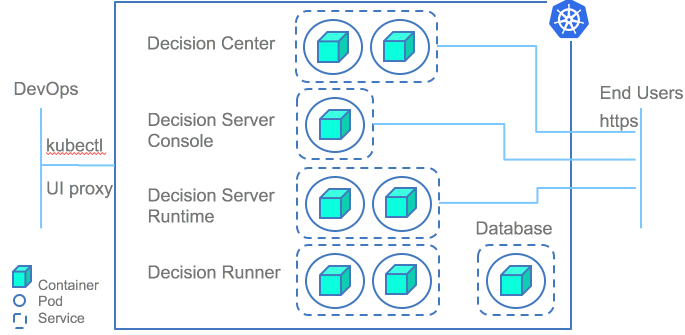

# IBM-ODM-Kubernetes
IBM Operational Decision Manager on Kubernetes

[](https://travis-ci.org/ODMDev/odm-docker-kubernetes)
[](https://github.com/ODMDev/odm-docker-kubernetes/releases)
[](https://github.com/ODMDev/odm-docker-kubernetes)
[](https://opensource.org/licenses/Apache-2.0)

<p align="center">
  <a href="https://join.slack.com/t/odmdev/shared_invite/enQtMjU0NzIwMjM1MTg0LTQyYTMzNGQ4NzJkMDYxMDU5MDRmYTM4MjcxN2RiMzNmZWZmY2UzYzRhMjk0N2FmZjU2YzJlMTRmN2FhZDY4NmQ">
        Follow us on slack
        <br>
        
  </a>
</p>

#  Deploying IBM Operational Decision Manager Standard on a Kubernetes Cluster

This repository centralizes materials to deploy [IBM® Operational Decision Manager](https://www.ibm.com/support/knowledgecenter/SSQP76_8.9.0/welcome/kc_welcome_odmV.html) (ODM) Standard in Kubernetes. It is deployed in a clustered topology that uses WebSphere® Application Server Liberty on a Kubernetes cluster.

ODM is a decisioning platform to automate your business policies. Business rules are used at the heart of the platform to implement decision logic on a business vocabulary and run it as web decision services.

The ODM Docker material is used here, which is available in the [odm-ondocker](https://github.com/lgrateau/odm-ondocker) repository. It includes Docker files and Docker Compose descriptors. The Docker files are used to build images of ODM runtimes. The Docker Compose descriptors can be used to group these images and push to your repository for a Kubernetes provisioning. Docker Compose and Kubernetes are two distinct technology paths to provision a container-based topology supported by ODM Standard.



## Deploying ODM Rules in the following environments
- [Bluemix Kubernetes Cluster](Bluemix/README.md)
- [MiniKube](MiniKube/README.md)

# Notice
© Copyright IBM Corporation 2017.

# License
```text
Licensed under the Apache License, Version 2.0 (the "License");
you may not use this file except in compliance with the License.
You may obtain a copy of the License at

    http://www.apache.org/licenses/LICENSE-2.0

Unless required by applicable law or agreed to in writing, software
distributed under the License is distributed on an "AS IS" BASIS,
WITHOUT WARRANTIES OR CONDITIONS OF ANY KIND, either express or implied.
See the License for the specific language governing permissions and
limitations under the License.
````

