# How to import Keycloak Groups and Users using SCIM

## Table of Contents
<!-- TOC depthfrom:1 depthto:6 withlinks:false updateonsave:false orderedlist:false -->
- [Introduction](#introduction)
- [Deploy on OpenShift a custom Keycloak service with a SCIM Server](#deploy-on-openShift-a-custom-keycloak-service-with-a-scim-server)
  - [Build the Keycloak docker image embedding the open source SCIM plug-in](#build-the-keycloak-docker-image-embedding-the-open-source-scim-plug-in)
  - [Push the image on the OpenShift Cluster](#push-the-image-on-the-openShift-cluster)
  - [Deploy Keycloak Service using the keycloak-scim image](#deploy-keycloak-service-using-the-keycloak-scim-image)
- [Configure an ODM Application with Keycloak dashboard](#configure-an-odm-application-with-keycloak-dashboard)
- [Deploy an Open LDAP Service](#deploy-an-open-ldap-service)
- [Add an LDAP User Federation to Keycloak](#add-an-ldap-user-federation-to-keycloak)
- [SCIM Configuration](#scim-configuration)
  - [Enable the SCIM Console Theme](#enable-the-scim-console-theme)
  - [Configure the odm client application authorization](#configure-the-odm-client-application-authorization)
  - [Check the SCIM Group and User endpoints](#check-the-scim-group-and-user-endpoints)
- [Deploy ODM on a container configured with Keycloak](#deploy-odm-on-a-container-configured-with-keycloak)
- [Manage Security on ODM Decision Service Project](#manage-security-on-odm-decision-service-project)
  - [Provide the relevant roles on groups](#provide-the-relevant-roles-on-groups)
  - [Load projects](#load-projects)
  - [Import Groups and Users](#import-groups-and-users)
  - [Set the project security](#set-the-project-security)
  - [Check the project security](#check-the-project-security)
- [Synchronize Decision Center when updating Keycloak](#synchronize-decision-center-when-updating-keycloak)

<!-- /TOC -->

# Introduction

ODM Decision Center allows to [manage users and groups from the Business console](https://www.ibm.com/docs/en/odm/9.0.0?topic=center-managing-users-groups-from-business-console) in order to set access security on specific projects.
The Groups and Users import can be done using an LDAP connection.
But, if the openId server also provides a SCIM server, then it can also be managed using a SCIM connection.

Keycloak does not provide a SCIM server off the shelf. But this feature can be added using the following open-source contribution: [https://github.com/Captain-P-Goldfish/scim-for-keycloak](https://github.com/Captain-P-Goldfish/scim-for-keycloak).
As the project [https://scim-for-keycloak.de/](https://scim-for-keycloak.de) will become Enterprise ready soon, this tutorial was performed using the last available open source version : kc-20-b1 for Keycloak 20.0.5.

# Deploy on OpenShift a custom Keycloak service with a SCIM Server

## Build the Keycloak docker image embedding the open source SCIM plug-in

- Get the [SCIM for Keycloak scim-for-keycloak-kc-20-b1.jar file](https://github.com/Captain-P-Goldfish/scim-for-keycloak/releases/download/kc-20-b1/scim-for-keycloak-kc-20-b1.jar)
- Get the [Dockerfile](Dockerfile)
- Build the image locally:

  ```shell
  docker build . --build-arg KEYCLOAK_IMAGE=quay.io/keycloak/keycloak:20.0.5 --build-arg SCIM_JAR_FILE=scim-for-keycloak-kc-20-b1.jar -t keycloak-scim:latest
  ```

  > Note:
  > The build command produces an image suitable to the architecture (amd64, ...) of the machine where the build is performed.
  >
  > Make sure that the architecture of the cluster is the same.
  > If not, you may consider using `docker buildx build --platform=linux/${ARCH} ...`  to build an image suitable to the target architecture.


## Push the image on the OpenShift Cluster

- Log on your OCP Cluster
- Expose the Docker image registry:

  ```shell
  oc patch configs.imageregistry.operator.openshift.io/cluster --patch '{"spec":{"defaultRoute":true}}' --type=merge
  ```

- Log into it:

  ```shell
  REGISTRY_HOST=$(oc get route default-route -n openshift-image-registry --template='{{ .spec.host }}')
  docker login -u kubeadmin -p $(oc whoami -t) $REGISTRY_HOST
  ```

- Upload the keycloak-scim:latest on the wanted <my-keycloak-project>:

  ```shell
  docker tag keycloak-scim:latest $REGISTRY_HOST/<my-keycloak-project>/keycloak-scim:latest
  docker push $REGISTRY_HOST/<my-keycloak-project>/keycloak-scim:latest
  ```

>Note: To avoid an error on the image push, perhaps you will have to add $REGISTRY_HOST to your Docker insecure-registries list configuration.
>
> For instance, if you use podman, you have to create a myregistry.conf file in the /etc/containers/registries.conf.d folder (inside the virtual machine on Windows or Mac) with the content below:
> ```
> [[registry]]
> location = "$REGISTRY_HOST"
> insecure = true
> ```

## Deploy Keycloak Service using the keycloak-scim image

- Get the [keycloak.yaml](https://raw.githubusercontent.com/keycloak/keycloak-quickstarts/refs/heads/main/openshift/keycloak.yaml) file
- Replace the provided image: input using image-registry.openshift-image-registry.svc:5000/\<my-keycloak-project>/keycloak-scim:latest

  ```shell
   ...
      spec:
          containers:
            - env:
                - name: KEYCLOAK_ADMIN
                  value: '${KEYCLOAK_ADMIN}'
                - name: KEYCLOAK_ADMIN_PASSWORD
                  value: '${KEYCLOAK_ADMIN_PASSWORD}'
                - name: KC_PROXY
                  value: 'edge'
                - name: KC_PROXY_HEADERS
                  value: 'forwarded'
              image: image-registry.openshift-image-registry.svc:5000/<my-keycloak-project>/keycloak-scim:latest
   ...
  ```

- Deploy keycloak:

  ```shell
   oc process -f ./keycloak.yaml \
    -p KEYCLOAK_ADMIN=admin \
    -p KEYCLOAK_ADMIN_PASSWORD=admin \
    -p NAMESPACE=<my-keycloak-project> \
  | oc create -f -
  ```
# Configure an ODM Application with Keycloak dashboard

You must start with the configuration of Keycloak with ODM roles as instructed in [Keycloak instance for ODM (Part 1)](README.md#configure-a-keycloak-instance-for-odm-part-1).


# Deploy an Open LDAP Service

- Create a Service Account with the `anyuid` policy

```shell
oc apply -f ./openldap/service-account-for-anyuid.yaml
oc adm policy add-scc-to-user anyuid -z openldap-anyuid
```

- Install the OpenLDAP Service

```shell
oc apply -f ./openldap/ldap-custom-ssl-secret.yaml
oc apply -f ./openldap/openldap-env.yaml
oc apply -f ./openldap/openldap-secret.yaml
oc apply -f ./openldap/openldap-customldif.yaml
oc apply -f ./openldap/openldap-deploy.yaml
oc apply -f ./openldap/ldap-service.yaml

```

- Check the OpenLDAP Service

The following command should return the OpenLDAP Schema :

```shell
oc exec -ti <OPENLDAP_POD> bash -- ldapsearch -x -Z -H ldap://ldap-service.<OPENLDAP_PROJECT>.svc:389  -D 'cn=admin,dc=example,dc=org' -b 'dc=example,dc=org' -w xNxICc74qG24x3GoW03n
```

Where:
  - OPENLDAP_POD is the name of the OpenLDAP pod
  - OPENLDAP_PROJECT is the name of the project in which the OpenLDAP pod has been deployed


# Add an LDAP User Federation to Keycloak

- Connect at the Keycloak Admin Dashboard using the odm realm with username/password `admin/admin`
- Select **Configure > User federation** and click **Add Provider > Add Ldap providers**

- Fill the **Add LDAP provider** dialog

   * General options
     * Console display name: openldap
     * Vendor: "Red Hat Directory Server"

   * Connection and authentication settings
     * Connection URL should be:  ldap://ldap-service.\<OPENLDAP_PROJECT>.svc:389 (where OPENLDAP_PROJECT is the project in which OpenLdap has been deployed)
     * Bind type: simple
     * Bind DN: cn=admin,dc=example,dc=org
     * Bind credentials: xNxICc74qG24x3GoW03n
- Click the **Test authentication** button => "Successfully connected to LDAP" message is displayed

   * LDAP searching and updating
     * Edit mode: READ_ONLY
     * Users DN: dc=example,dc=org
     * Username LDAP attribute: uid
     * RDN LDAP attribute: uid
     * UUID LDAP attribute: uid
     * User object classes: inetOrgPerson, organizationalPerson
     * User LDAP Filter:
     * Search scope: Subtree
     * Read timeout:
     * Pagination: Off

   * Synchronization settings
     * Import users: On
     * Sync Registrations: On
     * Batch size:
     * Periodic full sync: Off
     * Periodic changed users sync: Off

   * Kerberos integration
     * Allow Kerberos authentication: Off
     * Use Kerberos for password authentication: Off

   * Cache settings
     * Cache policy: DEFAULT

   * Advanced settings
     * Enable the LDAPv3 password modify extended operation: Off
     * Validate password policy: Off
     * Trust email: On

  - Click on the "Save" button

  At this step, all openldap users have been imported. You can check it by clicking on the **Users** tab, put "*" in the Search user box and click on the search button.
  You should see:

  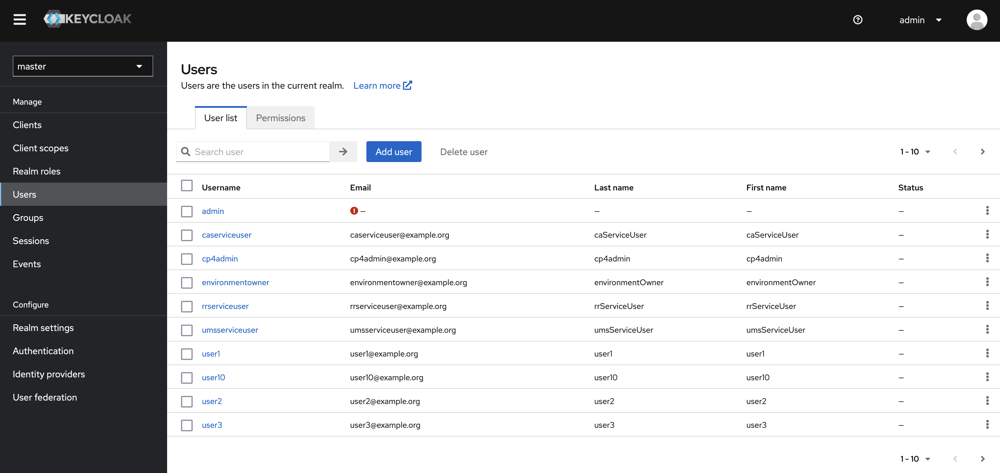

  Now let us import groups.

  - In **User federation**, click **openldap**
  - Click on the "Mappers" tab
  - Click "Add mapper"
     * Name: groups
     * Mapper type: group-ldap-mapper
     * LDAP Groups DN: dc=example,dc=org
     * Group Name LDAP Attribute: cn
     * Group Object Classes: groupOfNames
     * Preserve Group Inheritance: Off
     * Ignore Missing Groups: Off
     * Membership LDAP Attribute: member
     * Membership Attribute Type: DN
     * Membership User LDAP Attribute: uid
     * LDAP Filter:
     * Mode: READ_ONLY
     * User Groups Retrieve Strategy: LOAD_GROUPS_BY_MEMBER_ATTRIBUTE
     * Member-Of LDAP Attribute: memberOf
     * Mapped Group Attributes:
     * Drop non-existing groups during sync: Off
     * Groups Path: /

  - Click the **Save** button
  - Click **Action > Sync All users**

  Now you can check the openldap groups have been imported in the **Groups** tab. You should see :

  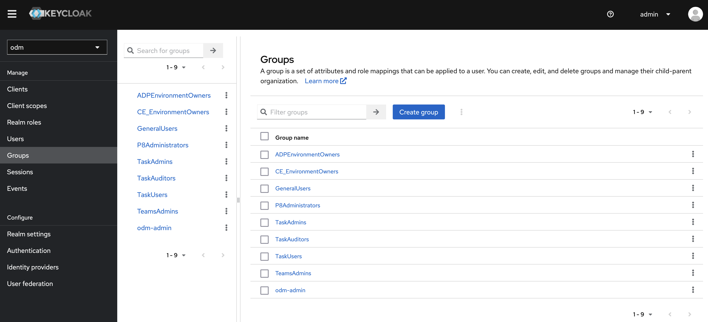

# SCIM Configuration


## Enable the SCIM Console Theme

  To access the SCIM Configuration User Interface, you have to change the Admin Console Theme.
  If you are in the **odm** realm, you need to switch to the **master** realm beforehand. Then:
  - Select the **Realm settings** Menu
  - Select the **Themes** Tab
  - Select **scim** for the **Admin console theme**
  - Click the **Save** button => the "Realm successfully updated" message is displayed
  - Refresh the browser page => a "Page not found..." message is displayed
  - Click the "Go to the home page >>" hyperlink

  Now, the Admin console theme has changed and you should be able to access the SCIM Configuration tab :

  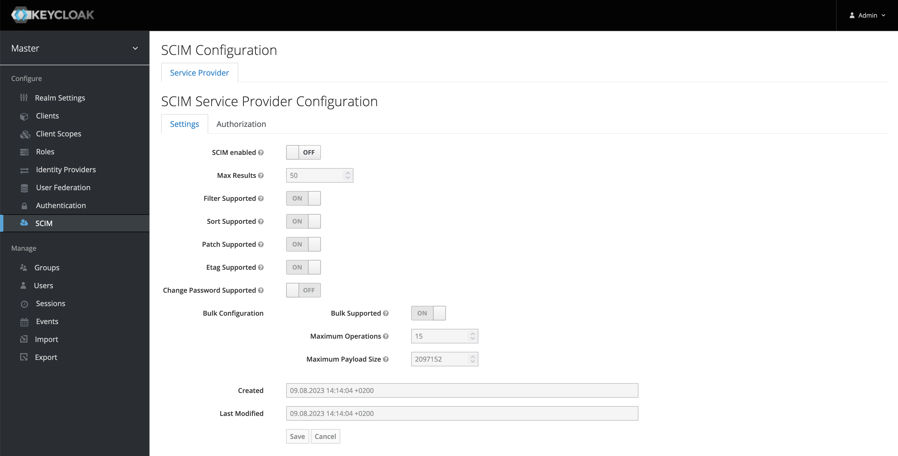

## Configure the odm client application authorization

  - Select the **Service Provider** tab

   - Select the **Settings** sub-tab
   - Set **SCIM enabled** to **ON**
   - Click the **Save** Button

   - Select the **Authorization** sub-tab
   - Select **odm** (clientId of the application) in the **Available Clients** list and click **Add selected >** to move it to the **Assigned Clients** list


  By default, the SCIM Groups and Users Endpoints require authentication.

  Now, let us configure these endpoints to authorize authenticated users that have the rtsAdministrators role. In the ODM client application, we will use the client_credentials flow using the "service-account-odm" service account having assigned the rtsAdministrators role. We just have to configure authorization for the "Get" endpoint as the ODM SCIM Import is a read only mode and doesn't need the other endpoints (Create, Update, Delete).

  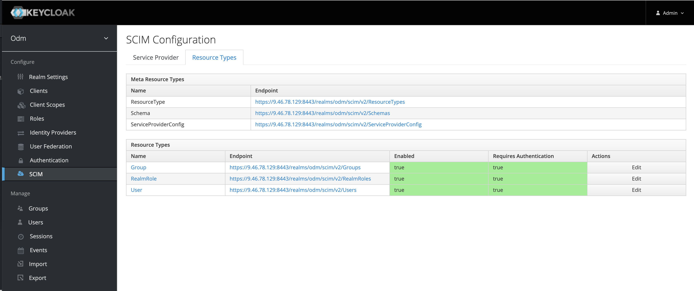

  - Select the **Resource Type** tab
    - Click **Group** inside the table
    - Select the **Authorization** sub-tab
    - Expand **Common Roles**, select **rtsAdministrators** in the **Available Roles** list and click **Add selected >** to move it to the **Assigned Roles** list
    - Expand **Roles for Get**, select **rtsAdministrators** in the **Available Roles** list and click **Add selected >** to move it to the **Assigned Roles** list

  

 - Select the **Resource Type** tab again
   - Click **User** inside the table
   - Click the **Authorization** sub-tab
   - Expand **Common Roles**, select **rtsAdministrators** in the **Available Roles** list and click **Add selected >** to move it to the **Assigned Roles** list
   - Expand **Roles for Get**, select **rtsAdministrators** in the **Available Roles** list and click **Add selected >** to move it to the **Assigned Roles** list

  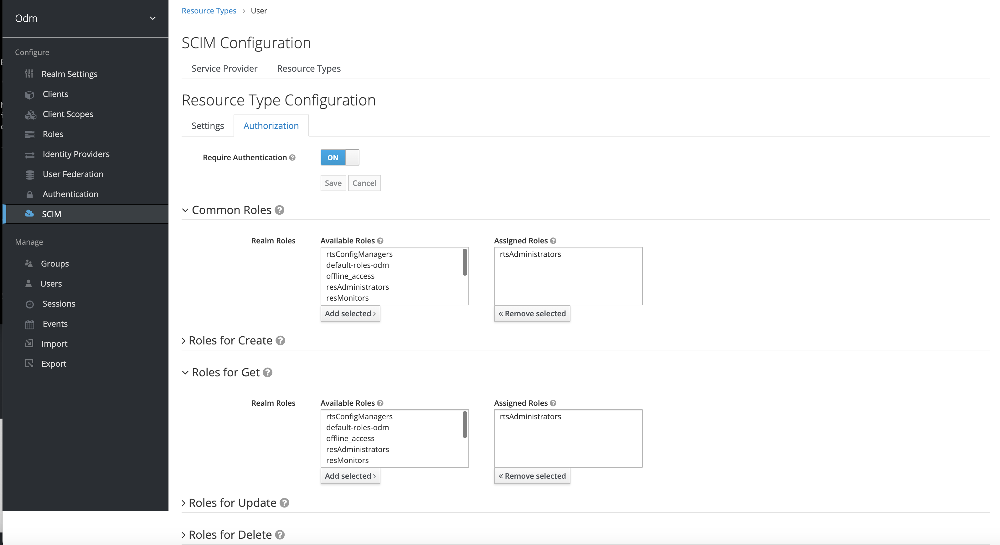

## Check the SCIM Group and User endpoints

  Download the [keycloak-odm-script.zip](keycloak-odm-script.zip) file to your machine and unzip it in your working directory.
  This .zip file contains scripts and templates to verify and set up ODM.

  Request an access token using the Client-Credentials flow

  ```shell
  ./get-client-credential-token.sh -i $CLIENT_ID -x $CLIENT_SECRET -n $KEYCLOAK_SERVER_URL
  ```

  Call the SCIM Group endpoint using this <ACCESS_TOKEN>

  ```shell
  curl -k -H "Authorization: Bearer $ACCESS_TOKEN" $KEYCLOAK_SERVER_URL/scim/v2/Groups
  ```

  Result should looks like :

  ```shell
  {"schemas":["urn:ietf:params:scim:api:messages:2.0:ListResponse"],"totalResults":10,"itemsPerPage":10,"startIndex":1,"Resources":[{"schemas":["urn:ietf:params:scim:schemas:core:2.0:Group"],"id":"ef20202e-20e3-44f3-8d70-b1cf2d2c2d7d","displayName":"ADPEnvironmentOwners","members":[{"value":"35560439-88a3-4a56-bb67-384f024bfd7a","$ref":"https://9.46.78.129:8443/realms/odm/scim/v2/Users/35560439-88a3-4a56-bb67-384f024bfd7a","type":"User"},{"value":"7d995178-294a-4175-91f4-43cd9f5906aa","$ref":"https://9.46.78.129:8443/realms/odm/scim/v2/Users/7d995178-294a-4175-91f4-43cd9f5906aa","type":"User"},{"value":"6c74e271-ae1c-4849-aa67-8351f1c816c5","$ref":"https://9.46.78.129:8443/realms/odm/scim/v2/Users/6c74e271-ae1c-4849-aa67-8351f1c816c5","type":"User"}],"meta":{"resourceType":"Group","created":"2023-08-09T13:09:44.164Z","lastModified":"2023-08-09T13:09:44.164Z","location":"https://9.46.78.129:8443/realms/odm/scim/v2/Groups/ef20202e-20e3-44f3-8d70-b1cf2d2c2d7d"}},{"schemas":["urn:ietf:params:scim:schemas:core:2.0:Group"],"id":"f671e618-ef45-41d4-bd0b-c134536edf45","displayName":"CE_EnvironmentOwners","members":[{"value":"35560439-88a3-4a56-bb67-384f024bfd7a","$ref":"https://9.46.78.129:8443/realms/odm/scim/v2/Users/35560439-88a3-4a56-bb67-384f024bfd7a","type":"User"}],"meta":{"resourceType":"Group","created":"2023-08-09T13:09:44.207Z","lastModified":"2023-08-09T13:09:44.207Z","location":"https://9.46.78.129:8443/realms/odm/scim/v2/Groups/f671e618-ef45-41d4-bd0b-c134536edf45"}},{"schemas":["urn:ietf:params:scim:schemas:core:2.0:Group"],"id":"7f767eac-0950-4e71-b2ec-b9e04a10be04","displayName":"GeneralUsers","members":[{"value":"88094536-a059-4383-8bf4-1dcb65457bb9","$ref":"https://9.46.78.129:8443/realms/odm/scim/v2/Users/88094536-a059-4383-8bf4-1dcb65457bb9","type":"User"},{"value":"94a6b972-04aa-4394-89b8-f16a875fe54d","$ref":"https://9.46.78.129:8443/realms/odm/scim/v2/Users/94a6b972-04aa-4394-89b8-f16a875fe54d","type":"User"},{"value":"9a37726a-2a69-4f97-a892-ef38d566c94f","$ref":"https://9.46.78.129:8443/realms/odm/scim/v2/Users/9a37726a-2a69-4f97-a892-ef38d566c94f","type":"User"},{"value":"35774b15-42bc-4c05-bcc9-145fbf075ace","$ref":"https://9.46.78.129:8443/realms/odm/scim/v2/Users/35774b15-42bc-4c05-bcc9-145fbf075ace","type":"User"},
    ...
  ```

  Call the SCIM Group endpoint using this <ACCESS_TOKEN>

  ```shell
  curl -k -H "Authorization: Bearer $ACCESS_TOKEN" $KEYCLOAK_SERVER_URL/scim/v2/Users
  ```

  Result should looks like :

  ```shell
  {"schemas":["urn:ietf:params:scim:api:messages:2.0:ListResponse"],"totalResults":23,"itemsPerPage":23,"startIndex":1,"Resources":[{"schemas":["urn:ietf:params:scim:schemas:core:2.0:User"],"id":"def4784e-7b1d-460b-86b3-8cf4d95e47e2","userName":"caserviceuser","name":{"familyName":"caServiceUser","givenName":"caServiceUser"},"active":true,"emails":[{"value":"caserviceuser@example.org","primary":true}],"meta":{"resourceType":"User","created":"2022-12-09T14:07:02.529Z","lastModified":"2022-12-09T14:07:02.529Z","location":"https://9.46.78.129:8443/realms/odm/scim/v2/Users/def4784e-7b1d-460b-86b3-8cf4d95e47e2"}},{"schemas":["urn:ietf:params:scim:schemas:core:2.0:User"],"id":"7d995178-294a-4175-91f4-43cd9f5906aa","userName":"cp4admin","name":{"familyName":"cp4admin","givenName":"cp4admin"},"active":true,"emails":[{"value":"cp4admin@example.org","primary":true}],"groups":[{"value":"da45f301-9b11-4367-be98-ecf63b677c45","display":"TaskAdmins","type":"direct"},{"value":"ef20202e-20e3-44f3-8d70-b1cf2d2c2d7d","display":"ADPEnvironmentOwners","type":"direct"},{"value":"8a0a6948-1c07-4c5c-8e17-c445a12572b8","display":"P8Administrators","type":"direct"},{"value":"ee18a23d-ba39-466a-a4f6-8d7ebc53825b","display":"TeamsAdmins","type":"direct"}],"meta":{"resourceType":"User","created":"2022-12-09T14:06:54.231Z","lastModified":"2022-12-09T14:06:54.231Z","location":"https://9.46.78.129:8443/realms/odm/scim/v2/Users/7d995178-294a-4175-91f4-43cd9f5906aa"}},{"schemas":["urn:ietf:params:scim:schemas:core:2.0:User"],"id":"35560439-88a3-4a56-bb67-384f024bfd7a","userName":"environmentowner","name":{"familyName":"environmentOwner","givenName":"environmentOwner"},"active":true,"emails":[{"value":"environmentowner@example.org","primary":true}],"groups":[{"value":"f671e618-ef45-41d4-bd0b-c134536edf45","display":"CE_EnvironmentOwners","type":"direct"},{"value":"ef20202e-20e3-44f3-8d70-b1cf2d2c2d7d","display":"ADPEnvironmentOwners","type":"direct"},
    ...
  ```

# Deploy ODM on a container configured with Keycloak

Follow - [Deploy ODM on a container configured with Keycloak (Part 2)](README.md#deploy-odm-on-a-container-configured-with-keycloak-part-2).

But replace the previous step "3. Create the Keycloak authentication secret" of the section [Create secrets to configure ODM with Keycloak](README.md#create-secrets-to-configure-odm-with-keycloak) by:

  ```
  kubectl create secret generic keycloak-auth-secret \
      --from-file=ldap-configurations.xml=./output/ldap-configurations.xml \
      --from-file=openIdParameters.properties=./output/openIdParameters.properties \
      --from-file=openIdWebSecurity.xml=./output/openIdWebSecurity.xml \
      --from-file=webSecurity.xml=./output/webSecurity.xml
  ```
Make sure that you finish [Complete post-deployment tasks](README.md#complete-post-deployment-tasks).

# Manage Security on ODM Decision Service Project 

ODM Decision Center allows to [manage users and groups from the Business console](https://www.ibm.com/docs/en/odm/9.0.0?topic=center-managing-users-groups-from-business-console) in order to set access security on specific projects.
Now, we will manage the following scenario. We will load the "Loan Validation Service" and "Miniloan Service" projects that are available at the getting started repository.
We will only provide access to the "Loan Validation Service" project for users belonging at the "TaskAuditors" group.
We will only provide access to the "Miniloan Service" project for users belonging at the "TaskUsers" group.

## Provide the relevant roles on groups

The first step is to declare the groups of users that will be Decision Center Administrators, and therefore have access to the Business Console Administration Tab.

  - In Keycloak admin console, select the **odm** realm
  - Select the **Manage > Groups** Tab
  - Double-click **TaskAdmins**
  - Select the **Role Mappings** Tab
  - Select all rts*** roles in the **Available Roles** list and click **Add selected >** to move them to the **Assigned Roles** list

  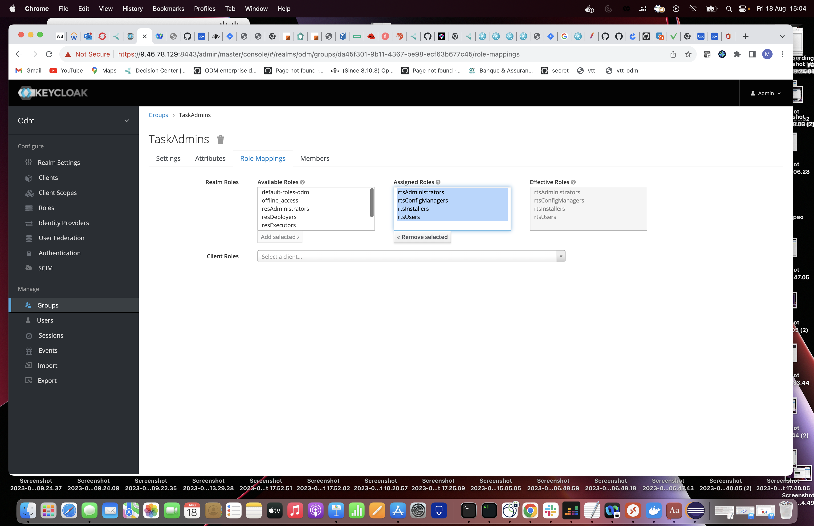

Let us also assign the **rtsUsers** role to the **TaskAuditors** and **TaskUsers** groups. If you do not do this, users are not authorized to login into the Business Console.

  - Select the **Manage > Groups** Tab
  - Double-click on **TaskAuditors**
  - Select the **Role Mappings** Tab
  - Select the **rtsUsers** role in the **Available Roles** list and click **Add selected >** to move it to the **Assigned Roles** list
  - Repeat the same for the **TaskUsers** group

  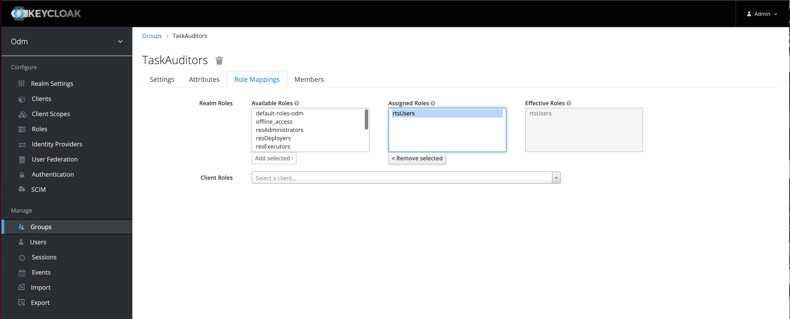

## Load projects

  For the next steps, the users password can be found in the `ldap_user.ldif` file of the `openldap-customldif` secret, by running the commmand:
  ```
  oc get secret openldap-customldif -o jsonpath={.data."ldap_user\.ldif"} | base64 -d
  ```

  - Log in to the ODM Decision Center Business Console as the `cp4admin` user
  - Select the **LIBRARY** tab
  - Import the [Loan Validation Service](https://github.com/DecisionsDev/odm-for-container-getting-started/blob/master/Loan%20Validation%20Service.zip) and [Miniloan Service](https://github.com/DecisionsDev/odm-for-container-getting-started/blob/master/Miniloan%20Service.zip) projects if they are not already there.

  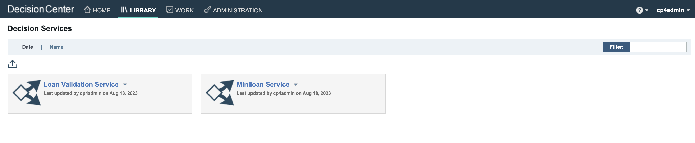

## Import Groups and Users

  - Select the **ADMINISTRATION** tab
  - Select the **Connection Settings** sub-tab
  - Check the KEYCLOAK_SCIM connection status is green
  - Select the **Groups** sub-tab
  - Click the **Import Groups from directories** icon button
  - Select the **TaskAuditors** and **TaskUsers** groups
  - Click on the **Import groups and users** button

  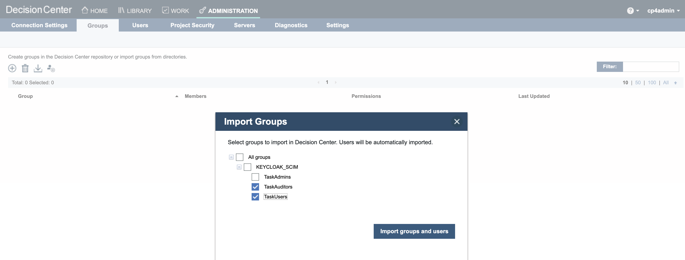

## Set the project security

  - Select the **Project Security** sub-tab
  - Click on the pen icon next to the "Loan Validation Service" project (the text **Edit decision service security** gets displayed when hovering the mouse pointer over the icon)
  - Below the Security section, select **Enforce Security**
  - Below the Groups section, select the **TaskAuditors** group
  - Click the **Done** button

  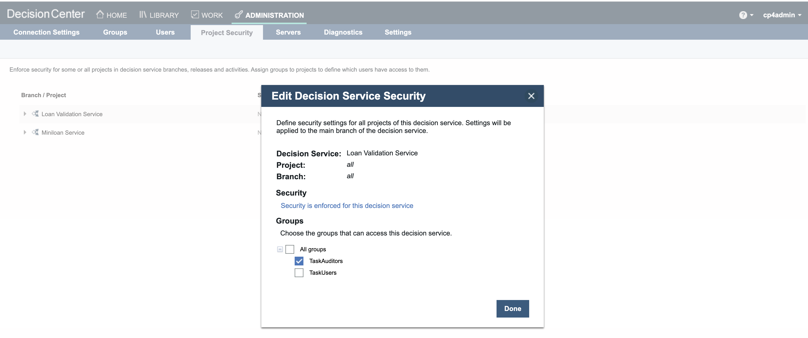

  - Click the the pen icon next to the "Miniloan Service" project (the text **Edit decision service security** gets displayed when hovering the mouse pointer over the icon)
  - Below the Security section, select **Enforce Security**
  - Below the Groups section, select the **TaskUsers** group
  - Click the **Done** button

  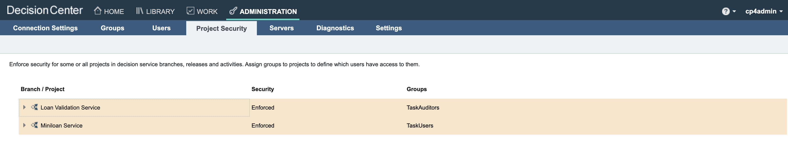

## Check the project security

  - Click on top right **cp4admin** user
  - Click the "Log out" link
  - Click the Keycloak Logout button

  - Log in as `user1`. Check that the **ADMINISTRATION** tab is not available
  - Click on **LIBRARY** tab, only the "Miniloan Service" project must be available
  - Click on top-right `user1` link
  - Select "Profile" link
  - The `user1` User Profile is showing the "TaskUsers" group

  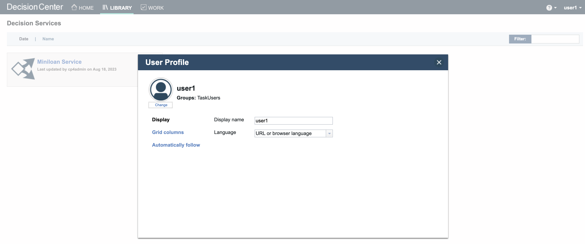

  - Log in as `user6`. Check that the **ADMINISTRATION** tab is not available
  - Click on **LIBRARY** tab, only the "Loan Validation Service" project must be available
  - Click on top-right `user6` link
  - Select "Profile" link
  - The `user6` User Profile is showing the "TaskAuditors" group

  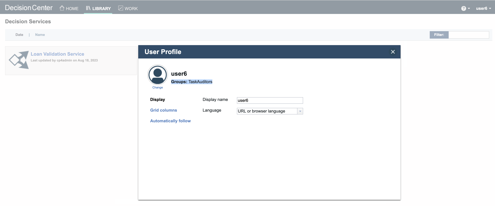

# Synchronize Decision Center when updating Keycloak

  During the life of a project, the following can happen :
  - a user moves from a group to an other,
  - a user leaves a group,
  - a new user joins a group, ...

  All these changes are performed using the Keycloak dashboard and then reflected inside Decision Center, either manually using the Decision Center Synchronize button or using the automatic synchronization (scheduled every 2 hours by default).

  You can read more about configuring the automatic synchronization in the documentation page [Importing users and groups from LDAP directories](https://www.ibm.com/docs/en/odm/9.5.0?topic=ldap-importing-users-groups-from-directories).