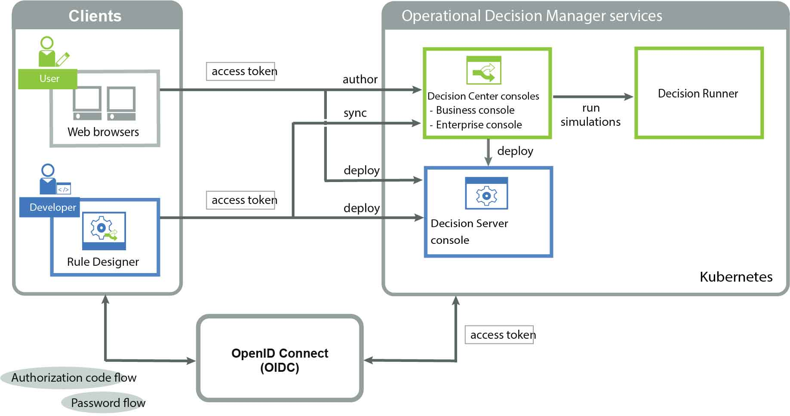
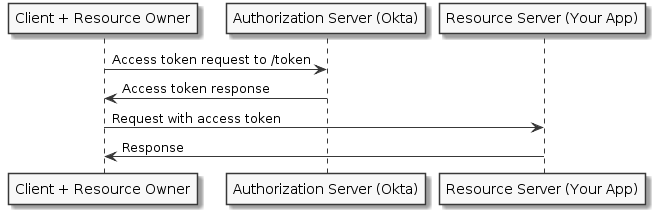
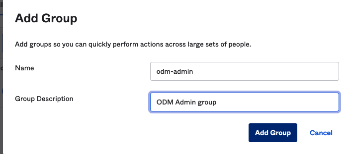
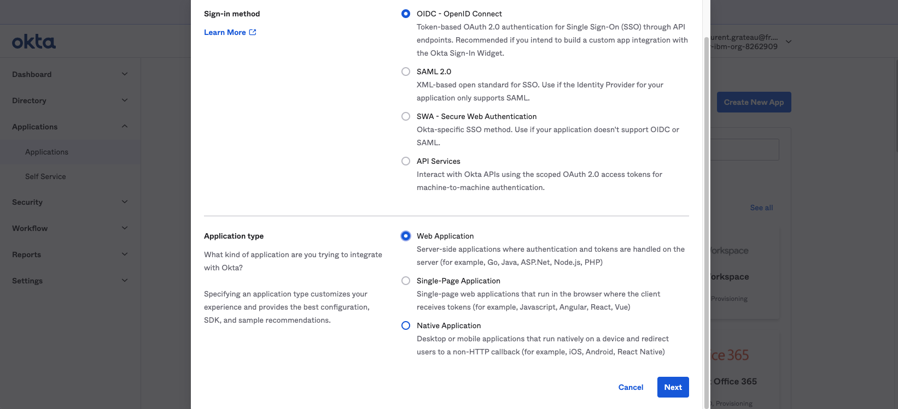
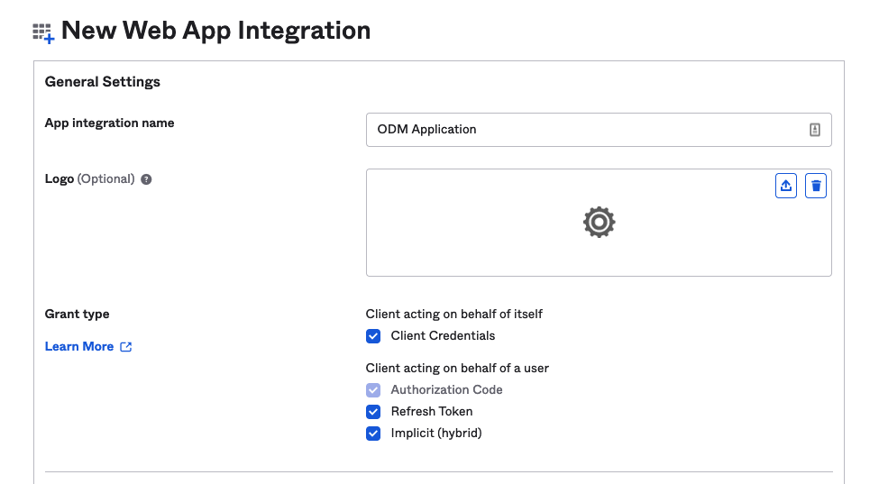
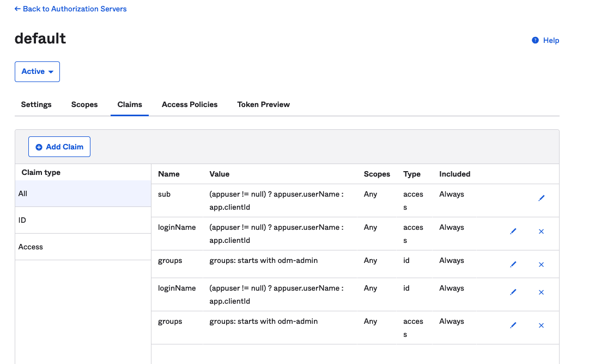
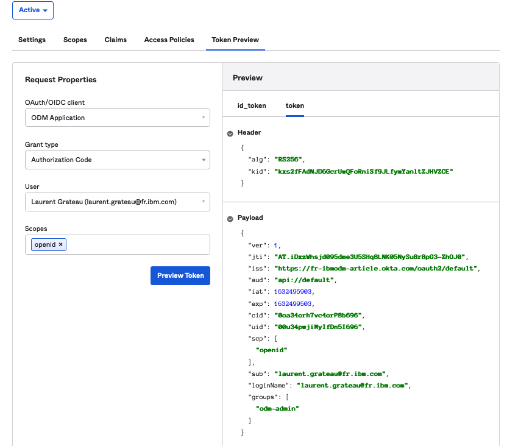
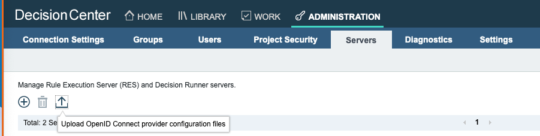
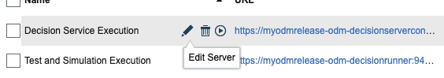

# Introduction
In the context of the IBM Cloud Pak for Business Automation or ODM on Certified Kubernetes offering, Operational Decision Manager for production can be configured with an external OpenID Connect server (OIDC Provider) such as OKTA Server. 

## About this task

In this 
You need to create a number of secrets before you can install an ODM instance with an external OIDC provider and use web application single sign-on (SSO). The following diagram shows the ODM services with an external OIDC provider after a successful installation.



The following procedure describes how to manually configure ODM with an external OpenID Connect server. You must define the mapping between the liberty roles and the LDAP groups by creating a secret and reference it in the customization.authSecretRef parameter.

## OKTA 
The Client Credentials flow is intended for server-side (AKA "confidential") client applications with no end user, which normally describes machine-to-machine communication. The application must be server-side because it must be trusted with the client secret, and since the credentials are hard-coded, it can't be used by an actual end user. It involves a single, authenticated request to the /token endpoint, which returns an access token.




# Configuring OKTA instance for ODM
## Manage group and user
   * Menu Directory -> Groups
      * Click Add Group button
         * Name : odm-admin
         * Group Description : ODM Admin group


        
   * Menu Directory -> People
      * Click 'Add Person' button
         * User type : User
         * First name : ``<YourFirstName>``
         * Last name : ``<YourLastName>``
         * Username : ``<YourFirstName>.<YourLastName>``
         * Primary email : ``<YourFirstName>.<YourLastName>@mycompany.com``
         * Groups (optional) : **odm-admin**
      * Click Save button 
      * Repeat for each user you want to add.
      
## Setup an Application 

   * Menu Applications -> Applications 
   * Click Create an App Integration
     * Select OIDC - OpenID Connect
     * Select WebApplication
     * Next
    
    
   
   * Edit Application
     * App integration name : ODM Application
     * Grant type:
        * Check Client Credentials
        * Check Refresh Token
        * Implicit (hybrid) 
     * Assignments:
        * Controlled access:
           * Limit access to selected groups:
              * Selected group(s) : **odm-admin**    
     * Click Save button 



## Configure the default Authorization Server

TODO BLABLA

   * Menu Security -> api
   * Click default link of Authorization server
   
Note that the discovery endpoint can be found in the settings tag Metadata URI. Menu Security -> api -> default (link) -> Metadata URI (link)
To be more secured we will used the client credential flow for the ODM Rest API call. This require to create a specific restricted scope.

   * Click Scopes tab 
   * Click 'Add Scope' Button
      * Name : odmapiusers
   * Click 'Create' Button
     
We need to augment the token by the useridentifier and group properties that will be used for the ODM authentication and authorization mechanism.

   * Select claims tab
   * Click 'Add claim' button
     * Name : loginName
     * Include in token type : **Access Token**
     * Value : (appuser != null) ? appuser.userName : app.clientId
   * Click Create Button  
   * Click 'Add claim' button
     * Name : loginName
     * Include in token type : **Id Token**
     * Value : (appuser != null) ? appuser.userName : app.clientId
   * Click Create Button
   * Click 'Add claim' button
   * Name : groups
     * Include in token type : **Access Token**
     * Value type : Groups
     * Start with : odm-admin
   * Click Create Button
   * Click 'Add claim' button
   * Name : groups
     * Include in token type : **Access Token**
     * Value type : Groups
     * Start with : odm-admin
   * Click Create Button
   

You can verify the content of the token with the Token Preview pannel. 
You have to check that the login name and groups are available in the id token using the authorization flow which the flow used by ODM.

   *  Click the Token Preview
      *  OAuth/OIDC client : ODM Application
      *  Grant type : Authorization Code
      *  User: ``<YourEmailAddress>``
      *  Scopes : openid
   *  Click the Preview Token button
   
   * As result the id_token tab as well as in the token tab should contains  

```...
   "loginName": "<YourEmailAddress>",
  "groups": [
    "odm-admin"
  ]
```

  

Note that the discovery endpoint can be found in the settings tag Metadata URI. Menu Security -> api -> default (link) -> Metadata URI (link)

# Configuring ODM for OKTA Server

## Prerequisites
First, install the following software on your machine:
* [Helm v3](https://github.com/helm/helm/releases)
* [Kubectl](https://kubernetes.io/docs/tasks/tools/install-kubectl)
* Access to an Operational Decision Manager Product

## Prepare your environment for the ODM installation
Log in to [MyIBM Container Software Library](https://myibm.ibm.com/products-services/containerlibrary) with the IBMid and password that are associated with the entitled software.

In the Container software library tile, verify your entitlement on the View library page, and then go to Get entitlement key to retrieve the key.

Create a pull secret by running a kubectl create secret command.

```
$ kubectl create secret docker-registry icregistry-secret --docker-server=cp.icr.io \
							  --docker-username=cp \
    							  --docker-password="<API_KEY_GENERATED>" \
							  --docker-email=<USER_EMAIL>
```

where:
* API_KEY_GENERATED is the entitlement key from the previous step. Make sure you enclose the key in double-quotes.
* USER_EMAIL is the email address associated with your IBMid.

Note: The cp.icr.io value for the docker-server parameter is the only registry domain name that contains the images. You must set the docker-username to cp to use an entitlement key as docker-password.

Make a note of the secret name so that you can set it for the image.pullSecrets parameter when you run a helm install of your containers. The image.repository parameter will later be set to cp.icr.io/cp/cp4a/odm.

Add the public IBM Helm charts repository:

```
helm repo add ibmcharts https://raw.githubusercontent.com/IBM/charts/master/repo/entitled
helm repo update
```

Check you can access ODM's chart

```
helm search repo ibm-odm-prod
NAME                  	CHART VERSION	APP VERSION	DESCRIPTION                     
ibmcharts/ibm-odm-prod	21.2.0       	8.10.5.1   	IBM Operational Decision Manager
```

## Create a secret with the Okta Server certificate

To allow ODM services to access Okta Server, it is compulsory to provide the Okta Server Certificate.
You can create the secret as follow :

```
keytool -printcert -sslserver <OKTA_SERVER_URL> -rfc > okta.crt
kubectl create secret generic okta-secret --from-file=tls.crt=okta.crt
```

## Create a secret to configure ODM with OKTA

To configure ODM with OKTA, we need to provide 3 files :
* openIdParameters.properties to configure ODM REST-API and web application (logout and allowed domains in web.xml)
* openIdWebSecurity.xml to configure the liberty OpenId connect client relying party
* webSecurity.xml to provide a mapping between liberty roles and OKTA groups/users to manage authorization

We provide a (generateTemplate.sh) script allowing to generate these 3 files according to your OKTA_SERVER_URL, OKTA_CLIENT_ID, OKTA_CLIENT_SECRET and OKTA_ODM_GROUP parameters.
You will get the generation in the output directory.
The, create the following secret :

```
kubectl create secret generic okta-auth-secret --from-file=openIdParameters.properties=./output/openIdParameters.properties \
                                       --from-file=openIdWebSecurity.xml=./output/openIdWebSecurity.xml \
                                       --from-file=webSecurity.xml=./output/webSecurity.xml \
```


## Install your ODM Helm release

You can now install the product. We will use the postgresql internal database by disabling the persistence (internalDatabase.persistence.enabled=false) to avoid any platform complexity concerning persistent volume allocation.

```
helm install myodmrelease ibmcharts/ibm-odm-prod --version 21.2.0 \
        --set image.repository=cp.icr.io/cp/cp4a/odm --set image.pullSecrets=icregistry-secret \
        --set image.tag=8.10.5.1 \
        --set oidc.enabled=true \
        --set internalDatabase.persistence.enabled=false \
        --set customization.trustedCertificateList={"okta-secret"} \
        --set customization.authSecretRef=okta-auth-secret \
        --set service.enableRoute=true
```

Note: On OpenShift, you have to set the following parameters due to security context constraint :  --set internalDatabase.runAsUser='' --set customization.runAsUser=''. See https://www.ibm.com/support/knowledgecenter/SSQP76_8.10.x/com.ibm.odm.kube/topics/tsk_preparing_odmk8s.html

## Register the ODM redirect URL

Get the endpoints.
On OpenShift, you can get the routes with :
```
oc get routes
```

You should get something like :
```
NAME                                HOST/PORT                                                                       PATH   SERVICES                                 PORT                          TERMINATION   WILDCARD
myodmrelease-odm-dc-route           myodmrelease-odm-dc-route-okta-article.apps.odm-dev48.cp.fyre.ibm.com                  myodmrelease-odm-decisioncenter          decisioncenter-https          passthrough   None
myodmrelease-odm-dr-route           myodmrelease-odm-dr-route-okta-article.apps.odm-dev48.cp.fyre.ibm.com                  myodmrelease-odm-decisionrunner          decisionrunner-https          passthrough   None
myodmrelease-odm-ds-console-route   myodmrelease-odm-ds-console-route-okta-article.apps.odm-dev48.cp.fyre.ibm.com          myodmrelease-odm-decisionserverconsole   decisionserverconsole-https   passthrough   None
myodmrelease-odm-ds-runtime-route   myodmrelease-odm-ds-runtime-route-okta-article.apps.odm-dev48.cp.fyre.ibm.com          myodmrelease-odm-decisionserverruntime   decisionserverruntime-https   passthrough   None
```

The redirect are built this way :
* DC-REDIRECT_URL=https://DC-HOST/decisioncenter/openid/redirect/odm 
* DR-REDIRECT_URL=https://DR-HOST/DecisionRunner/openid/redirect/odm
* DSC-REDIRECT_URL=https://DSC-HOST/res/openid/redirect/odm
* DSR-REDIRECT_URL=https://DSR-HOST/DecisionService/openid/redirect/odm

## Install Using the CP4BA Operator


# Post installation steps

## Define server configuration

   * Open the decision center URL
   * Login
   * Go to the Admin Tab -> Servers Tab 
   * Click "Upload OpenID connect provider configuration file"
 
   -> Select the OdmOpenIdProviders.json file generated in the OUTPUTDIR
   * Edit the 'Decision Service Execution'

 

   * In the Configuration select box choose 'okta_clientcredentials'
   * Unselect 'Use OpenID Connect' selector
   * Select 'Use OpenID Connect' selector
   * Click Test button 
   * Check should be OK
   * Click Done button
   * Edit the 'Test and Simulation Execution'
   * Unselect 'Use OpenID Connect' selector
   * Select 'Use OpenID Connect' selector
   * In the Configuration select box choose 'okta_clientcredentials'
   * Click Test button 
   * Check should be OK
   * Click Done button

   
