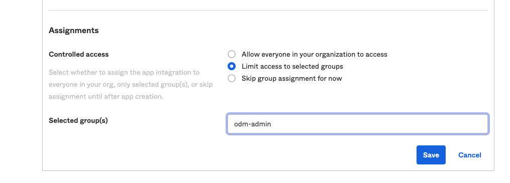

<!-- TOC titleSize:2 tabSpaces:2 depthFrom:1 depthTo:6 withLinks:1 updateOnSave:1 orderedList:0 skip:0 title:1 charForUnorderedList:* -->
## Table of Contents
* [Introduction](#introduction)
  * [What is Okta?](#what-is-okta)
  * [About this task](#about-this-task)
  * [ODM OpenID flows](#odm-openid-flows)
  * [Prerequisites](#prerequisites)
    * [Create an Okta account](#create-an-okta-account)
* [Configuring Okta instance for ODM (Part 1)](#configuring-okta-instance-for-odm-part-1)
  * [Manage group and user](#manage-group-and-user)
  * [Setup an application](#setup-an-application)
  * [Configure the default Authorization Server](#configure-the-default-authorization-server)
* [Deploy ODM on container configured with Okta Server (Part 2)](#deploy-odm-on-container-configured-with-okta-server-part-2)
  * [Prepare your environment for the ODM installation](#prepare-your-environment-for-the-odm-installation)
  * [Retrieve Okta Server information](#retrieve-okta-server-information)
  * [Create a secret with the Okta Server certificate](#create-a-secret-with-the-okta-server-certificate)
  * [Create a secret to configure ODM with Okta](#create-a-secret-to-configure-odm-with-okta)
  * [Install your ODM Helm release](#install-your-odm-helm-release)
  * [Register the ODM redirect URL](#register-the-odm-redirect-url)
<!-- /TOC -->

# Introduction

In the context of the IBM Cloud Pak for Business Automation or ODM on Certified Kubernetes offering, Operational Decision Manager for production can be configured with an external OpenID Connect server (OIDC Provider) such as Okta Server.

## What is Okta?

Okta is a secure identity cloud that links all your apps, logins and devices into a unified digital fabric. With Okta, you’re up and running on day one, with every app and program you use to work, instantly available. Whether you’re at your desktop or on the go, Okta seamlessly connects you to everything you need.

## About this task

You need to create a number of secrets before you can install an ODM instance with an external OIDC provider such as Okta server and use web application single sign-on (SSO). The following diagram shows the ODM services with an external OIDC provider after a successful installation.


The following procedure describes how to manually configure ODM with an Okta Connect server.

## ODM OpenID flows

OpenID Connect is an authentication standard built on top of OAuth 2.0. It adds an additional token called an ID token.

Terminology:
   * The "OpenID provider" — The authorization server that issues the ID token. In this case Okta is the OpenID provider.
   * The "end user" — Whose information is contained in the ID token
   * The "relying party" — The client application that requests the ID token from Okta
   * The "ID token" is issued by the OpenID Provider and contains information about the end user in the form of claims.
   * A "claim" is a piece of information about the end user.

The Client Credentials flow is intended for server-side (AKA "confidential") client applications with no end user, which normally describes machine-to-machine communication. The application must be server-side because it must be trusted with the client secret, and since the credentials are hard-coded, it can't be used by an actual end user. It involves a single, authenticated request to the /token endpoint, which returns an access token.


The Authorization Code flow is best used by server-side apps where the source code isn't publicly exposed. The apps should be server-side because the request that exchanges the authorization code for a token requires a client secret, which has to be stored in your client. The server-side app requires an end user, however, because it relies on interaction with the end user's web browser, which redirects the user and then receives the authorization code.

Auth Code flow width:


## Prerequisites

First, install the following software on your machine:

- [Helm v3](https://github.com/helm/helm/releases)
- [Kubectl](https://kubernetes.io/docs/tasks/tools/install-kubectl)
- Access to an Operational Decision Manager Product
- A CNCF Kubernetes cluster
- An admin Okta account

### Create an Okta account

First, sign up for [a free Okta developer account](https://www.okta.com/free-trial/customer-identity/) that provides access for up to 1k monthly active users. However, you can skip this section if you already have one.

# Configuring Okta instance for ODM (Part 1)

In this section we will explain how to:

- Manage group and user
- Setup an application
- Configure the default Authorization Server

## Manage group and user

   * Menu Directory -> Groups
      * Click Add Group button
         * Name : odm-admin
         * Group Description : ODM Admin group


   * Menu Directory -> People
      * Click 'Add Person' button
         * User type: User
         * First name: ``<YourFirstName>``
         * Last name: ``<YourLastName>``
         * Username: ``<YourEmailAddress>``
         * Primary email: ``<YourEmailAddress>``
         * Groups (optional): **odm-admin**
         * Click Save button
      * Repeat for each user you want to add.

## Setup an application

   * Menu Applications -> Applications
   * Click Create an App Integration
     * Select OIDC - OpenID Connect
     * Select Web Application
     * Next


   * Edit Application
     * App integration name: ODM Application
     * Grant type:
        * Check Client Credentials
        * Check Refresh Token
        * Check Implicit (hybrid)
     * Assignments:
        * Controlled access:
           * Limit access to selected groups:
              * Selected group(s) : **odm-admin**    
     * Click Save button




## Configure the default Authorization Server

TODO BLABLA

   * Menu Security -> API
   * Click default link of Authorization server

Note that the discovery endpoint can be found in the settings tag as Metadata URI. Menu Security -> API -> default (link) -> Metadata URI (link).
To be more secured we will use the client credential flow for the ODM Rest API call. This require to create a specific restricted scope.

   * Click Scopes tab
   * Click 'Add Scope' Button
      * Name : odmapiusers
   * Click 'Create' Button

We need to augment the token by the useridentifier and group properties that will be used for the ODM authentication and authorization mechanism.

* Select Claims tab

  * Click 'Add claim' button
    * Name: loginName
    * Include in token type: **Access Token**
    * Value: (appuser != null) ? appuser.userName : app.clientId
    * Click Create Button  

  * Click 'Add claim' button
    * Name: loginName
    * Include in token type: **Id Token**
    * Value: (appuser != null) ? appuser.userName : app.clientId
    * Click Create Button

  * Click 'Add claim' button
    * Name: groups
    * Include in token type: **Access Token**
    * Value type: Groups
    * Equals: odm-admin
    * Click Create Button

  * Click 'Add claim' button
    * Name: groups
    * Include in token type: **Id Token**
    * Value type: Groups
    * Equals: odm-admin
    * Click Create Button


You can verify the content of the token with the Token Preview panel.
You have to check that the login name and groups are available in the id token using the authorization flow which the flow used by ODM.

   *  Click the Token Preview
      *  OAuth/OIDC client: ODM Application
      *  Grant type: Authorization Code
      *  User: ``<YourEmailAddress>``
      *  Scopes: openid
      * Click the Preview Token button

As result the id_token tab as well as in the token tab should contains:

```...
    "loginName": "<YourEmailAddress>",
    "groups": [
      "odm-admin"
    ]
```


# Deploy ODM on container configured with Okta Server (Part 2)

## Prepare your environment for the ODM installation

Log in to [MyIBM Container Software Library](https://myibm.ibm.com/products-services/containerlibrary) with the IBMid and password that are associated with the entitled software to get your entitlement key.

In the Container software library tile, verify your entitlement on the View library page, and then go to Get entitlement key to retrieve the key.

Create a pull secret by running a kubectl create secret command.

```
$ kubectl create secret docker-registry icregistry-secret \
    --docker-server=cp.icr.io \
    --docker-username=cp \
    --docker-password="<API_KEY_GENERATED>" \
    --docker-email=<USER_EMAIL>
```

where:

- API_KEY_GENERATED is the entitlement key from the previous step. Make sure you enclose the key in double-quotes.
- USER_EMAIL is the email address associated with your IBMid.

>Note: The cp.icr.io value for the docker-server parameter is the only registry domain name that contains the images. You must set the docker-username to cp to use an entitlement key as docker-password.

Make a note of the secret name so that you can set it for the image.pullSecrets parameter when you run a helm install of your containers. The image.repository parameter will later be set to cp.icr.io/cp/cp4a/odm.

## Retrieve Okta Server information

The following steps require to retrieve this informations from Okta console:

- Login Okta Console
- Go to Security->API
- Note the OKTA_SERVER_URL

## Create a secret with the Okta Server certificate

To allow ODM services to access Okta Server, it is mandatory to provide the Okta Server certificate.
You can create the secret as follow:

```
keytool -printcert -sslserver <OKTA_SERVER_URL> -rfc > okta.crt
kubectl create secret generic okta-secret --from-file=tls.crt=okta.crt
```

## Create a secret to configure ODM with Okta

To configure ODM with Okta, we need to provide 4 files:

- OdmOidcProviders.json BLABLA
- openIdParameters.properties to configure ODM REST-API and web application (logout and allowed domains in web.xml)
- openIdWebSecurity.xml to configure the liberty OpenId connect client relying party
- webSecurity.xml to provide a mapping between liberty roles and Okta groups/users to manage authorization

We provide a [script](generateTemplate.sh) allowing to generate these 4 files according to your OKTA_SERVER_URL, Okta_CLIENT_ID, Okta_CLIENT_SECRET and Okta_ODM_GROUP parameters.

You will get the generation in the output directory.
The, create the following secret :

```
kubectl create secret generic okta-auth-secret \
    --from-file=OdmOidcProviders.json=./output/OdmOidcProviders.json \
    --from-file=openIdParameters.properties=./output/openIdParameters.properties \
    --from-file=openIdWebSecurity.xml=./output/openIdWebSecurity.xml \
    --from-file=webSecurity.xml=./output/webSecurity.xml
```

## Install your ODM Helm release

Add the public IBM Helm charts repository:

```
helm repo add ibmcharts https://raw.githubusercontent.com/IBM/charts/master/repo/entitled
helm repo update
```

Check you can access ODM's chart:

```
helm search repo ibm-odm-prod
NAME                  	CHART VERSION	APP VERSION	DESCRIPTION                     
ibmcharts/ibm-odm-prod	21.3.0       	8.11.0.0   	IBM Operational Decision Manager
```

You can now install the product. We will use the PostgreSQL internal database and disable the persistence (internalDatabase.persistence.enabled=false) to avoid any platform complexity concerning persistent volume allocation.

```
helm install myodmrelease ibmcharts/ibm-odm-prod --version 21.3.0 \
        --set image.repository=cp.icr.io/cp/cp4a/odm --set image.pullSecrets=icregistry-secret \
        --set oidc.enabled=true \
        --set internalDatabase.persistence.enabled=false \
        --set customization.trustedCertificateList={"okta-secret"} \
        --set customization.authSecretRef=okta-auth-secret \
        --set service.enableRoute=true
```

Note: On OpenShift, you have to add the following parameters due to security context constraint:

```
--set internalDatabase.runAsUser='' --set customization.runAsUser=''
```

See https://www.ibm.com/support/knowledgecenter/SSQP76_8.10.x/com.ibm.odm.kube/topics/tsk_preparing_odmk8s.html.

## Register the ODM redirect URL

Get the endpoints. On OpenShift, you can get the routes with:

```
oc get routes
```

You should get something like :
```
NAME                                HOST/PORT                                                                       PATH   SERVICES                                 PORT                          TERMINATION   WILDCARD
myodmrelease-odm-dc-route           myodmrelease-odm-dc-route-okta-article.apps.odm-dev48.cp.fyre.ibm.com                  myodmrelease-odm-decisioncenter          decisioncenter-https          passthrough   None
myodmrelease-odm-dr-route           myodmrelease-odm-dr-route-okta-article.apps.odm-dev48.cp.fyre.ibm.com                  myodmrelease-odm-decisionrunner          decisionrunner-https          passthrough   None
myodmrelease-odm-ds-console-route   myodmrelease-odm-ds-console-route-okta-article.apps.odm-dev48.cp.fyre.ibm.com          myodmrelease-odm-decisionserverconsole   decisionserverconsole-https   passthrough   None
myodmrelease-odm-ds-runtime-route   myodmrelease-odm-ds-runtime-route-okta-article.apps.odm-dev48.cp.fyre.ibm.com          myodmrelease-odm-decisionserverruntime   decisionserverruntime-https   passthrough   None
```

The redirect are built this way :
* DC-REDIRECT_URL=https://DC-HOST/decisioncenter/openid/redirect/odm
* DR-REDIRECT_URL=https://DR-HOST/DecisionRunner/openid/redirect/odm
* DSC-REDIRECT_URL=https://DSC-HOST/res/openid/redirect/odm
* DSR-REDIRECT_URL=https://DSR-HOST/DecisionService/openid/redirect/odm

You must register these endpoints into your Okta application.
