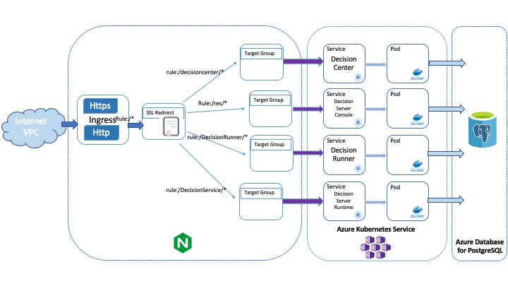

# Deploying IBM Operational Decision Manager on Azure AKS

This project demonstrates how to deploy an IBM® Operational Decision Manager (ODM) clustered topology on the Azure Kubernetes Service (AKS) cloud service. This deployment implements Kubernetes and Docker technologies.
Here is the home page of Microsoft Azure: https://portal.azure.com/#home



The ODM Docker material is available in Passport Advantage. It includes Docker container images and Helm chart descriptors.

## Included components
The project comes with the following components:
- [IBM Operational Decision Manager](https://www.ibm.com/support/knowledgecenter/en/SSQP76_8.10.x/welcome/kc_welcome_odmV.html)
- [Azure Database for PostgreSQL](https://docs.microsoft.com/en-us/azure/postgresql/)
- [Azure Kubernetes Service (AKS)](https://docs.microsoft.com/en-us/azure/aks/)
- [Network concepts for applications in AKS](https://docs.microsoft.com/en-us/azure/aks/concepts-network)

## Tested environment
The commands and tools have been tested on macOS and Linux.

## Prerequisites
First, install the following software on your machine:

* [Azure CLI](https://docs.microsoft.com/en-us/cli/azure/install-azure-cli?view=azure-cli-latest)
* [Helm v3](https://github.com/helm/helm/releases)

Then [create an Azure account and pay as you go](https://azure.microsoft.com/en-us/pricing/purchase-options/pay-as-you-go/).

## Steps to deploy ODM on Kubernetes from Azure AKS

- [Deploying IBM Operational Decision Manager on Azure AKS](#deploying-ibm-operational-decision-manager-on-azure-aks)
  * [Included components](#included-components)
  * [Tested environment](#tested-environment)
  * [Prerequisites](#prerequisites)
  * [Steps to deploy ODM on Kubernetes from Azure AKS](#steps-to-deploy-odm-on-kubernetes-from-azure-aks)
  * [Prepare your AKS instance (30 min)](#prepare-your-aks-instance--30-min-)
    + [Log in to Azure](#log-in-to-azure)
    + [Create a resource group](#create-a-resource-group)
    + [Create an AKS cluster](#create-an-aks-cluster)
    + [Set up your environment to this cluster](#set-up-your-environment-to-this-cluster)
  * [Create the PostgreSQL Azure instance (10 min)](#create-the-postgresql-azure-instance--10-min-)
    + [Create an Azure Database for PostgreSQL](#create-an-azure-database-for-postgresql)
    + [Create a firewall rule that allows access from Azure services](#create-a-firewall-rule-that-allows-access-from-azure-services)
  * [Prepare your environment for the ODM installation (20 min)](#prepare-your-environment-for-the-odm-installation--20-min-)
      - [Option A:  Using the IBM Entitled registry with your IBMid](#option-a---using-the-ibm-entitled-registry-with-your-ibmid)
      - [Option B:  Using the download archives from IBM Passport Advantage (PPA)](#option-b---using-the-download-archives-from-ibm-passport-advantage--ppa-)
    + [Create the datasource secrets for Azure PostgreSQL](#create-the-datasource-secrets-for-azure-postgresql)
    + [Manage a digital certificate (10 min)](#manage-a-digital-certificate--10-min-)
  * [Install an ODM Helm release and expose it with the service type LoadBalancer (10 min)](#install-an-odm-helm-release-and-expose-it-with-the-service-type-loadbalancer--10-min-)
    + [Allocate a public IP](#allocate-a-public-ip)
    + [Install the ODM release](#install-the-odm-release)
    + [Check the topology](#check-the-topology)
    + [Access ODM services](#access-odm-services)
  * [Install an ODM Helm release and expose it with an Ingress controller (15 min)](#install-an-odm-helm-release-and-expose-it-with-an-ingress-controller--15-min-)
    + [Create an Ingress controller](#create-an-ingress-controller)
    + [Create a Kubernetes secret for the TLS certificate](#create-a-kubernetes-secret-for-the-tls-certificate)
    + [Install the ODM release](#install-the-odm-release-1)
    + [Create an Ingress route](#create-an-ingress-route)
    + [Edit your /etc/hosts](#edit-your--etc-hosts)
    + [Access the ODM services](#access-the-odm-services)
      - [a. Check that ODM services are in NodePort type](#a-check-that-odm-services-are-in-nodeport-type)
      - [b. ODM services are available through the following URLs](#b-odm-services-are-available-through-the-following-urls)
  * [Troubleshooting](#troubleshooting)
  * [References](#references)
- [License](#license)

## Prepare your AKS instance (30 min)

Source: https://docs.microsoft.com/en-us/azure/aks/kubernetes-walkthrough

### Log in to Azure

After installing the Azure CLI, use the following command line:

```console
az login [--tenant <name>.onmicrosoft.com]
```

A Web browser opens where you can connect with your Azure credentials.

### Create a resource group

An Azure resource group is a logical group in which Azure resources are deployed and managed. When you create a resource group, you are asked to specify a location. This location is where resource group metadata is stored. It is also where your resources run in Azure, if you don't specify another region during resource creation. Create a resource group by running the `az group create` command.

```console
az group create --name odm-group --location francecentral [--tags Owner=pylochou@fr.ibm.com Team=DBA Usage=demo Usage_desc="Azure customers support" Delete_date=2021-02-15]
```

The following example output shows that the resource group has been created successfully:

```json
{
  "id": "/subscriptions/<guid>/resourceGroups/odm-group",
  "location": "francecentral",
  "managedBy": null,
  "name": "odm-group",
  "properties": {
    "provisioningState": "Succeeded"
  },
  "tags": null
}
```

### Create an AKS cluster

Use the `az aks create` command to create an AKS cluster. The following example creates a cluster named odm-cluster with two nodes. Azure Monitor for containers is also enabled using the `--enable-addons monitoring` parameter.  The operation takes several minutes to complete.

> Note:  During the creation of the AKS cluster, a second resource group is automatically created to store the AKS resources. For more information, see [Why are two resource groups created with AKS](https://docs.microsoft.com/en-us/answers/questions/25725/why-are-two-resource-groups-created-with-aks.html).

```console
az aks create --resource-group odm-group --name odm-cluster --node-count 2 \
          --location francecentral --enable-addons monitoring --generate-ssh-keys
```

After a few minutes, the command completes and returns JSON-formatted information about the cluster.  Make a note of the newly-created Resource Group that is displayed in the JSON output (e.g.: "nodeResourceGroup": "MC_odm-group_odm-cluster_francecentral") if you have to tag it, for instance:

```console
az group update --name MC_odm-group_odm-cluster_francecentral \
    --tags Owner=pylochou@fr.ibm.com Team=DBA Usage=demo Usage_desc="Azure customers support" Delete_date=2021-02-15
```

> Note:  By default, a Kubernetes cluster version 1.16 or higher is created.
       
### Set up your environment to this cluster

To manage a Kubernetes cluster, use kubectl, the Kubernetes command-line client. If you use Azure Cloud Shell, kubectl is already installed. To install kubectl locally, use the `az aks install-cli` command:

```console
az aks install-cli
```

To configure kubectl to connect to your Kubernetes cluster, use the `az aks get-credentials` command. This command downloads credentials and configures the Kubernetes CLI to use them.

```console
az aks get-credentials --resource-group odm-group --name odm-cluster
```

To verify the connection to your cluster, use the `kubectl get` command to return the list of cluster nodes.

```console
kubectl get nodes
```

The following example output shows the single node created in the previous steps. Make sure that the status of the node is Ready.

```console
NAME                                STATUS   ROLES   AGE   VERSION
aks-nodepool1-21196610-vmss000000   Ready    agent   97m   v1.17.13
aks-nodepool1-21196610-vmss000001   Ready    agent   97m   v1.17.13
```

To further debug and diagnose cluster problems, run the following command:

```console
kubectl cluster-info dump
```

## Create the PostgreSQL Azure instance (10 min)

### Create an Azure Database for PostgreSQL

Create an Azure Database for PostgreSQL server by running the `az postgres server create` command. A server can contain multiple databases.

```console
az postgres server create --resource-group odm-group --name odmpsqlserver \
                          --admin-user myadmin --admin-password 'passw0rd!' \
                          --sku-name GP_Gen5_2 --version 9.6 --location francecentral
```

> Note:  The PostgreSQL server name must be unique within Azure.

Verify the database.
To connect to your server, you need to provide host information and access credentials.

```console
az postgres server show --resource-group odm-group --name odmpsqlserver
```

Result:

```json
{
  "administratorLogin": "myadmin",
  "byokEnforcement": "Disabled",
  "earliestRestoreDate": "2020-07-13T06:59:05.050000+00:00",
  "fullyQualifiedDomainName": "odmpsqlserver.postgres.database.azure.com",
  "id": "/subscriptions/xxxx-xx-xxxx-beba-1a633f94cdaa/resourceGroups/odm-group/providers/Microsoft.DBforPostgreSQL/servers/odmpsqlserver",
  "identity": null,
  "infrastructureEncryption": "Disabled",
  "location": "francecentral",
  "masterServerId": "",
  "minimalTlsVersion": "TLSEnforcementDisabled",
  "name": "odmpsqlserver",
  "privateEndpointConnections": [],
  "publicNetworkAccess": "Enabled",
  "replicaCapacity": 5,
  "replicationRole": "None",
  "resourceGroup": "odm-group",
  "sku": {
    "capacity": 2,
    "family": "Gen5",
    "name": "GP_Gen5_2",
    "size": null,
    "tier": "GeneralPurpose"
  },
  "sslEnforcement": "Enabled",
  "storageProfile": {
    "backupRetentionDays": 7,
    "geoRedundantBackup": "Disabled",
    "storageAutogrow": "Enabled",
    "storageMb": 5120
  },
  "tags": null,
  "type": "Microsoft.DBforPostgreSQL/servers",
  "userVisibleState": "Ready",
  "version": "9.6"
}
```

Make a note of the server name that is displayed in the JSON output (e.g.: "fullyQualifiedDomainName": "odmpsqlserver.postgres.database.azure.com") as it will be used [later](#create-the-datasource-secrets-for-azure-postgresql).

###  Create a firewall rule that allows access from Azure services

To make sure your database and your AKS cluster can communicate, put in place firewall rules with the following command:

```console
az postgres server firewall-rule create -g odm-group -s odmpsqlserver \
            -n myrule --start-ip-address 0.0.0.0 --end-ip-address 255.255.255.255
```

## Prepare your environment for the ODM installation (20 min)

To get access to the ODM material, you must have an IBM entitlement registry key to pull the images from the IBM Entitled registry (option A) or download the ODM on Kubernetes package (.tgz file) from Passport Advantage® (PPA) and then push it to the Azure Container Registry (option B).

* To access image from IBM entitlement registry follow the instructions in the section [Create a pull secret to pull the ODM Docker images from the IBM Entitled Registry](#option-a--using-the-ibm-entitled-registry-with-your-ibmid)

* To push image in the Azure Container Registry follow the instructions in the section [Push the ODM images to the ACR (Azure Container Registry](#option-b--using-the-download-archives-from-ibm-passport-advantage-ppa)

#### Option A:  Using the IBM Entitled registry with your IBMid

Log in to [MyIBM Container Software Library](https://myibm.ibm.com/products-services/containerlibrary) with the IBMid and password that are associated with the entitled software.

In the Container software library tile, verify your entitlement on the View library page, and then go to Get entitlement key to retrieve the key.

Create a pull secret by running a kubectl create secret command.

```console
$ kubectl create secret docker-registry <REGISTRY_SECRET> --docker-server=cp.icr.io --docker-username=cp \
    --docker-password="<API_KEY_GENERATED>" --docker-email=<USER_EMAIL>
```

where:

* <REGISTRY_SECRET> is the secret name
* <API_KEY_GENERATED> is the entitlement key from the previous step. Make sure you enclose the key in double-quotes.
* <USER_EMAIL> is the email address associated with your IBMid.

> Note:  The cp.icr.io value for the docker-server parameter is the only registry domain name that contains the images. You must set the docker-username to cp to use an entitlement key as docker-password.

Make a note of the secret name so that you can set it for the image.pullSecrets parameter when you run a helm install of your containers.  The image.repository parameter will later be set to cp.icr.io/cp/cp4a/odm.

Add the public IBM Helm charts repository:

```console
helm repo add ibmcharts https://raw.githubusercontent.com/IBM/charts/master/repo/entitled
helm repo update
```

Check you can access ODM's chart

```console
helm search repo ibm-odm-prod
NAME                  	CHART VERSION	APP VERSION	DESCRIPTION                     
ibmcharts/ibm-odm-prod	20.3.0       	8.10.5.0   	IBM Operational Decision Manager
```

#### Option B:  Using the download archives from IBM Passport Advantage (PPA)

Prerequisites:  You must install Docker.

Download the IBM Operational Decision Manager chart and images from [IBM Passport Advantage (PPA)](https://www-01.ibm.com/software/passportadvantage/pao_customer.html).

Refer to the [ODM download document](https://www.ibm.com/support/pages/node/310661) to view the list of Passport Advantage eAssembly installation images.

Extract the file that contains both the Helm chart and the images.  The name of the file includes the chart version number:

```console
$ mkdir ODM-PPA
$ cd ODM-PPA
$ tar zxvf PPA_NAME.tar.gz
charts/ibm-odm-prod-20.3.0.tgz
images/odm-decisionserverconsole_8.10.5.0-amd64.tar.gz
images/odm-decisionserverruntime_8.10.5.0-amd64.tar.gz
images/odm-decisionrunner_8.10.5.0-amd64.tar.gz
images/odm-decisioncenter_8.10.5.0-amd64.tar.gz
images/dbserver_8.10.5.0-amd64.tar.gz
manifest.json
manifest.yaml
```

In order to load the container images from the extracted folder into your Docker registry, you must:

1. Create an [ACR registry](https://docs.microsoft.com/en-US/azure/container-registry/container-registry-get-started-azure-cli):

   ```console
   az acr create --resource-group odm-group --name <registryname> --sku Basic
   ```

   Make a note of the `loginServer` that will be displayed in the JSON output (e.g.: "loginServer": "registryodm.azurecr.io"):

   ```console
   export DOCKER_REGISTRY=<loginServer>
   ```

   > Note: The registry name must be unique within Azure.

2. Log in to the ACR registry

   ```console
   az acr login --name <registryname>
   ```

3. Load the container images into your internal Docker registry.

    ```console
    $ for name in images/*.tar.gz; do echo $name && docker image load --input $name ; done
    ```

  For more information, refer to the [ODM knowledge center](https://www.ibm.com/support/knowledgecenter/SSQP76_8.10.x/com.ibm.odm.kube/topics/tsk_config_odm_prod_kube.html).

4. Tag the images loaded locally with your registry name.

    ```console
    export ODM_VERSION=<ODM_VERSION>
    export IMAGE_TAG_NAME=${ODM_VERSION:-8.10.5.0}-amd64
    docker tag odm-decisionserverconsole:$IMAGE_TAG_NAME $DOCKER_REGISTRY/odm-decisionserverconsole:$IMAGE_TAG_NAME
    docker tag dbserver:$IMAGE_TAG_NAME $DOCKER_REGISTRY/dbserver:$IMAGE_TAG_NAME
    docker tag odm-decisioncenter:$IMAGE_TAG_NAME $DOCKER_REGISTRY/odm-decisioncenter:$IMAGE_TAG_NAME
    docker tag odm-decisionserverruntime:$IMAGE_TAG_NAME $DOCKER_REGISTRY/odm-decisionserverruntime:$IMAGE_TAG_NAME
    docker tag odm-decisionrunner:$IMAGE_TAG_NAME $DOCKER_REGISTRY/odm-decisionrunner:$IMAGE_TAG_NAME
    ```

5. Push the images to your registry.

    ```console
    docker push $DOCKER_REGISTRY/odm-decisioncenter:$IMAGE_TAG_NAME
    docker push $DOCKER_REGISTRY/odm-decisionserverconsole:$IMAGE_TAG_NAME
    docker push $DOCKER_REGISTRY/odm-decisionserverruntime:$IMAGE_TAG_NAME
    docker push $DOCKER_REGISTRY/odm-decisionrunner:$IMAGE_TAG_NAME
    docker push $DOCKER_REGISTRY/dbserver:$IMAGE_TAG_NAME
    ```

6. Create a registry key to access the ACR registry.  Refer to the [documentation](https://docs.microsoft.com/en-US/azure/container-registry/container-registry-tutorial-prepare-registry#enable-admin-account) to enable the registry's admin account and get the credentials in the Container registry portal, then:

    ```console
    kubectl create secret docker-registry registry-secret --docker-server="$DOCKER_REGISTRY" \
            --docker-username="<adminUsername>" --docker-password="<adminPassword>" \
            --docker-email="mycompany@email.com"
    ```

  Make a note of the secret name so that you can set it for the image.pullSecrets parameter when you run a helm install of your containers. The image.repository parameter must be set to \<loginServer\> (ie $DOCKER_REGISTRY).

### Create the datasource secrets for Azure PostgreSQL

Copy the files [ds-bc.xml.template](ds-bc.xml.template) and [ds-res.xml.template](ds-res.xml.template) on your local machine and rename them to `ds-bc.xml` and `ds-res.xml`.

 Replace the following placeholers:
- DBNAME : The database name
- USERNAME : The database username 
- PASSWORD : The database password
- SERVERNAME : The name of the database server

It should be something like in the following extract.

```xml
 <properties
  databaseName="postgres"
  user="myadmin@odmpsqlserver"
  password="passw0rd!"
  portNumber="5432"
  sslMode="require"
  serverName="odmpsqlserver.postgres.database.azure.com" />
```

Create a secret with this two modified files

```console
kubectl create secret generic customdatasource-secret \
        --from-file datasource-ds.xml=ds-res.xml --from-file datasource-dc.xml=ds-bc.xml
```

### Manage a digital certificate (10 min)

1. (Optional) Generate a self-signed certificate

If you do not have a trusted certificate, you can use OpenSSL and other cryptography and certificate management libraries to generate a certificate file and a private key, to define the domain name, and to set the expiration date. The following command creates a self-signed certificate (.crt file) and a private key (.key file) that accept the domain name *.mycompany.com*. The expiration is set to 1000 days:

```console
openssl req -x509 -nodes -days 1000 -newkey rsa:2048 -keyout mycompany.key \
        -out mycompany.crt -subj "/CN=*.mycompany.com/OU=it/O=mycompany/L=Paris/C=FR"
```

2. Generate a JKS version of the certificate to be used in the ODM container 

```console
$ openssl pkcs12 -export -passout pass:password -passin pass:password \
          -inkey mycompany.key -in mycompany.crt -name mycompany -out mycompany.p12
$ keytool -importkeystore -srckeystore mycompany.p12 -srcstoretype PKCS12 \
                          -srcstorepass password -destkeystore mycompany.jks \
                          -deststoretype JKS -deststorepass password
$ keytool -import -v -trustcacerts -alias mycompany -file mycompany.crt \
                  -keystore truststore.jks -storepass password -storetype jks -noprompt
```

3. Create a Kubernetes secret with the certificate

```console
kubectl create secret generic mycompany-secret --from-file=keystore.jks=mycompany.jks \
                                               --from-file=truststore.jks=truststore.jks \
                                               --from-literal=keystore_password=password \
                                               --from-literal=truststore_password=password
```

The certificate must be the same as the one you used to enable TLS connections in your ODM release. For more information, see [Defining the security certificate](https://www.ibm.com/support/knowledgecenter/SSQP76_8.10.x/com.ibm.odm.icp/topics/tsk_replace_security_certificate.html?view=kc) and [Working with certificates and SSL](https://www.ibm.com/links?url=https%3A%2F%2Fdocs.oracle.com%2Fcd%2FE19830-01%2F819-4712%2Fablqw%2Findex.html).

## Install an ODM Helm release and expose it with the service type LoadBalancer (10 min)

### Allocate a public IP

```console
 az aks update \
    --resource-group odm-group \
    --name odm-cluster \
    --load-balancer-managed-outbound-ip-count 4
```

### Install the ODM release

You can now install the product.

If you choose to use Entitled Registry for images and to download the Helm chart from IBM's public Helm charts repository [option A above](#option-a---using-the-ibm-entitled-registry-with-your-ibmid):

```console
helm install mycompany --set image.repository=cp.icr.io/cp/cp4a/odm --set image.pullSecrets=registry-secret \
                       --set image.arch=amd64 --set image.tag=${ODM_VERSION:-8.10.5.0} --set service.type=LoadBalancer \
                       --set externalCustomDatabase.datasourceRef=customdatasource-secret \
                       --set customization.securitySecretRef=mycompany-secret ibmcharts/ibm-odm-prod --version 20.3.0
```

If you downloaded the PPA archive and prefer to use the Helm chart archive from it [option B above](#option-b---using-the-download-archives-from-ibm-passport-advantage--ppa-):

```console
helm install mycompany --set image.repository=$DOCKER_REGISTRY --set image.pullSecrets=registry-secret \
                       --set image.arch=amd64 --set image.tag=${ODM_VERSION:-8.10.5.0} --set service.type=LoadBalancer \
                       --set externalCustomDatabase.datasourceRef=customdatasource-secret \
                       --set customization.securitySecretRef=mycompany-secret charts/ibm-odm-prod-20.3.0.tgz
```

> Remember:  If you choose to use the IBM Entitled registry, the `image.repository` must be set to cp.icr.io/cp/cp4a/odm.  If you choose to push the ODM images to the Azure Container Registry, the `image.repository` should be set to your `loginServer` value.

### Check the topology

Run the following command to check the status of the pods that have been created:

```console
kubectl get pods
NAME                                                   READY   STATUS    RESTARTS   AGE
mycompany-odm-decisioncenter-***                       1/1     Running   0          20m
mycompany-odm-decisionrunner-***                       1/1     Running   0          20m
mycompany-odm-decisionserverconsole-***                1/1     Running   0          20m
mycompany-odm-decisionserverruntime-***                1/1     Running   0          20m
```

### Access ODM services

By setting `service.type=LoadBalancer`, the services are exposed with a public IP to be accessed with the following command:

```console
kubectl get services
NAME                                        TYPE           CLUSTER-IP     EXTERNAL-IP       PORT(S)          AGE
kubernetes                                  ClusterIP      10.0.0.1       <none>            443/TCP          26h
mycompany-odm-decisioncenter                LoadBalancer   10.0.141.125   xxx.xxx.xxx.xxx   9453:31130/TCP   22m
mycompany-odm-decisionrunner                LoadBalancer   10.0.157.225   xxx.xxx.xxx.xxx   9443:31325/TCP   22m
mycompany-odm-decisionserverconsole         LoadBalancer   10.0.215.192   xxx.xxx.xxx.xxx   9443:32448/TCP   22m
mycompany-odm-decisionserverconsole-notif   ClusterIP      10.0.201.87    <none>            1883/TCP         22m
mycompany-odm-decisionserverruntime         LoadBalancer   10.0.177.153   xxx.xxx.xxx.xxx   9443:31921/TCP   22m
```

You can then open a browser on https://xxx.xxx.xxx.xxx:9443 to access Decision Server console, Decision Server Runtime, and Decision Runner, and on https://xxx.xxx.xxx.xxx:9453 to access Decision Center.

## Install an ODM Helm release and expose it with an Ingress controller (15 min)

This section explains how to expose the ODM services to Internet connectivity with Ingress. For reference, see the Microsoft Azure documentation https://docs.microsoft.com/en-US/azure/aks/ingress-own-tls.

### Create an Ingress controller

1. Create a namespace for your Ingress resources

    ```console
    kubectl create namespace ingress-basic
    ```

2. Add the official stable repository

    ```console
    helm repo add ingress-nginx https://kubernetes.github.io/ingress-nginx
    ```

3. Use Helm to deploy an NGINX Ingress controller

    ```console
    helm install nginx-ingress ingress-nginx/ingress-nginx \
      --namespace ingress-basic \
      --set controller.replicaCount=2 \
      --set controller.nodeSelector."beta\.kubernetes\.io/os"=linux \
      --set defaultBackend.nodeSelector."beta\.kubernetes\.io/os"=linux
    ```

4. Get the Ingress controller external IP address

    ```console
    kubectl get service -l app.kubernetes.io/name=ingress-nginx --namespace ingress-basic
    NAME                                               TYPE           CLUSTER-IP     EXTERNAL-IP    PORT(S)                      AGE
    nginx-ingress-ingress-nginx-controller             LoadBalancer   10.0.191.246   EXTERNAL-IP   80:30222/TCP,443:31103/TCP   3m8s
    nginx-ingress-ingress-nginx-controller-admission   ClusterIP      10.0.214.250   <none>         443/TCP                      3m8s
    ```

### Create a Kubernetes secret for the TLS certificate

For more informations see https://docs.microsoft.com/en-US/azure/aks/ingress-own-tls#create-kubernetes-secret-for-the-tls-certificate

You must create the appropriate certificate files: `mycompany.key` and `mycompany.crt`, as defined in [a. (Optional) Generate a self-signed certificate](#a-optional-generate-a-self-signed-certificate).
```console
kubectl create secret tls mycompany-tls --namespace ingress-basic --key mycompany.key --cert mycompany.crt
```

### Install the ODM release

You can now install the product.

If you choose to use Entitled Registry for images and to download the Helm chart from IBM's public Helm charts repository [option A above](#option-a---using-the-ibm-entitled-registry-with-your-ibmid):

```console
helm install mycompany --set image.repository=cp.icr.io/cp/cp4a/odm --set image.pullSecrets=registry-secret \
                       --set image.arch=amd64 --set image.tag=${ODM_VERSION:-8.10.5.0} \
                       --set externalCustomDatabase.datasourceRef=customdatasource-secret ibmcharts/ibm-odm-prod --version 20.3.0
```

If you downloaded the PPA archive and prefer to use the Helm chart archive from it [option B above](#option-b---using-the-download-archives-from-ibm-passport-advantage--ppa-):

```console
helm install mycompany --set image.repository=$DOCKER_REGISTRY --set image.pullSecrets=registry-secret \
                       --set image.arch=amd64 --set image.tag=${ODM_VERSION:-8.10.5.0} \
                       --set externalCustomDatabase.datasourceRef=customdatasource-secret charts/ibm-odm-prod-20.3.0.tgz
```

> Remember:  If you choose to use the IBM Entitled registry, the `image.repository` must be set to cp.icr.io/cp/cp4a/odm.  If you choose to push the ODM images to the Azure Container Registry, the `image.repository` should be set to your `loginServer` value.

### Create an Ingress route

Create a YAML file named `ingress-odm.yml`, as follows:

```yaml
apiVersion: extensions/v1beta1
kind: Ingress
metadata:
  name: mycompany
  namespace: ingress-basic
  annotations:
    kubernetes.io/ingress.class: nginx
    nginx.ingress.kubernetes.io/backend-protocol: "HTTPS"
    # Sticky session parameter needed for DecisionCenter see https://github.com/kubernetes/ingress-nginx/tree/master/docs/examples/affinity/cookie
    nginx.ingress.kubernetes.io/affinity: "cookie"
spec:
  tls:
  - hosts:
    - mycompany.com
    secretName: mycompany-tls
  rules:
  - host: mycompany.com
    http:
      paths:
      - path: /res
        backend:
          serviceName: mycompany-odm-decisionserverconsole
          servicePort: 9443
      - path: /DecisionService
        backend:
          serviceName: mycompany-odm-decisionserverruntime
          servicePort: 9443
      - path: /DecisionRunner
        backend:
          serviceName: mycompany-odm-decisionrunner
          servicePort: 9443
      - path: /decisioncenter
        backend:
          serviceName: mycompany-odm-decisioncenter
          servicePort: 9453
```

Apply an Ingress route:
```console
kubectl apply -f ingress-odm.yml
```

### Edit your /etc/hosts
```console
vi /etc/hosts
<EXTERNAL_IP> mycompany.com
```
### Access the ODM services

#### a. Check that ODM services are in NodePort type

```console
kubectl get services
NAME                                               TYPE           CLUSTER-IP     EXTERNAL-IP    PORT(S)                      AGE
mycompany-odm-decisioncenter                       NodePort       10.0.178.43    <none>         9453:32720/TCP               16m
mycompany-odm-decisionrunner                       NodePort       10.0.171.46    <none>         9443:30223/TCP               16m
mycompany-odm-decisionserverconsole                NodePort       10.0.106.222   <none>         9443:30280/TCP               16m
mycompany-odm-decisionserverconsole-notif          ClusterIP      10.0.115.118   <none>         1883/TCP                     16m
mycompany-odm-decisionserverruntime                NodePort       10.0.232.212   <none>         9443:30082/TCP               16m
nginx-ingress-ingress-nginx-controller             LoadBalancer   10.0.191.246   51.103.3.254   80:30222/TCP,443:31103/TCP   3d
nginx-ingress-ingress-nginx-controller-admission   ClusterIP      10.0.214.250   <none>         443/TCP                      3d
```

#### b. ODM services are available through the following URLs

| SERVICE NAME | URL | USERNAME/PASSWORD |
| --- | --- | --- |
| Decision Server Console | https://mycompany.com/res | odmAdmin/odmAdmin |
| Decision Center | https://mycompany.com/decisioncenter | odmAdmin/odmAdmin |
| Decision Server Runtime | https://mycompany.com/DecisionService | odmAdmin/odmAdmin |
| Decision Runner | https://mycompany.com/DecisionRunner | odmAdmin/odmAdmin |

## Troubleshooting

If your ODM instances are not running properly, check the logs by running the following command:
```console
kubectl logs <your-pod-name>
```

## References
https://docs.microsoft.com/en-US/azure/aks/

https://docs.microsoft.com/en-US/azure/aks/ingress-own-tls

https://docs.microsoft.com/en-US/azure/container-registry/container-registry-get-started-azure-cli

# License
[Apache 2.0](LICENSE)
