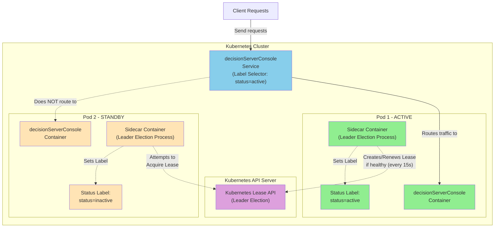

# High Availability RES Console

This article explains how to have more than one RES console in a deployment of Operational Decision Manager on Certified Kubernetes to achieve High Availability.

## Introduction

The solution relies on additional processes that orchestrate which 'decisionServerConsole' pod gets to be active and switch to another pod whenever the active pod becomes unhealthy.

There is one such additional process in each 'decisionServerConsole' pod. The process runs in its own container (called a 'sidecar' container).

The leader election relies on the Kubernetes [Lease](https://kubernetes.io/docs/concepts/architecture/leases/) API. The first pod to create the Lease object gets to become the active pod, and remains active unless it fails to renew its ownership over the Lease object which expires every 15 seconds (configurable).

The active pod is flagged with a `status` label set to `active`. The 'decisionServerConsole' services send the requests only to the pod that has this label set to `active`.


This article walks you through the steps to deploy ODM that way.

## Prerequisites

You need to install either:
- [Helm v3](https://helm.sh/docs/v3/intro/install/) and [kustomize](https://kubectl.docs.kubernetes.io/installation/kustomize/)

or
- [Helm v4](https://helm.sh/docs/intro/install/) and [yq](https://github.com/mikefarah/yq/#install)

## Setup

### 1. Configuration

#### 1.1 Set the current directory

In the rest of the article, the current directory is expected to be `HA-res-console`:
```shell
cd contrib/HA-res-console
```

#### 1.2 Set environment variables

```shell
# change with the name of the Helm deployment to be created
HELM_RELEASE='active-res'

# change with the name of Service Account to be created
SERVICEACCOUNT="custom-service-account"

# change with the name of an different namespace if needed
NAMESPACE="odm"
```

#### 1.3 Create a namespace (optional)

If the namespace does not exists yet, run the command below to create it:

```bash
kubectl create ns ${NAMESPACE}
```

#### 1.4 Create a Service Account

Run the commands below to create a new Service Account and grants it access to the leases API and the pods API with the minimal permissions needed:

```shell
kubectl create serviceaccount ${SERVICEACCOUNT} -n ${NAMESPACE}
kubectl create role        lease-access-role --verb=get,patch,create,delete --resource=leases -n ${NAMESPACE}
kubectl create role          pod-access-role --verb=get,patch               --resource=pods   -n ${NAMESPACE}
kubectl create rolebinding lease-binding     --role=lease-access-role --serviceaccount=${NAMESPACE}:${SERVICEACCOUNT} -n ${NAMESPACE}
kubectl create rolebinding   pod-binding     --role=pod-access-role   --serviceaccount=${NAMESPACE}:${SERVICEACCOUNT} -n ${NAMESPACE}
```

#### 1.5 Create the pull secret

You need an IBM entitlement key to pull the container images from the IBM Entitled Registry.

- Log in to [MyIBM Container Software Library](https://myibm.ibm.com/products-services/containerlibrary) with the IBMid and password that are associated with the entitled software.

- In the Container software library tile, verify your entitlement on the **View library** page, and then go to **Get entitlement key** to retrieve the key.

To create the pull secret, run:

```shell
kubectl create secret docker-registry ibm-entitlement-key \
        --docker-server=cp.icr.io \
        --docker-username=cp \
        --docker-password="<YOUR_ENTITLEMENT_KEY>" \
        -n ${NAMESPACE}
```

#### 1.6 Create the sidecar secret

When the active pod changes, the [`leader-election.sh`](leader-election.sh) script can update the list of ruleapps and rulesets in the RES console that becomes active.

Otherwise the RES console that becomes active might not display the up to date list of ruleapps and rulesets, and a manual update is needed by running the command "Update RuleApps" in the "Server Info" tab.

To enable this automatic update, the script expects credentials to connect to the RES console in basic auth. The account only needs the `resMonitor` role.

Please define those credentials in the lines below in [`leader-election.sh`](leader-election.sh) or set them empty if you prefer to disable this automatic update:
```shell
# optionally specify credentials to connect to the RES console in order to update the list of ruleapps & rulesets when a pod becomes active (and was inactive previously)
RESMONITOR_USER="resMonitor"    # change with your actual credentials
RESMONITOR_PWD="odmAdmin"       # or leave it empty to disable the update
```

Then run the command below to create the secret that configures the sidecar container in the 'decisionServerConsole' pods:

```shell
kubectl create secret generic res-console-sidecar \
  --from-file=sidecar-start.sh=./leader-election.sh \
  --from-file=sidecar-liveness-probe.sh=./sidecar-liveness-probe.sh
```

> [!WARNING]
> Please note that the statistics displayed in the RES console (number of executions, errors, average execution time, ...) are kept in memory only.
So they are lost when the active 'decisionServiceConsole' pod changes. 

#### 1.7 Add IBM Helm charts repository

Add IBM Helm charts repository to the repositories that Helm uses by running:

```shell
helm repo add ibm-helm https://raw.githubusercontent.com/IBM/charts/master/repo/ibm-helm
helm repo update
```

You can then check that Helm can find the `ibm-odm-prod` chart:

```shell
helm search repo ibm-odm-prod
```
```shell
NAME                  	CHART VERSION   APP VERSION     DESCRIPTION
ibm-helm/ibm-odm-prod	26.0.0          9.6.0.0        IBM Operational Decision Manager
```

#### 1.8 Install the Helm plugin (only if you use Helm v4)

Run the command below to install the Helm plugin **only if you use Helm version 4**.
```shell
helm plugin install ./plugin
```
```
Installing plugin from local directory (development mode)
Installed plugin: ha-res-console
```
> Note 1: This plugin is used when running `helm install` (thanks to the option `--post-renderer <plugin-name>`) to post-process the manifests created by Helm in order to:
> - set the replica count to 2 in the 'decisionServerConsole' Deployment
> - set `automountServiceAccountToken` to `true` in the 'decisionServerConsole' Deployment (needed to use the Kubernetes API from within the pod)
> - let the 'decisionServerConsole' Services send all the requests only to the active 'decisionServerConsole' pod

> Note 2: If you use Helm version 3, no plugin is required even though a post-processing is performed too when running `helm install`. But in this version of Helm, the option `--post-renderer` expects the path of a script instead.

### 2. Deploy ODM

#### 2.1. Edit values.yaml and adjust the values if needed

You can use the Helm chart parameters file [`values.yaml`](values.yaml) to deploy ODM quickly or use your own parameters file.

If you choose to use your own parameters file, make sure that: 
1. the `serviceAccountName` parameter is present and references the custom Service Account
1. the `sidecar` parameters are present and reference the secret created

```yaml
serviceAccountName: "custom-service-account" # make sure this is the name of the custom service account

decisionServerConsole:
  sidecar:
    enabled: true
    confSecretRef: res-console-sidecar
    probes:
      livenessProbe:
        exec:
          command:
          - /tmp/sidecarconf/sidecar-liveness-probe.sh
        initialDelaySeconds: 30
        periodSeconds: 30
        timeoutSeconds: 5
        successThreshold: 1
        failureThreshold: 3
```


#### 2.2. Deploy ODM

Run one of the command below to deploy ODM, depending on your version of Helm:
- for Helm v3:
  ```shell
  helm install ${HELM_RELEASE} ibm-helm/ibm-odm-prod --post-renderer ./kustomize.sh -f values.yaml
  ```

- for Helm v4:
  ```shell
  helm install ${HELM_RELEASE} ibm-helm/ibm-odm-prod --post-renderer ha-res-console -f values.yaml
  ```

After a few minutes, ODM should be up and running.

#### 2.3. Check which pod is active

You can check which pod is active by running:
```
kubectl get pods --label-columns=status
```

which outputs:
```
NAME                                                   READY   STATUS    RESTARTS   AGE   STATUS
active-res-dbserver-7d5f4fc5f5-t84d5                    1/1     Running   0          26m   
active-res-odm-decisioncenter-d69bd7bd7-5g75h           1/1     Running   0          26m   
active-res-odm-decisionrunner-84574db5f4-vvvdz          1/1     Running   0          26m   
active-res-odm-decisionserverconsole-75c688dd6-9spdv    2/2     Running   0          26m   inactive
active-res-odm-decisionserverconsole-75c688dd6-kg8mt    2/2     Running   0          26m   active
active-res-odm-decisionserverruntime-5f567dddb7-p8pz5   1/1     Running   0          26m   
```

You can also check the logs from the sidecar containers by running:

```shell
kubectl logs --selector="run=${HELM_RELEASE}-odm-decisionserverconsole" --container sidecar --prefix=true --follow
```

You should see messages such as:

```log
[pod/active-res-odm-decisionserverconsole-75c688dd6-9spdv/sidecar] 01/13/26 13:18:17 Starting leader election for pod: active-res-odm-decisionserverconsole-75c688dd6-9spdv in namespace: odm (Lease name: decisionserverconsole-lease) - checking every 5s...
[pod/active-res-odm-decisionserverconsole-75c688dd6-9spdv/sidecar] 01/13/26 13:18:17 the main container is not ready
[pod/active-res-odm-decisionserverconsole-75c688dd6-kg8mt/sidecar] 01/13/26 13:18:17 Starting leader election for pod: active-res-odm-decisionserverconsole-75c688dd6-kg8mt in namespace: odm (Lease name: decisionserverconsole-lease) - checking every 5s...
[pod/active-res-odm-decisionserverconsole-75c688dd6-kg8mt/sidecar] 01/13/26 13:18:17 the main container is not ready
[pod/active-res-odm-decisionserverconsole-75c688dd6-kg8mt/sidecar] 01/13/26 13:18:27 the main container is not ready
[pod/active-res-odm-decisionserverconsole-75c688dd6-9spdv/sidecar] 01/13/26 13:18:27 the main container is not ready
[pod/active-res-odm-decisionserverconsole-75c688dd6-kg8mt/sidecar] 01/13/26 13:18:36 the main container is not ready
[pod/active-res-odm-decisionserverconsole-75c688dd6-9spdv/sidecar] 01/13/26 13:18:36 the main container is not ready
[pod/active-res-odm-decisionserverconsole-75c688dd6-kg8mt/sidecar] 01/13/26 13:18:42 the main container is not ready
[pod/active-res-odm-decisionserverconsole-75c688dd6-9spdv/sidecar] 01/13/26 13:18:45 the main container is not ready
[pod/active-res-odm-decisionserverconsole-75c688dd6-kg8mt/sidecar] 01/13/26 13:18:51 the main container is not ready. Starting buffering identical messages (will issue one msg every 15 minutes).
[pod/active-res-odm-decisionserverconsole-75c688dd6-9spdv/sidecar] 01/13/26 13:18:52 the main container is not ready. Starting buffering identical messages (will issue one msg every 15 minutes).
[pod/active-res-odm-decisionserverconsole-75c688dd6-kg8mt/sidecar] 01/13/26 13:18:59 Successfully acquired leadership (created new lease)
[pod/active-res-odm-decisionserverconsole-75c688dd6-kg8mt/sidecar] 01/13/26 13:18:59 >>> THIS POD IS NOW THE ACTIVE LEADER <<<
[pod/active-res-odm-decisionserverconsole-75c688dd6-kg8mt/sidecar] 01/13/26 13:18:59 Set the 'status' label of the pod to 'active'
[pod/active-res-odm-decisionserverconsole-75c688dd6-9spdv/sidecar] 01/13/26 13:19:01 Lease is held by active-res-odm-decisionserverconsole-75c688dd6-kg8mt (not expired)
[pod/active-res-odm-decisionserverconsole-75c688dd6-9spdv/sidecar] 01/13/26 13:19:01 >>> This pod is now inactive (standby) <<<
[pod/active-res-odm-decisionserverconsole-75c688dd6-9spdv/sidecar] 01/13/26 13:19:01 Set the 'status' label of the pod to 'inactive'
[pod/active-res-odm-decisionserverconsole-75c688dd6-kg8mt/sidecar] 01/13/26 13:19:04 Successfully renewed leadership
[pod/active-res-odm-decisionserverconsole-75c688dd6-kg8mt/sidecar] 01/13/26 13:19:09 Successfully renewed leadership
[pod/active-res-odm-decisionserverconsole-75c688dd6-9spdv/sidecar] 01/13/26 13:19:10 Lease is held by active-res-odm-decisionserverconsole-75c688dd6-kg8mt (not expired)
[pod/active-res-odm-decisionserverconsole-75c688dd6-kg8mt/sidecar] 01/13/26 13:19:15 Successfully renewed leadership
[pod/active-res-odm-decisionserverconsole-75c688dd6-9spdv/sidecar] 01/13/26 13:19:19 Lease is held by active-res-odm-decisionserverconsole-75c688dd6-kg8mt (not expired)
[pod/active-res-odm-decisionserverconsole-75c688dd6-kg8mt/sidecar] 01/13/26 13:19:20 Successfully renewed leadership
[pod/active-res-odm-decisionserverconsole-75c688dd6-kg8mt/sidecar] 01/13/26 13:19:25 Successfully renewed leadership. Starting buffering identical messages (will issue one msg every 15 minutes).
[pod/active-res-odm-decisionserverconsole-75c688dd6-9spdv/sidecar] 01/13/26 13:19:28 Lease is held by active-res-odm-decisionserverconsole-75c688dd6-kg8mt (not expired)
[pod/active-res-odm-decisionserverconsole-75c688dd6-9spdv/sidecar] 01/13/26 13:19:38 Lease is held by active-res-odm-decisionserverconsole-75c688dd6-kg8mt (not expired)
[pod/active-res-odm-decisionserverconsole-75c688dd6-9spdv/sidecar] 01/13/26 13:19:47 Lease is held by active-res-odm-decisionserverconsole-75c688dd6-kg8mt (not expired). Starting buffering identical messages (will issue one msg every 15 minutes).
[pod/active-res-odm-decisionserverconsole-75c688dd6-kg8mt/sidecar] 01/13/26 13:34:28 Successfully renewed leadership (msg issued 173 times in the last 15 minutes)
[pod/active-res-odm-decisionserverconsole-75c688dd6-9spdv/sidecar] 01/13/26 13:34:52 Lease is held by active-res-odm-decisionserverconsole-75c688dd6-kg8mt (not expired) (msg issued 119 times in the last 15 minutes)
```
