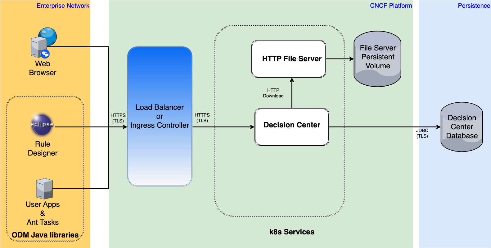

# Setup an Httpd file server

For several ODM on k8s use-cases, there is the need to provide some downloadable material.
It's the case if you want to download a different driver than the one provided by default.

It's also needed when you want to customize Decision Center using the **decisionCenter.downloadUrl** helm chart parameter.

If you don't have on your kubernetes environment an available FTP server, or an other solution in order to propose to your ODM instance some downloadable URL, we explain below how to setup an Apache HTTP Server with upload/download capabilities using the [Bitnami HTTP Server Helm Chart](https://artifacthub.io/packages/helm/bitnami/apache)   

Obviously the following solution is a proposition and can be modified according to the real use-case.



Install the Bitnami Helm Chart

```bash
helm repo add bitnami https://charts.bitnami.com/bitnami
helm repo update 
```

Get the [httpd.conf](./httpd.conf) file and create the configmap to provide the httpd.conf configuration file that activate the Dav module.

```bash
kubectl create configmap httpd-cm --from-file=httpd.conf
```

It's the default Apache **httpd.conf** file with the following modifications :

- 1/ Activation of the Dav module with :

```
LoadModule dav_module modules/mod_dav.so 
LoadModule dav_fs_module modules/mod_dav_fs.so
```

- 2/ Creation of a Dav lock DB directory :

```
DavLockDB /tmp/lock
```

- 3/ Enabling Dav in the default root directory :

```
DocumentRoot "/opt/bitnami/apache/htdocs"
<Directory "/opt/bitnami/apache/htdocs"> 
Dav On
...
</Directory>
```

Get the [httpd-pvc.yaml](./httpd-pvc.yaml) file and create a PVC to persist all the downloads, by adapting the storage.

```bash
kubectl create -f httpd-pvc.yaml
```

Get the [httpd-values.yaml](./httpd-values.yaml) file and instanciate the Apache Http file server :

```bash
helm install fileserver bitnami/apache -f httpd-values.yaml
```

[Optional] Expose the service

The service exposition is optional. It's only needed if you want to manage an upload on the file server using an external URL.
On several platform like AWS EKS, a cluster external access is provided.
For OCP, if you want to create a route providing a public URL, you have to do :

```bash
oc expose svc fileserver-apache
```

If you are on OCP, you can get the fileserver route URL to upload the sample jar or zip file :

```bash
curl -T <sample-file> http://<fileserver-url>
```

It must generates the following output when the file is correctly uploaded.

```bash
<!DOCTYPE HTML PUBLIC "-//W3C//DTD HTML 4.01//EN" "http://www.w3.org/TR/html4/strict.dtd">
<html>
<head>
<title>201 Created</title>
</head><body>
<h1>Created</h1>
<p>Resource /<sample-file> has been created.</p>
</body></html>
```

If, for security reason, it's not allowed to expose the service, you can directly copy the **sample-file** on the file server pod after a cluster login :

```bash
kubectl cp <sample-file> <namespace>/<file-server-pod-name>:/opt/bitnami/apache/htdocs/<sample-file> -n <namespace>
```

You can check the download URL from a container inside the same cluster :

```bash
curl http://fileserver-apache.<namespace>.svc.cluster.local:80/<sample-file> -o <sample-file>
```

> [!IMPORTANT]
> Pay attention to manage downloads with a size adapted to the Decision Center ephemeral storage to avoid a pod eviction. 


