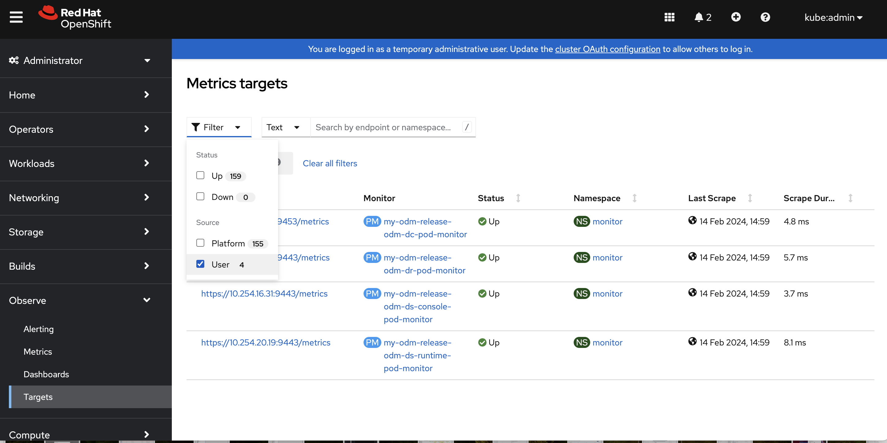
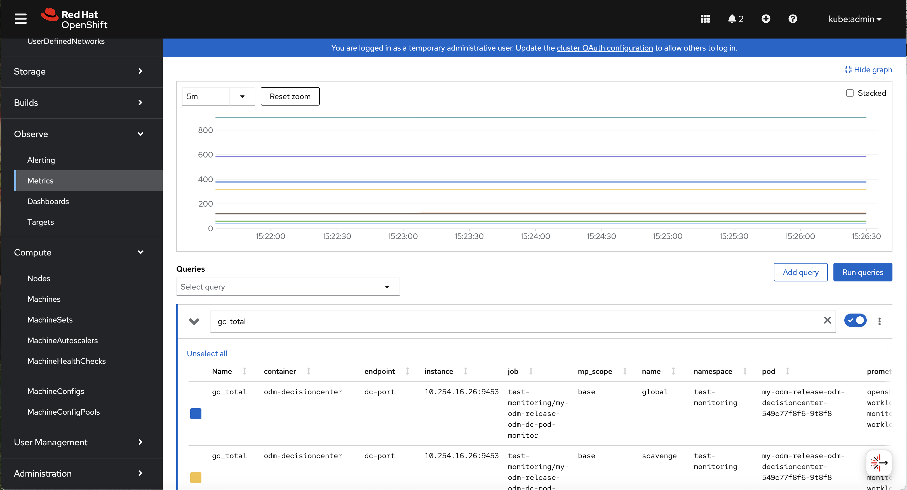

# Monitor ODM liberty metrics with mpMetrics and Prometheus

The aim of this tutorial is to explain how to expose ODM Liberty metrics provided by mpMetrics using Prometheus on an Openshift cluster. 

## What is Prometheus ?

Prometheus stores its data in time-series databases, which allow for easy querying and aggregation of data over time. It uses a pull modeling approach, where it periodically queries the target systems to collect their metrics. These metrics are then stored in Prometheus time-series database and can be used for monitoring, alerting, and visualization.

Prometheus is supported natively in OpenShift.

## What is mpMetrics Liberty feature ?

The MicroProfile mpMetrics Liberty feature provides a /metrics endpoint from which you can access all metrics that are emitted by the Liberty server and deployed applications. When the application runs, you can view your metrics from any browser by accessing the endpoint.

## Prerequisites

- [Helm 3.1](https://helm.sh/docs/intro/install/)
- Access to an Operational Decision Manager product
- Access to an Openshift cluster

## How to expose ODM metrics in OCP

### Create a secret to use the Entitled Registry

1. To get your entitlement key, log in to [MyIBM Container Software Library](https://myibm.ibm.com/products-services/containerlibrary) with the IBMid and password that are associated with the entitled software.

    In the **Container software library** tile, verify your entitlement on the **View library** page, and then go to **Get entitlement key**  to retrieve the key.

2. Create a pull secret by running a `kubectl create secret` command.

    ```
    $ kubectl create secret docker-registry icregistry-secret \
        --docker-server=cp.icr.io \
        --docker-username=cp \
        --docker-password="<API_KEY_GENERATED>" \
        --docker-email=<USER_EMAIL>
    ```

    Where:

    - *API_KEY_GENERATED* is the entitlement key from the previous step. Make sure you enclose the key in double-quotes.
    - *USER_EMAIL* is the email address associated with your IBMid.

    > Note: The **cp.icr.io** value for the docker-server parameter is the only registry domain name that contains the images. You must set the *docker-username* to **cp** to use an entitlement key as *docker-password*.

3. Make a note of the secret name so that you can set it for the **image.pullSecrets** parameter when you run a helm install of your containers. The **image.repository** parameter is later set to *cp.icr.io/cp/cp4a/odm*.

### Create a secret to configure mpMetrics

Get the [monitor.xml](./monitor.xml) file that is containing a minimal mpMetrics liberty configuration. You can add your own configuration using [liberty documentation](https://openliberty.io/docs/23.0.0.12/reference/config/mpMetrics.html)

Create the monitor-secret

  ```shell
  kubectl create secret generic monitor-secret --from-file=monitor.xml
  ``` 

## Install your ODM Helm release

### 1. Add the public IBM Helm charts repository

  ```shell
  helm repo add ibm-helm https://raw.githubusercontent.com/IBM/charts/master/repo/ibm-helm
  helm repo update
  ```

### 2. Check that you can access the ODM chart

  ```shell
  helm search repo ibm-odm-prod
  NAME                  	CHART VERSION	APP VERSION	DESCRIPTION
  ibm-helm/ibm-odm-prod	        24.0.0       	9.0.0.0   	IBM Operational Decision Manager
  ```

### 3. Run the `helm install` command

You can now install the product. We will use the PostgreSQL internal database and disable data persistence (`internalDatabase.persistence.enabled=false`) to avoid any platform complexity with persistent volume allocation.

See the [Preparing to install](https://www.ibm.com/docs/en/odm/8.12.0?topic=production-preparing-install-operational-decision-manager) documentation for more information.

  ```shell
  helm install my-odm-release ibm-helm/ibm-odm-prod \
          --set image.repository=cp.icr.io/cp/cp4a/odm --set image.pullSecrets=icregistry-secret \
          --set license=true --set usersPassword=odmAdmin \
          --set internalDatabase.persistence.enabled=false \
          --set customization.monitorRef=monitor-secret \
          --set internalDatabase.runAsUser='' --set customization.runAsUser='' --set service.enableRoute=true
  ```

### 4. Check the /metrics endpoints

As the installation has been done using **customization.monitorRef**, all ODM components are exposing metrics. So, you can check all /metrics endpoints exposed by the routes.
On OpenShift you can get the route names and hosts with:

    ```
    kubectl get routes --no-headers --output custom-columns=":metadata.name,:spec.host"
    ```

    You get the following hosts:
    ```
    my-odm-release-odm-dc-route           <DC_HOST>
    my-odm-release-odm-dr-route           <DR_HOST>
    my-odm-release-odm-ds-console-route   <DS_CONSOLE_HOST>
    my-odm-release-odm-ds-runtime-route   <DS_RUNTIME_HOST>
    ```

    Check all metrics endpoints using the following URL in a browser or with command line:
    ```
    curl -k https://<DC_HOST>/metrcis
    curl -k https://<DR_HOST>/metrics
    curl -k https://<DS_CONSOLE_HOST>/metrics
    curl -k https://<DS_RUNTIME_HOST>/metrics
    ```

    You should get a view of all Liberty metrics that will be accessible in Prometheus:
    ```
    # TYPE base_gc_total counter
    # HELP base_gc_total Displays the total number of collections that have occurred. This attribute lists -1 if the collection count is undefined for this collector.
    base_gc_total{name="global"} 30
    base_gc_total{name="scavenge"} 157
    ...
    # TYPE vendor_connectionpool_waitTime_total_seconds gauge
    # HELP vendor_connectionpool_waitTime_total_seconds The total wait time on all connection requests since the start of the server.
    vendor_connectionpool_waitTime_total_seconds{datasource="jdbc_ilogDataSource"} 0.0
    ```

## Explose metrics in OCP

### Enable Monitoring

Follow the OCP documentation explaining how to [enable monitoring for user-defined projects](https://docs.openshift.com/container-platform/4.14/monitoring/enabling-monitoring-for-user-defined-projects.html) 

If you are logged as the kubeadmin user, creating the [enableMetricsConfigMap.yaml](./enableMetricsConfigMap.yaml) configmap is enough:

    ```
    kubectl create -f enableMetricsConfigMap.yaml
    ```
### Check that ODM targets are available

The ODM Helm chart instance has created a PodMonitor k8s resource that you can retrieve now in the OCP dashboard.
 > Drill at Observe > Target
 > Click on Filter and check **User**
 
You should see the 4 ODM metrics endpoints

 

### Consume Metrics

Drill at Observe > metrics
You can now use any kind of available metrics using a query.
For example put **base_gc_total** in the **Expression** field and click on the **Run queries** button.




