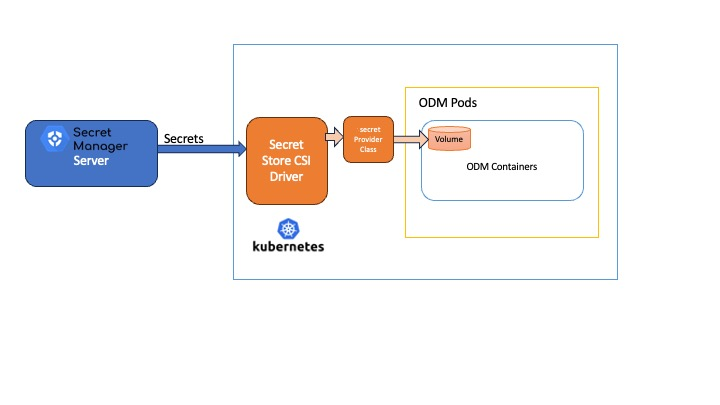

# Introduction

In the rapidly evolving world of Kubernetes (K8s), securing sensitive information remains a paramount concern. Traditional methods, like using K8s secrets, often fall short in providing the necessary security measures.

This article delves into a more robust solution: integrating IBM's Operation Decision Manager (ODM) with external secrets stores supported by the [Secrets Store CSI Driver](https://secrets-store-csi-driver.sigs.k8s.io/).

Why this integration? K8s secrets, while convenient, are sometimes deemed insufficient for high-security environments.

The integration of the ODM running on Kubernetes with an external secret store via the Secrets Store CSI Driver offers a more secure and efficient way to handle sensitive data.

This article guides you through the setup and configuration process, ensuring a secure and streamlined integration of these powerful technologies.

We will use [Hashicorp Vault as secrets store](https://developer.hashicorp.com/vault/tutorials/kubernetes/kubernetes-secret-store-driver) and OpenShift Container Platform (OCP) as a Kubernetes cluster for this article.

# Architecture

The Container Storage Interface (CSI) pattern is essentially a standardized approach for connecting block or file storage to containers. This standard is adopted by various storage providers.

On Kubernetes, the Secrets Store CSI Driver operates as a DaemonSet. It interacts with each Kubelet instance on the Kubernetes nodes. When a pod initiates, this driver liaises with the external secrets provider to fetch secret data. The accompanying diagram demonstrates the functionality of the Secrets Store CSI Driver within Kubernetes.

The architecture diagram illustrates the integration process between the Secret Manager Server and IBM Operation Decision Manager (ODM) pods within a Kubernetes environment using the Secrets Store CSI Driver.



- **Secret Manager Server**: It functions as the central repository for all secrets data, securely managing sensitive information.

- **Secrets Data**: Labeled clearly, this represents the actual sensitive information that needs to be securely managed and injected into the ODM Pods.

- **Secrets Provider Class**: Definition of the data that should be injected in the ODM Pods.

- **Secret Store CSI Driver**:
  - It acts as a secure bridge between the Secret Manager Server and the Kubernetes cluster.
  - It's in charge of safely transmitting the secrets data to the ODM Pods within Kubernetes.

- **Kubernetes**:  It's the container orchestration system where the ODM application is deployed.

- **ODM Pods**:
  - Detailed within the Kubernetes rectangle, showcasing the components that make up the ODM Pods:

    - **Volume**:
      - Represented by the cylinder within the ODM Pods.
      - This is where the secrets data is stored after retrieval.

    - **ODM Containers**:
      - The main containers running the ODM application.
      - They utilize the secrets data stored in the volume for secure operations and configuration.

The diagram visually represents the secure flow of secrets data from the central manager to the ODM application in Kubernetes, facilitated by the Secret Store CSI Driver, ensuring best practices in secret management.

This documentation is based on an external HashiCorp Vault instance which hosts a few secrets needed by ODM's deployment. The differences with other Secrets stores will be highlighted.

## Prerequisites

HashiCorp Vault must be up and running. An [on-prem installation description](README-External_Vault.md) is provided (with hints about the Secrets Store CSI driver and the HashiCorp Vault provider installation) but of course you can use your own instance.

* [Secrets Store CSI Driver](https://secrets-store-csi-driver.sigs.k8s.io/) already installed.
* [HashiCorp Vault provider driver](https://developer.hashicorp.com/vault/tutorials/kubernetes/kubernetes-secret-store-driver) already installed
* [Helm](https://helm.sh/docs/intro/install/)
* Access to Operational Decision Manager on Container 9.0.0.0 images

> Note: The first and second steps are described in the [companion document](README-External_Vault.md) when you use OCP.

In this documentation ODM will be installed in the "odm" namespace.

# HashiCorp Vault setup

## Log into HashiCorp Vault server

Please refer to the [separate document](README-External_Vault.md) if you don't have such a secrets store already available.

Most following commands require you are connected already to your secrets store:

```bash
export VAULT_ADDR=http://<serverfqdn>:8200
vault login
```

## Define RBAC on HashiCorp Vault

Create the `odm-policy` policy that enables the read capability for secrets at path `secret/data/`:

```bash
vault policy write odm-policy - <<EOF
path "secret/data/*" {
  capabilities = ["read"]
}
EOF
```

Create an authentication role which assigns the policy created to above to some `odm-sa` service account in the namespace `odm` on your OCP cluster:

```bash
vault write auth/<clustername>/role/database \
    bound_service_account_names=odm-sa \
    bound_service_account_namespaces=odm \
    policies=odm-policy \
    ttl=24h
```

# ODM setup

## Prepare your environment for the ODM installation

A few mandatory items have to be created so that ODM can be deployed.

### Namespace

Create an ODM project and the Service Account already described in the [companion document](README-External_Vault.md):

```bash
oc new-project odm
oc create serviceaccount odm-sa
```

### Image pull secret

To get access to the ODM material, you need an IBM entitlement key to pull the images from the IBM Entitled Registry.

- Log in to [MyIBM Container Software Library](https://myibm.ibm.com/products-services/containerlibrary) with the IBMid and password that are associated with the entitled software.

- In the Container software library tile, verify your entitlement on the **View library** page, and then go to **Get entitlement key** to retrieve the key.

Create a pull secret by running a kubectl create secret command:

```bash
oc create secret docker-registry <REGISTRY_SECRET> \
    --docker-server=cp.icr.io \
    --docker-username=cp \
    --docker-password="<API_KEY_GENERATED>" \
    --docker-email=<USER_EMAIL>
```

Where:

* `<REGISTRY_SECRET>` is the secret name.
* `<API_KEY_GENERATED>` is the entitlement key from the previous step. Make sure you enclose the key in double-quotes.
* `<USER_EMAIL>` is the email address associated with your IBMid.

> NOTE:  The `cp.icr.io` value for the docker-server parameter is the only registry domain name that contains the images. You must set the docker-username to `cp` to use an entitlement key as docker-password.

Take note of the secret name so that you can set it for the *image.pullSecrets* parameter when you run a helm install command of your containers.  The *image.repository* parameter will later be set to `cp.icr.io/cp/cp4a/odm`.

***However, as the goal of this article is to eliminate the need for secrets, refer to the Kubernetes implementation to understand the alternative methods. For example, the OpenShift documentation on this topic can be found [here](https://docs.openshift.com/container-platform/4.14/openshift_images/managing_images/using-image-pull-secrets.html#images-update-global-pull-secret_using-image-pull-secrets)***

### IBM Helm charts repository

Add the public IBM Helm charts repository to your environment:

```bash
helm repo add ibm-helm https://raw.githubusercontent.com/IBM/charts/master/repo/ibm-helm
helm repo update
```

Check that you can access ODM charts:

```bash
helm search repo ibm-odm-prod
NAME                  	CHART VERSION   APP VERSION     DESCRIPTION
ibm-helm/ibm-odm-prod   24.0.0       	  9.0.0           IBM Operational Decision Manager
```

### Data to be injected in the pods

To manage this process, the SecretProviderClass Custom Resource Definition (CRD) is utilized. Within this provider class, it's necessary to specify the address of the secure secret store and the locations of the secret keys. The following is the SecretProviderClass (SPC) for our specific case, which involves using HashiCorp Vault deployed on Kubernetes.

As an example, we have populated some data. You will need to adjust it according to your needs.

First create the username and associated password used to connect to the internal database:

```bash
vault kv put <secretspath>/db-pass db-password="postgrespwd" db-user="postgresuser"
```

Please refer to the secrets store provider for the syntax.

```yaml
apiVersion: secrets-store.csi.x-k8s.io/v1
kind: SecretProviderClass
metadata:
  name: odmdbsecret
spec:
  provider: vault
  parameters:
    vaultAddress: http://<vaultfqdn>:8200
    roleName: database
    objects: |
      - objectName: "db-password"
        secretPath: "<secretspath>/data/db-pass"
        secretKey: "db-password"
      - objectName: "db-user"
        secretPath: "<secretspath>/data/db-pass"
        secretKey: "db-user"
```

Save the content in a serviceproviderclass.yaml file and create the SecretProviderClass:

```bash
oc apply -f serviceproviderclass.yaml
```

> The exact syntax of the SPC depends on the Secrets store provider. The example given above corresponds to HashiCorp Vault, but the "parameters" syntax can differ greatly according to the provider. For instance Google Secret Manager relies on [other keys](https://github.com/GoogleCloudPlatform/secrets-store-csi-driver-provider-gcp/blob/main/examples/app-secrets.yaml.tmpl).

It replaces the Kubernetes Secret that would have been created with (don't do that here!):

```shell
kubectl create secret generic odmdbsecret --from-literal=db-user=myadmin@mypostgresqlserver \
                                          --from-literal=db-password='passw0rd!'
```

or:

```yaml
apiVersion: v1
kind: Secret
metadata:
  name: odmdbsecret
data:
  db-password: cGFzc3cwcmQh
  db-user: bXlhZG1pbkBteXBvc3RncmVzcWxzZXJ2ZXI=
```

Note the equivalence between the key data.db-user (for instance) in the Secret and the key spec.parameters.objects[].secretKey = "db-user" in the SecretProviderClass. It corresponds to the db-user key in the secret/db-pass you created previously with the `vault kv put` command.

(Optional) Generate a self-signed certificate.

If you do not have a trusted certificate, you can use OpenSSL and other cryptography and certificate management libraries to generate a certificate file and a private key, to define the domain name, and to set the expiration date. The following command creates a self-signed certificate (.crt file) and a private key (.key file) that accept the domain name *myodmcompany.com*. The expiration is set to 1000 days:

```shell
openssl req -x509 -nodes -days 1000 -newkey rsa:2048 -keyout myodmcompany.key \
        -out myodmcompany.crt -subj "/CN=myodmcompany.com/OU=it/O=myodmcompany/L=Paris/C=FR" \
        -addext "subjectAltName = DNS:myodmcompany.com"
```

> [!NOTE]
> You can use -addext only with actual OpenSSL and from LibreSSL 3.1.0.

Upload your self-signed certificate to your Vault:

```shell
vault kv put <secretspath>/myodmcompany.com tls.crt=@myodmcompany.crt  tls.key=@myodmcompany.key
```

and create the corresponding SPC:

```yaml
apiVersion: secrets-store.csi.x-k8s.io/v1
kind: SecretProviderClass
metadata:
  name: myodmcompanytlssecret
spec:
  provider: vault
  parameters:
    vaultAddress: http://<vaultfqdn>:8200
    roleName: database
    objects: |
      - objectName: "tls.crt"
        secretPath: "<secretspath>/data/myodmcompany.com/tls.crt"
        secretKey: "tls.crt"
      - objectName: "tls.key"
        secretPath: "<secretspath>/data/myodmcompany.com/tls.key"
        secretKey: "tls.key"
```

It replaces the K8s secret that would have been created with (again, don't do that here!):

```shell
kubectl create secret generic <myodmcompanytlssecret> --from-file=tls.crt=myodmcompany.crt --from-file=tls.key=myodmcompany.key
```

The certificate must be the same as the one you used to enable TLS connections in your ODM release. For more information, see [Server certificates](https://www.ibm.com/docs/en/odm/8.12.0?topic=servers-server-certificates).

## ODM installation with Basic authentication (10 min)

1. Edit the values-default-vault.yaml and adjust the values.

2. Run Helm deployment with the CSI driver:

```bash
helm install odm-vault-spc ibm-helm/ibm-odm-prod -f values-default-vault.yaml
```

After a few minutes, ODM should be up and running without using any secrets for installation.

> An example with more secrets hosted by an external Vault is described in our [Vault with initContainer contrib](../vault-initcontainer/README.md).

# Reference: Secrets that you can get from your secrets store with SPC

| Secret name |
| ----------- |
| customization.authSecretRef
| customization.baiEmitterSecretRef
| customization.securitySecretRef
| customization.usageMeteringSecretRef
| externalCustomDatabase.datasourceRef
| externalDatabase.decisionCenter.sslSecretRef
| externalDatabase.decisionServer.secretCredentials
| externalDatabase.decisionServer.sslSecretRef
| externalDatabase.secretCredentials
| externalDatabase.sslSecretRef
| internalDatabase.secretCredentials
| oidc.clientRef
| service.ingress.tlsSecretRef
