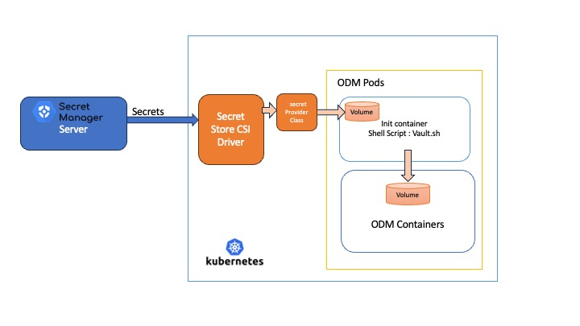

# Introduction

In the rapidly evolving world of Kubernetes (K8s), securing sensitive information remains a paramount concern. Traditional methods, like using K8s secrets, often fall short in providing the necessary security measures.

This article delves into a more robust solution: integrating IBM's Operation Decision Manager (ODM) with external secret stores supported by the [Secrets Store CSI Driver](https://secrets-store-csi-driver.sigs.k8s.io/).

Why this integration? K8s secrets, while convenient, are sometimes deemed insufficient for high-security environments.

The integration of the ODM running on Kubernetes with Vault via the Secrets Store CSI Driver offers a more secure and efficient way to handle sensitive data.

On the ODM on Kubernetes side, we introduce an init container - a specialized container that sets up the necessary environment before the main container runs. In this init container, we inject the Vault CSI volume. This approach allows us to craft a shell script, which is then executed within the init container, to seamlessly transfer the files into the ODM containers.

This article guides you through the setup and configuration process, ensuring a secure and streamlined integration of these powerful technologies.
We will used [Hashicorp Vault as secret store](https://developer.hashicorp.com/vault/tutorials/kubernetes/kubernetes-secret-store-driver) for this article.

> Alternatively, you may consider our [Secrets Store setup](../secrets-store/README.md) as another secure method for managing secrets with a Vault Secret manager.  This option is designed to minimize configuration efforts and reduce the workload on your part. We encourage you to explore both configurations to identify which setup aligns better with your operational needs and simplicity preferences.

# Architecture
The Container Storage Interface (CSI) pattern is essentially a standardized approach for connecting block or file storage to containers. This standard is adopted by various storage providers.

On Kubernetes, the Secrets Store CSI Driver operates as a DaemonSet. It interacts with each Kubelet instance on the Kubernetes nodes. When a pod initiates, this driver liaises with the external secrets provider to fetch secret data. The accompanying diagram demonstrates the functionality of the Secrets Store CSI Driver within Kubernetes.


The architecture diagram illustrates the integration process between the Secret Manager Server and IBM Operation Decision Manager (ODM) pods within a Kubernetes environment using the Secrets Store CSI Driver.


- **Secret Manager Server**: It functions as the central repository for all secrets data, securely managing sensitive information.

- **Secrets Data**: Labeled clearly, this represents the actual sensitive information that needs to be securely managed and injected into the ODM Pods.

- **Secrets Provider Class**: Definition of the data that should be injected in the ODM Pods.

- **Secret Store CSI Driver**:
  - It acts as a secure bridge between the Secret Manager Server and the Kubernetes cluster.
  - It's in charge of safely transmitting the secrets data to the ODM Pods within Kubernetes.

- **Kubernetes**:  It's the container orchestration system where the ODM application is deployed.

- **ODM Pods**:
  - Detailed within the Kubernetes rectangle, showcasing the components that make up the ODM Pods:
    - **Init Container**:
      - A temporary container that runs a shell script ('Vault.sh') before the main ODM Containers start. See the sample [vault.sh](configmap/vault.sh) script for more details.
      - It's responsible for retrieving the secrets data from the Secret Store CSI Driver and placing it into a shared volume.
    - **Volume**:
      - Represented by the two smaller rectangles within the ODM Pods.
      - This is where the secrets data is stored after retrieval, accessible by both the init container and the ODM Containers.
    - **ODM Containers**:
      - The main containers running the ODM application.
      - They utilize the secrets data stored in the volume for secure operations and configuration. An empty directory ephemeral storage is used to transmit the data between the containers.

The diagram visually represents the secure flow of secrets data from the central manager to the ODM application in Kubernetes, facilitated by the Secret Store CSI Driver, ensuring best practices in secret management.


## Pre-requisite
   * Harshicorp Instance evaluation setup and running. Tutorial can found [here](https://developer.hashicorp.com/vault/tutorials/kubernetes/kubernetes-secret-store-driver).
   * [Vault client](https://developer.hashicorp.com/vault/install)
   * [Helm v3](https://helm.sh/docs/intro/install/)
   * [Kustomize](https://github.com/kubernetes-sigs/kustomize/releases)
   * Operational Decision Manager on Container 9.0.0.0

> Note: This documentation has been tested with a HashiCorp evaluation instance. We assume that the procedure will remain the same for the commercial product.

In this documentation will do the assumption that :
   * Vault Server is installed in the vault namespace.
   * ODM will be installed in the odm namespace.

# Setup
## 1. Initialize Vault server for ODM (10 min)
### a. Configure Kubernetes authentication in the Vault server
Vault provides a Kubernetes authentication method that enables clients to authenticate with a Kubernetes Service Account Token. This token is provided to each pod when it is created.

```bash
oc exec -ti vault-0 --namespace vault -- sh
```

Then,

```bash
vault auth enable kubernetes
vault write auth/kubernetes/config \
    token_reviewer_jwt="$(cat /var/run/secrets/kubernetes.io/serviceaccount/token)" \
    kubernetes_host="https://$KUBERNETES_PORT_443_TCP_ADDR:443"
vault create token
```


### b. Setup `vault` command line for the next steps.
```bash
export VAULT_ADDR=http://$(oc get route vault -n vault -o jsonpath='{.spec.host}')
vault login
```

- Define the `odm-policy` policy that enables the read capability for secrets at path `secret/data/`

```bash
vault policy write odm-policy - <<EOF
path "secret/data/*" {
  capabilities = ["read"]
}
EOF
```

- Create a Kubernetes authentication role

```bash
vault write auth/kubernetes/role/database \
    bound_service_account_names=odm-sa \
    bound_service_account_namespaces=odm \
    policies=odm-policy \
    ttl=24h
```

### c. Populate the secrets in the vault

As an example, we have populated some data. You will need to adjust it according to your needs.

```bash
export VAULT_ADDR=http://$(oc get route vault --no-headers -o custom-columns=HOST:.spec.host)
vault kv put secret/privatecertificates tls.crt=@vaultdata/mycompany.crt  tls.key=@vaultdata/mycompany.key
vault kv put secret/trustedcertificates digicert.crt=@vaultdata/digicert.crt microsoft.crt=@vaultdata/microsoft.crt
vault kv put secret/db-pass db-password="postgrespwd" db-user="postgresuser"
```


## 3. Prepare your environment for the ODM installation (10 min)

To get access to the ODM material, you need an IBM entitlement key to pull the images from the IBM Entitled Registry.

### a. Create an ODM namespace

```bash
kubectl create ns odm
```

### b. Retrieve your entitled registry key

- Log in to [MyIBM Container Software Library](https://myibm.ibm.com/products-services/containerlibrary) with the IBMid and password that are associated with the entitled software.

- In the Container software library tile, verify your entitlement on the **View library** page, and then go to **Get entitlement key** to retrieve the key.

### c. Create a pull secret by running a kubectl create secret command.

In a standard ODM on Kubernetes installation, the procedure for creating a pull secret involves the following instructions

```bash
kubectl create secret docker-registry <REGISTRY_SECRET> \
        --docker-server=cp.icr.io \
        --docker-username=cp \
        --docker-password="<API_KEY_GENERATED>" \
        --docker-email=<USER_EMAIL> -n odm
```

Where:

* `<REGISTRY_SECRET>` is the secret name.
* `<API_KEY_GENERATED>` is the entitlement key from the previous step. Make sure you enclose the key in double-quotes.
* `<USER_EMAIL>` is the email address associated with your IBMid.

> NOTE:  The `cp.icr.io` value for the docker-server parameter is the only registry domain name that contains the images. You must set the docker-username to `cp` to use an entitlement key as docker-password.

Take note of the secret name so that you can set it for the *image.pullSecrets* parameter when you run a helm install command of your containers.  The *image.repository* parameter will later be set to `cp.icr.io/cp/cp4a/odm`.

***However, as the goal of this article is to eliminate the need for secrets, refer to the Kubernetes implementation to understand the alternative methods. For example, the OpenShift documentation on this topic can be found [here](https://docs.openshift.com/container-platform/4.14/openshift_images/managing_images/using-image-pull-secrets.html#images-update-global-pull-secret_using-image-pull-secrets)***

### d. Add the public IBM Helm charts repository

```
helm repo add ibm-helm https://raw.githubusercontent.com/IBM/charts/master/repo/ibm-helm
helm repo update
```

### e. Check you can access ODM charts

```
helm search repo ibm-odm-prod
NAME                  	CHART VERSION   APP VERSION     DESCRIPTION
ibm-helm/ibm-odm-prod	24.0.0          9.0.0.0        IBM Operational Decision Manager
```


### f. Define the data that will be injected in the pods.

To manage this process, the SecretProviderClass Custom Resource Definition (CRD) is utilized. Within this provider class, it's necessary to specify the address of the secure secret store and the locations of the secret keys. The following is the SecretProviderClass for our specific case, which involves using HashiCorp Vault deployed on Kubernetes.
Please refer to the implement secret store provider for the syntax.
```yaml
apiVersion: secrets-store.csi.x-k8s.io/v1
kind: SecretProviderClass
metadata:
  name: vault-database
spec:
  provider: vault
  parameters:
    vaultAddress: http://vault:8200
    roleName: database
    objects: |
      - objectName: "db-password"
        secretPath: "secret/data/db-pass"
        secretKey: "db-password"
      - objectName: "db-user"
        secretPath: "secret/data/db-pass"
        secretKey: "db-user"
      - objectName: "automation.crt"
        secretPath: "secret/data/trustedcertificates"
        secretKey: "automationcloud.crt"
      - objectName: "tls.crt"
        secretPath: "secret/data/privatecertificates"
        secretKey: "tls.crt"
      - objectName: "tls.key"
        secretPath: "secret/data/privatecertificates"
        secretKey: "tls.key"
```
Save the content in a serviceproviderclass.yaml file

### g. Create the service account and the config map that contain the vault.sh script

```
echo "Create the service account"
kubectl apply -f service-account.yaml -n odm
echo "Create the configmap that countains the vault.sh script"
kubectl create cm vaultcm --from-file=./configmap -n odm
echo "Create the SecretProviderClass"
oc apply -f serviceproviderclass.yaml -n odm
```

## ODM installation with Basic authentication (10 min)

1. Edit the values-default-vault.yaml and adjust the values.

2. Kustomize helm deployment with the csi driver

```bash
helm template odm-vault-kust -n odm ibm-helm/ibm-odm-prod -f values-default-vault.yaml > odm-template-nocsi.yaml && kustomize build -o odm-csi.yaml && kubectl apply -f odm-csi.yaml
```
The Kustomize script allows the injection of the CSIDriver volume into the custom-init-container.

After a few minutes, ODM should be up and running without using any secrets for installation.

## ODM installation with OpenID third party provider (10 min)

If you wish to deploy ODM with an OpenID provider, you should follow this procedure:

1. **Assumptions:** This guide assumes that you have successfully completed the previous steps and have the necessary OpenID files required for configuring ODM with an OpenID provider.
2. **Navigate to the openid Directory:**
   Execute the following command to change to the OpenID directory:
```bash
cd openid
```
4. Place your ODM OpenID configuration files in the ***vaultdata*** directory. The following files should be included: `openIdParameters.properties`, `openIdWebSecurity.xml`, `webSecurity.xml`, `OdmOidcProvidersAzureAD.json`.
5. Push these files into the vault:
```bash
echo "Push the OpenID files into the vault"
vault kv put secret/oidc openIdParameters.properties=@vaultdata/openIdParameters.properties openIdWebSecurity.xml=@vaultdata/openIdWebSecurity.xml webSecurity.xml=@vaultdata/webSecurity.xml OdmOidcProvidersAzureAD.json=@vaultdata/OdmOidcProvidersAzureAD.json
```
5. Apply the new service provider class with these files:
```bash
echo "Apply the new Provider with additional entries"
oc apply -f serviceproviderclass.yaml
```
7. Deploy ODM with OpenID
If you have already deployed ODM, you may need to delete the previous deployment:
```bash
 kubectl delete -f ../odm-csi.yaml
```
Then you can generate the new template with OIDC enabled
```bash
echo "Generate the new ODM template with OIDC"
helm template odm-vault-oidc -n odm ibm-helm/ibm-odm-prod -f values-default-vault.yaml > odm-template-nocsi.yaml && kustomize build -o odm-csi.yaml && kubectl apply -f odm-csi.yaml
```

