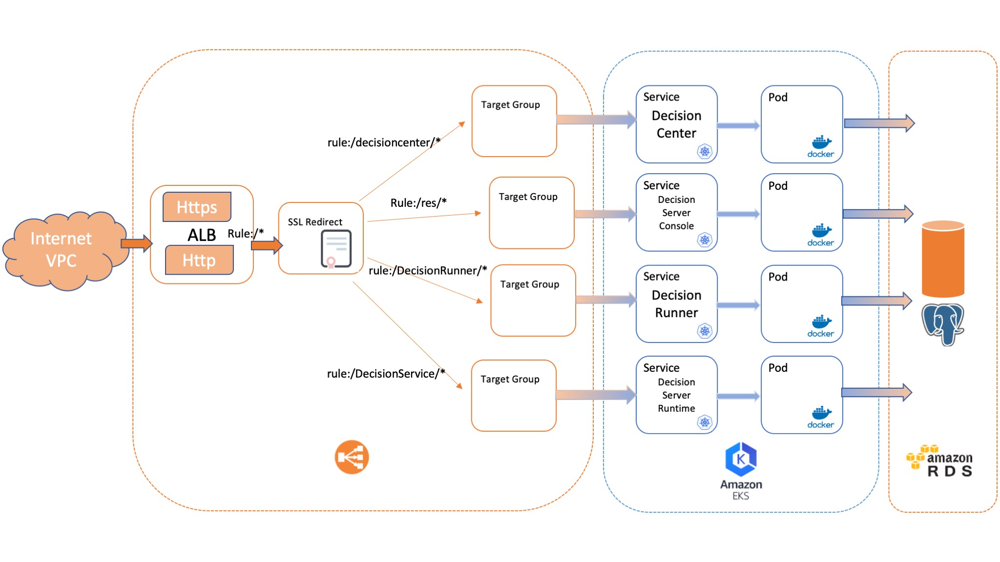

# Deploying IBM Operational Decision Manager on Amazon EKS

This project demonstrates how to deploy an IBM® Operational Decision Manager (ODM) clustered topology on the Amazon Elastic Kubernetes Service (EKS) cloud service. This deployment implements Kubernetes and Docker technologies.



The ODM Docker material is available in Passport Advantage. It includes Docker container images and Helm chart descriptors.

## Included components
The project uses the following components:
- [IBM Operational Decision Manager](https://www.ibm.com/support/knowledgecenter/en/SSQP76_8.10.x/com.ibm.odm.kube/kc_welcome_odm_kube.html)
- [Amazon Elastic Kubernetes Service (Amazon EKS)](https://aws.amazon.com/eks/)
- [Amazon Elastic Container Registry (Amazon ECR) ](https://aws.amazon.com/ecr/)
- [Amazon Relational Database Service (Amazon RDS) ](https://aws.amazon.com/rds/)
- [Amazon Application Load Balancer(ALB)](https://aws.amazon.com/elasticloadbalancing/?nc=sn&loc=0)

## Tested environment
The commands and tools have been tested on MacOS and linux.

## Prerequisites
First, install the following software on your machine:
* [AWS CLI](https://docs.aws.amazon.com/cli/latest/userguide/cli-chap-install.html)
* [Helm](https://github.com/helm/helm/releases)
* [Kubectl](https://kubernetes.io/docs/tasks/tools/install-kubectl/)

Then, create an  [AWS Account](https://aws.amazon.com/getting-started/?sc_icontent=awssm-evergreen-getting_started&sc_iplace=2up&trk=ha_awssm-evergreen-getting_started&sc_ichannel=ha&sc_icampaign=evergreen-getting_started)

## Steps to deploy ODM on Kubernetes from Amazon EKS

1. [Prepare your environment (40 min)](#1-prepare-your-environment-40-min)
2. [Prepare your environment for the ODM installation (25 min)](#2-prepare-your-environment-for-the-odm-installation-25-min)
3. [Create an RDS database (20 min)](#3-create-an-rds-database-20-min)
4. [Manage a  digital certificate (10 min)](#4-manage-a-digital-certificate-10-min)
5. [Install an ODM release (10 min)](#5-install-an-ibm-operational-decision-manager-release-10-min)
6. [Access the ODM services](#6-access-the-odm-services)

For more information, see [Getting started with Amazon EKS](https://docs.aws.amazon.com/eks/latest/userguide/getting-started.html)


### 1. Prepare your environment (40 min)
#### a. Create an EKS cluster (30 min)
    Follow the documentation [here](https://docs.aws.amazon.com/eks/latest/userguide/create-cluster.html)

> NOTE: Use Kubernetes version 1.15 or higher.
       
 
#### b. Set up your environment (10 min)
 - [Configure the AWS CLI](https://docs.aws.amazon.com/cli/latest/userguide/cli-chap-configure.html)

   ```bash
   $ aws configure 
   ```

 - [Create a kubeconfig for Amazon EKS](https://docs.aws.amazon.com/eks/latest/userguide/create-kubeconfig.html)

   ```bash
   $  aws eks --region <region> update-kubeconfig --name odm
   ```

 - Check your environment

   If your environment is set up correctly, you should be able to get the cluster information by running the following command:

   ```bash
   $ kubectl cluster-info
     Kubernetes master is running at https://xxxxxx.yl4.<region>.eks.amazonaws.com
     CoreDNS is running at https://xxxxx.yl4.<region>.eks.amazonaws.com/api/v1/namespaces/kube-system/services/kube-dns:dns/proxy

     Metrics-server is running at https://xxxxx.yl4.<region>.eks.amazonaws.com/api/v1/namespaces/kube-system/services/https:metrics-server:/proxy
   ```

To further debug and diagnose cluster problems, run the command:
```
kubectl cluster-info dump
```


### 2. Prepare your environment for the ODM installation (25 min)

To get access to the ODM material, you must have an IBM entitlement registry key to pull the images from the IBM Entitled registry (option A) or you can download the ODM on Kubernetes package (.tgz file) from Passport Advantage® (PPA) and then push the contained images to the EKS Container Registry (option B).

* To access the images from IBM entitlement registry, follow the instructions in the section [Using the IBM Entitled registry with your IBMid](#option-a--using-the-ibm-entitled-registry-with-your-ibmid)

* To download the PPA and push the images in the AWS Container Registry, follow the instructions in the section [Push the ODM images to the ECR (EKS Container Registry](#option-b--using-the-download-archives-from-ibm-passport-advantage-ppa)

#### Option A:  Using the IBM Entitled registry with your IBMid

#### a. Retrieve your entitled registry key
  - Log in to [MyIBM Container Software Library](https://myibm.ibm.com/products-services/containerlibrary) with the IBMid and password that are associated with the entitled software.

  - In the Container software library tile, verify your entitlement on the View library page, and then go to *Get entitlement key* to retrieve the key.

#### b. Create a pull secret by running a kubectl create secret command.

```console
$ kubectl create secret docker-registry <REGISTRY_SECRET> --docker-server=cp.icr.io \
    --docker-username=cp --docker-password="<API_KEY_GENERATED>" --docker-email=<USER_EMAIL>
```

where:
* <REGISTRY_SECRET> is the secret name
* <API_KEY_GENERATED> is the entitlement key from the previous step. Make sure you enclose the key in double-quotes.
* <USER_EMAIL> is the email address associated with your IBMid.

> Note: The `cp.icr.io` value for the docker-server parameter is the only registry domain name that contains the images. You must set the docker-username to `cp` to use an entitlement key as docker-password.

Make a note of the secret name so that you can set it for the `image.pullSecrets` parameter when you run a helm install of your containers. The `image.repository` parameter will later be set to `cp.icr.io/cp/cp4a/odm`.

#### c. Add the public IBM Helm charts repository:

```console
helm repo add ibmcharts https://raw.githubusercontent.com/IBM/charts/master/repo/entitled
helm repo update
```

#### d. Check you can access ODM's chart

```console
helm search repo ibm-odm-prod
NAME                  	CHART VERSION	APP VERSION	DESCRIPTION                     
ibmcharts/ibm-odm-prod	20.3.0       	8.10.5.0   	IBM Operational Decision Manager
```

You can now proceed to the [Create an RDS database (20 min)](#3-create-an-rds-database-20-min).

#### Option B: Using the downloaded archives from IBM Passport Advantage (PPA)

Prerequisites:
- Install Docker

Here we are using the [ECR registry](https://docs.aws.amazon.com/AmazonECR/latest/userguide/what-is-ecr.html).
If you use another public registry, skip this section and go to [step c](#c-load-the-odm-images-locally).

#### a. Log in to the [ECR registry](https://docs.aws.amazon.com/AmazonECR/latest/userguide/Registries.html)

```bash
$ aws ecr get-login-password --region <region> | docker login --username AWS --password-stdin <aws_account_id>.dkr.ecr.<region>.amazonaws.com
```

#### b. Create the [ECR repository instances](https://docs.aws.amazon.com/AmazonECR/latest/userguide/repository-create.html)
 
> NOTE: You must create one repository per image.

```bash
export REGION=<region>
aws ecr create-repository --repository-name odm-decisioncenter --image-scanning-configuration scanOnPush=true --region $REGION
aws ecr create-repository --repository-name odm-decisionrunner --image-scanning-configuration scanOnPush=true --region $REGION
aws ecr create-repository --repository-name odm-decisionserverruntime --image-scanning-configuration scanOnPush=true --region $REGION
aws ecr create-repository --repository-name odm-decisionserverconsole --image-scanning-configuration scanOnPush=true --region $REGION
aws ecr create-repository --repository-name dbserver --image-scanning-configuration scanOnPush=true --region $REGION
```

#### c. Load the ODM images locally

 - Download the latest IBM Operational Decision Manager chart and images from [IBM Passport Advantage (PPA)](https://www-01.ibm.com/software/passportadvantage/pao_customer.html).

   Refer to the [ODM download document](https://www.ibm.com/support/pages/node/310661) to view the list of Passport Advantage eAssembly installation images.

 - Extract the .tgz archives to your local file system.

    Extract the file that contains both the Helm chart and the images. The name of the file includes the chart version number:

    ```console
    $ mkdir ODM-PPA
    $ cd ODM-PPA
    $ tar zxvf PPA_NAME.tar.gz
    charts/ibm-odm-prod-20.3.0.tgz
    images/odm-decisionserverconsole_8.10.5.0-amd64.tar.gz
    images/odm-decisionserverruntime_8.10.5.0-amd64.tar.gz
    images/odm-decisionrunner_8.10.5.0-amd64.tar.gz
    images/odm-decisioncenter_8.10.5.0-amd64.tar.gz
    images/dbserver_8.10.5.0-amd64.tar.gz
    manifest.json
    manifest.yaml
    ```

- Check that you can run a docker command.
    ```bash
    $ docker ps
    ```

- Load the images to your local registry.

    ```bash
    $ for name in images/*.tar.gz; do echo $name && docker image load --input $name; done
    ```

   For more information, refer to the [ODM knowledge center](https://www.ibm.com/support/knowledgecenter/SSQP76_8.10.x/com.ibm.odm.kube/topics/tsk_config_odm_prod_kube.html).  
     
#### d. Tag and push the images to the ECR registry

- Tag the images to the ECR registry previously created

    ```bash
    export REGION=<region>
    export AWSACCOUNTID=<AWS-AccountId>
    docker tag odm-decisioncenter:8.10.5.0-amd64 $AWSACCOUNTID.dkr.ecr.$REGION.amazonaws.com/odm-decisioncenter:8.10.5.0-amd64
    docker tag odm-decisionserverruntime:8.10.5.0-amd64 $AWSACCOUNTID.dkr.ecr.$REGION.amazonaws.com/odm-decisionserverruntime:8.10.5.0-amd64
    docker tag odm-decisionserverconsole:8.10.5.0-amd64 $AWSACCOUNTID.dkr.ecr.$REGION.amazonaws.com/odm-decisionserverconsole:8.10.5.0-amd64
    docker tag odm-decisionrunner:8.10.5.0-amd64 $AWSACCOUNTID.dkr.ecr.$REGION.amazonaws.com/odm-decisionrunner:8.10.5.0-amd64
    docker tag dbserver:8.10.5.0-amd64 $AWSACCOUNTID.dkr.ecr.$REGION.amazonaws.com/dbserver:8.10.5.0-amd64
    ```

- Push the images to the ECR registry
 
    ```bash
    docker push $AWSACCOUNTID.dkr.ecr.$REGION.amazonaws.com/odm-decisioncenter:8.10.5.0-amd64
    docker push $AWSACCOUNTID.dkr.ecr.$REGION.amazonaws.com/odm-decisionserverconsole:8.10.5.0-amd64
    docker push $AWSACCOUNTID.dkr.ecr.$REGION.amazonaws.com/odm-decisionserverruntime:8.10.5.0-amd64
    docker push $AWSACCOUNTID.dkr.ecr.$REGION.amazonaws.com/odm-decisionrunner:8.10.5.0-amd64
    docker push $AWSACCOUNTID.dkr.ecr.$REGION.amazonaws.com/dbserver:8.10.5.0-amd64
    ```

#### e. Create a pull secret for the ECR registry  

```bash
$ kubectl create secret docker-registry ecrodm --docker-server=<AWS-AccountId>.dkr.ecr.<region>.amazonaws.com --docker-username=AWS --docker-password=$(aws ecr get-login-password --region <region>)
```
> NOTE: `ecrodm` is the name of the secret that will be used to pull the images in EKS.


### 3. Create an RDS database (20 min)

This project uses PostgreSQL but the procedure is valid for any database supported by ODM.
 
To set up the database, follow the procedure described here [RDS PostgreSQL database](https://docs.aws.amazon.com/AmazonRDS/latest/UserGuide/USER_CreateDBInstance.html).

> NOTE:  Make sure to:
> - Set up incoming trafic to allow connection from EKS (set vpc inboud rule to anywhere)
> - Create a database instance by setting an *Initial database name*
> - Set the database *Master password*

After the creation of the RDS PostgreSQL database, an endpoint gives access to this database instance. The enpoint is named `RDS_POSTGRESQL_SERVERNAME` in the next sections.


### 4. Manage a  digital certificate (10 min)

#### a. (Optional) Generate a self-signed certificate

If you do not have a trusted certificate, you can use OpenSSL and other cryptography and certificate management libraries to generate a .crt certificate file and a private key, to define the domain name, and to set the expiration date. The following command creates a self-signed certificate (.crt file) and a private key (.key file) that accept the domain name *.mycompany.com*. The expiration is set to 1000 days:

```bash
$ openssl req -x509 -nodes -days 1000 -newkey rsa:2048 -keyout mycompany.key -out mycompany.crt -subj "/CN=*.mycompany.com/OU=it/O=mycompany/L=Paris/C=FR"
```

#### b. Upload the certificate to AWS IAM service

Run the following command:
```bash
$ aws iam upload-server-certificate --server-certificate-name mycompany --certificate-body file://mycompany.crt --private-key file://mycompany.key
```

The output of the command is:
```yaml
{
   "ServerCertificateMetadata": {
      "Path": "/",
      "ServerCertificateName": "mycompany",
      "ServerCertificateId": "ASCA4GCFYJYN5C35DTU5X",
      "Arn": "arn:aws:iam::<AWS-AccountId>:server-certificate/mycompany",
      "UploadDate": "2020-04-08T13:52:49+00:00",
      "Expiration": "2023-01-03T13:39:08+00:00"
    }
}
```

> NOTE: "Arn": "arn:aws:iam::\<AWS-AccountId>:server-certificate/mycompany" is used later to configure the Application Load Balancer (ALB).

#### c. Generate a JKS version of the certificate to be used in the ODM container 

```bash
$ openssl pkcs12 -export -passout pass:password -passin pass:password -inkey mycompany.key -in mycompany.crt -name mycompany -out mycompany.p12
$ keytool -importkeystore -srckeystore mycompany.p12 -srcstoretype PKCS12 -srcstorepass password -destkeystore mycompany.jks -deststoretype JKS -deststorepass password
$ keytool -import -v -trustcacerts -alias mycompany -file mycompany.crt -keystore truststore.jks -storepass password -noprompt
```


### 5. Install an IBM Operational Decision Manager release (10 min)


#### a. Prerequisites

- Create a database secret

    To secure access to the database, you must create a secret that encrypts the database user and password before you install the Helm release.

    ```bash
    $ kubectl create secret generic <odm-db-secret> --from-literal=db-user=<rds-postgresql-user-name> --from-literal=db-password=<rds-postgresql-password> 
    ```


    Example:
    ```
    $ kubectl create secret generic odm-db-secret --from-literal=db-user=postgres --from-literal=db-password=postgres
    ```

- Create a Kubernetes secret from the certificate generated in [step 4](#4-manage-a-digital-certificate-10-min).

    ```bash
    $ kubectl create secret generic <mycompany-secret> --from-file=keystore.jks=mycompany.jks --from-file=truststore.jks=truststore.jks --from-literal=keystore_password=password --from-literal=truststore_password=password
    ```

    The certificate must be the same as the one you used to enable TLS connections in your ODM release. For more information, see [Defining the security certificate](https://www.ibm.com/support/knowledgecenter/SSQP76_8.10.x/com.ibm.odm.icp/topics/tsk_replace_security_certificate.html?view=kc) and [Working with certificates and SSL](https://www.ibm.com/links?url=https%3A%2F%2Fdocs.oracle.com%2Fcd%2FE19830-01%2F819-4712%2Fablqw%2Findex.html).

#### b. Install an ODM Helm release

Install a Kubernetes release with the default configuration and a name of `mycompany`.  

- If you choose to use Entitled Registry for images and to download the Helm chart from IBM's public Helm charts repository [(option A above)](#option-a--using-the-ibm-entitled-registry-with-your-ibmid):

    ```bash
    helm install mycompany ibmcharts/ibm-odm-prod --version 20.3.0 \
            --set image.repository=cp.icr.io/cp/cp4a/odm --set image.pullSecrets=ecrodm \
            --set image.arch=amd64 --set image.tag=8.10.5.0 \
            --set externalDatabase.type=postgres --set externalDatabase.serverName=<RDS_DB_ENDPOINT> \
            --set externalDatabase.secretCredentials=odm-db-secret --set externalDatabase.port=5432 \
            --set externalDatabase.databaseName=<RDS_DATABASE_NAME> \
            --set customization.securitySecretRef=mycompany-secret
    ```

- If you downloaded the PPA archive and prefer to use the Helm chart archive from it [(option B above)](#option-b--using-the-download-archives-from-ibm-passport-advantage-ppa):

    ```bash
    helm install mycompany charts/ibm-odm-prod-20.3.0.tgz \
            --set image.repository=<AWS-AccountId>.dkr.ecr.<region>.amazonaws.com --set image.pullSecrets=ecrodm \
            --set image.arch=amd64 --set image.tag=8.10.5.0 \
            --set externalDatabase.type=postgres --set externalDatabase.serverName=<RDS_DB_ENDPOINT> \
            --set externalDatabase.secretCredentials=<odm-db-secret> --set externalDatabase.port=5432 \
            --set externalDatabase.databaseName=<RDS_DATABASE_NAME> \
            --set customization.securitySecretRef=<mycompany-secret>
    ```

where:
- `<RDS_DB_ENDPOINT>` is your database server endpoint (of the form: db-server-name-1.********.<region>.rds.amazonaws.com)
- `<RDS_DATABASE_NAME>` is the database name defined when creating the RDS database


#### c. Check the topology
Run the following command to check the status of the pods that have been created: 
```bash
$ kubectl get pods
```

| *NAME* | *READY* | *STATUS* | *RESTARTS* | *AGE* |
|---|---|---|---|---|
| mycompany-odm-decisioncenter-*** | 1/1 | Running | 0 | 44m |  
| mycompany-odm-decisionrunner-*** | 1/1 | Running | 0 | 44m |
| mycompany-odm-decisionserverconsole-*** | 1/1 | Running | 0 | 44m |
| mycompany-odm-decisionserverruntime-*** | 1/1 | Running | 0 | 44m |

Table 1. Status of pods


### 6. Access the ODM services  

This section explains how to implement an Application Load Balancer (ALB) to expose the ODM services to Internet connectivity.

#### a. Provision an AWS Load Balancer Controller

Provision an AWS Load Balancer Controller to your EKS cluster following this [documentation](https://docs.aws.amazon.com/eks/latest/userguide/aws-load-balancer-controller.html).

The AWS Load Balancer Controller creates Application Load Balancers (ALBs) and the necessary supporting AWS resources whenever a Kubernetes Ingress resource is created on the cluster with the `kubernetes.io/ingress.class: alb` annotation.

#### b. Deploy a Kubernetes Ingress resource for ODM services

- Check that your cluster meets the specific requirements

    Review prerequisites from this [documentation](https://docs.aws.amazon.com/eks/latest/userguide/alb-ingress.html).

- Write the ingress descriptor

    You must define an ingress to route your request to the ODM services.

    Here is a sample descriptor to implement the ingress:

    ```yaml
    apiVersion: extensions/v1beta1
    kind: Ingress
    metadata:
      name: mycompany
      annotations:
        kubernetes.io/ingress.class: alb
        alb.ingress.kubernetes.io/scheme: internet-facing
        alb.ingress.kubernetes.io/listen-ports: '[{"HTTP": 80}, {"HTTPS":443}]'
        alb.ingress.kubernetes.io/actions.ssl-redirect: '{"Type": "redirect", "RedirectConfig": { "Protocol": "HTTPS", "Port": "443", "StatusCode": "HTTP_301"}}'
        alb.ingress.kubernetes.io/backend-protocol: "HTTPS"
        alb.ingress.kubernetes.io/certificate-arn: "arn:aws:iam::<AWS-AccountId>:server-certificate/mycompany"
    spec:
      rules:
      - http:
          paths:
          - path: /*
            backend:
              serviceName: ssl-redirect
              servicePort: use-annotation
          - path: /res/*
            backend:
              serviceName: mycompany-odm-decisionserverconsole
              servicePort: 9443
          - path: /decisioncenter*/*
            backend:
              serviceName: mycompany-odm-decisioncenter
              servicePort: 9453
          - path: /DecisionService/*
            backend:
              serviceName: mycompany-odm-decisionserverruntime
              servicePort: 9443
          - path: /DecisionRunner/*
            backend:
              serviceName: mycompany-odm-decisionrunner
              servicePort: 9443
    ```
    Source file [ingress-mycompany.yaml](ingress-mycompany.yaml)

- Deploy the ingress controller

    ```bash
    kubectl apply -f ingress-mycompany.yaml 
    ```

    After a couple of minutes, the  ALB reflects the ingress configuration. Then you can access the ODM services by retrieving the URL with this command:

    ```bash
    export ROOTURL=$(kubectl get ingress mycompany| awk '{print $4}' | tail -1)
    ```

With this ODM topology in place, you can access web applications to author, deploy, and test your rule-based decision services.

The services are accessible from the following URLs:

| *Component* | *URL* | *Username/Password* |
|---|---|---|
| Decision Center | https://$ROOTURL/decisioncenter/ | odmAdmin/odmAdmin |
| Decision Server Console |https://$ROOTURL/res/| odmAdmin/odmAdmin |
| Decision Server Runtime | https://$ROOTURL/DecisionService/ | odmAdmin/odmAdmin |


## Troubleshooting

If your microservice instances are not running properly, check the logs by running the following command:
```
kubectl logs <your-pod-name>
```


## References
https://aws.amazon.com/blogs/opensource/network-load-balancer-nginx-ingress-controller-eks/


# License
[Apache 2.0](LICENSE)
