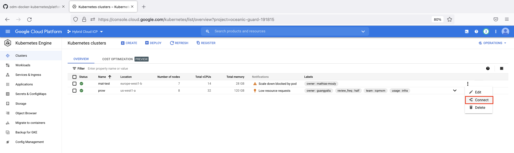
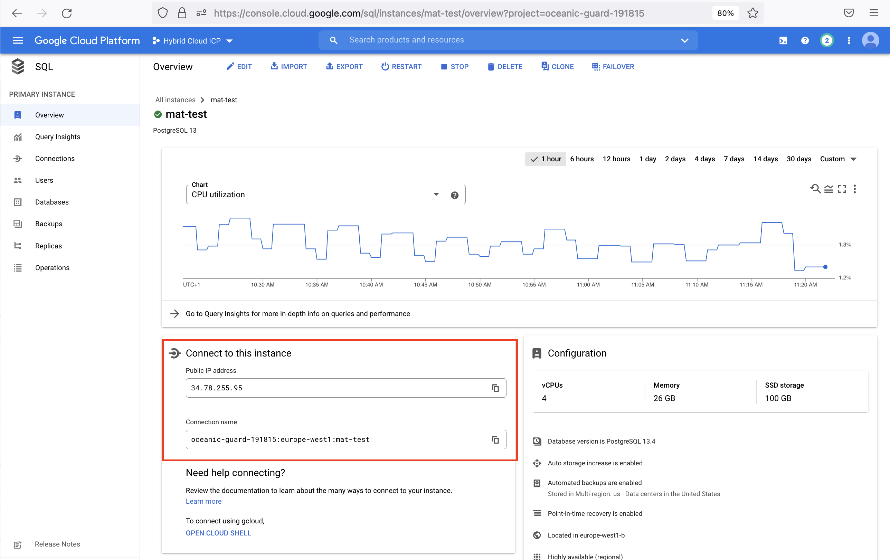
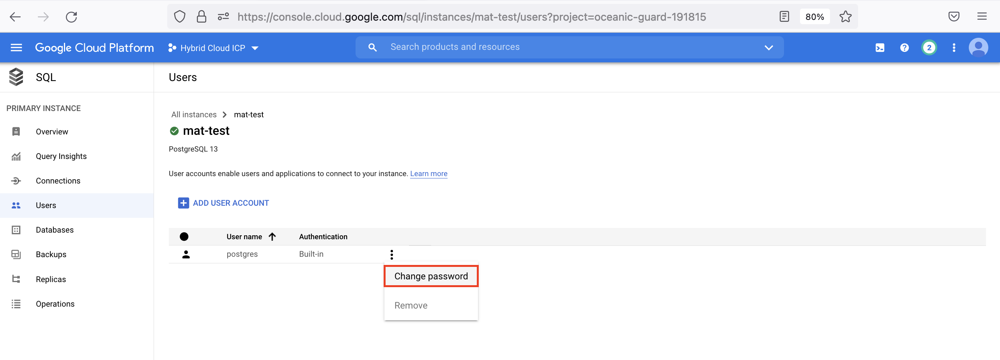
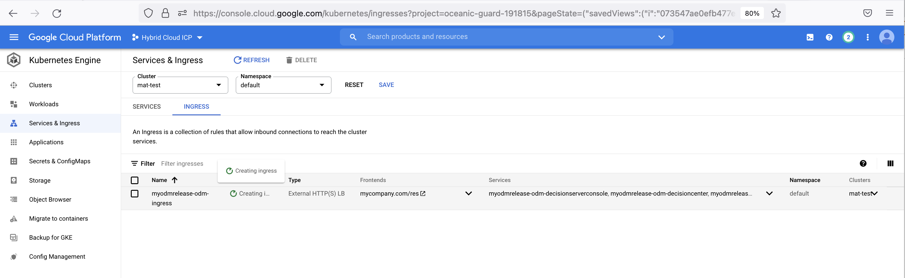
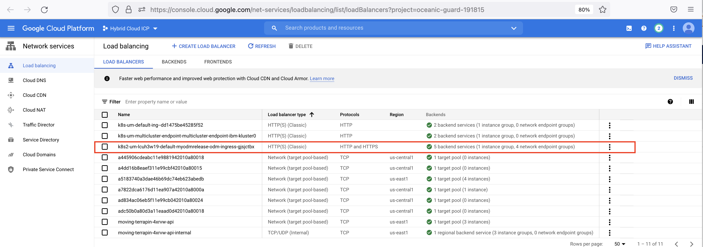
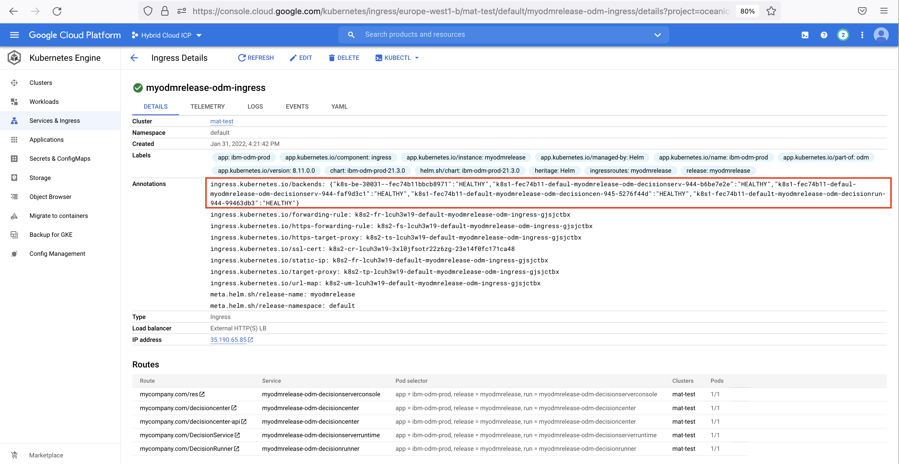
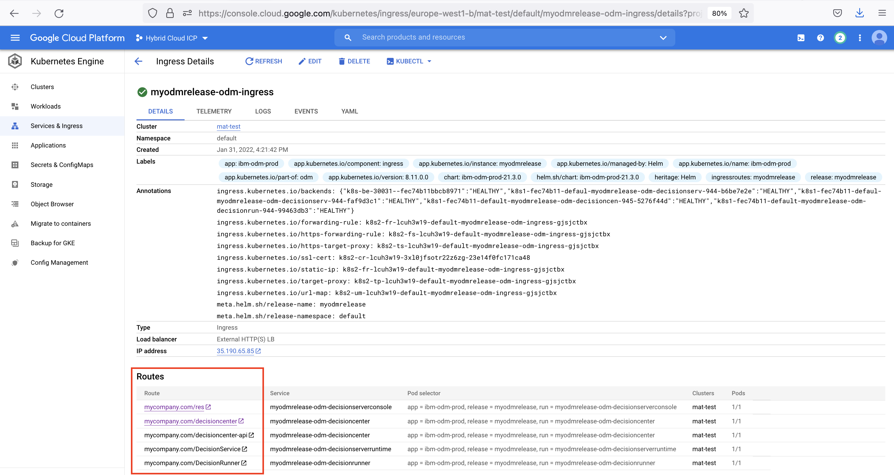

# Deploying IBM Operational Decision Manager on Google GKE

This project demonstrates how to deploy an IBM® Operational Decision Manager (ODM) clustered topology thanks to the [container-native load balancer of GKE](https://cloud.google.com/blog/products/containers-kubernetes/container-native-load-balancing-on-gke-now-generally-available). 
The ODM services will be exposed using the Ingress provided by ODM on k8s Helm chart. 
This deployment implements Kubernetes and Docker technologies.
Here is the home page of Google Cloud: https://cloud.google.com


The ODM Docker material is available in Passport Advantage. It includes Docker container images and Helm chart descriptors.

## Included components

The project comes with the following components:

- [IBM Operational Decision Manager](https://www.ibm.com/docs/en/odm/8.11.0)
- [Google Cloud SQL for PostgreSQL](https://cloud.google.com/sql)
- [Google Kubernetes Engine (GKE)](https://cloud.google.com/kubernetes-engine)
- [IBM License Service](https://github.com/IBM/ibm-licensing-operator)

## Tested environment
The commands and tools have been tested on macOS and Linux.

## Prerequisites
First, install the following software on your machine:

* [gcloud tool](https://cloud.google.com/sdk/gcloud)
* [Helm v3](https://github.com/helm/helm/releases)

[create a google cloud account](https://cloud.google.com/apigee/docs/hybrid/v1.6/precog-gcpaccount)
[create a google cloud project](https://cloud.google.com/resource-manager/docs/creating-managing-projects)
[manage the associated billing](https://cloud.google.com/billing/docs/how-to/modify-project#confirm_billing_is_enabled_on_a_project).

Without the relevant billing level, some google cloud resources will not be created

> Note:  Prerequisites and software supported by ODM 8.11 are listed on [the Detailed System Requirements page](https://www.ibm.com/software/reports/compatibility/clarity-reports/report/html/softwareReqsForProduct?deliverableId=2D28A510507B11EBBBEA1195F7E6DF31&osPlatforms=AIX%7CLinux%7CMac%20OS%7CWindows&duComponentIds=D002%7CS003%7CS006%7CS005%7CC006&mandatoryCapIds=30%7C1%7C13%7C25%7C26&optionalCapIds=341%7C47%7C9%7C1%7C15).

## Steps to deploy ODM on Kubernetes from Google GKE

<!-- TOC titleSize:2 tabSpaces:2 depthFrom:1 depthTo:6 withLinks:1 updateOnSave:1 orderedList:0 skip:0 title:0 charForUnorderedList:* -->
* [Deploying IBM Operational Decision Manager on Google GKE](#deploying-ibm-operational-decision-manager-on-azure-aks)
  * [Included components](#included-components)
  * [Tested environment](#tested-environment)
  * [Prerequisites](#prerequisites)
  * [Steps to deploy ODM on Kubernetes from Google GKE](#steps-to-deploy-odm-on-kubernetes-from-google-gke)
  * [Prepare your GKE instance (30 min)](#prepare-your-gke-instance-30-min)
    * [Log into Google Cloud](#log-into-google-cloud)
    * [Create a GKE cluster](#create-a-gke-cluster)
    * [Set up your environment to this cluster](#set-up-your-environment-to-this-cluster)
  * [Create the Google Cloud SQL PostgreSQL instance (10 min)](#create-the-google-cloud-sql-postgresql-instance-10-min)
  * [Prepare your environment for the ODM installation](#prepare-your-environment-for-the-odm-installation)
    * [Using the IBM Entitled registry with your IBMid (10 min)](#using-the-ibm-entitled-registry-with-your-ibmid-10-min)
    * [Create the datasource secrets for Google Cloud SQL PostgreSQL](#create-the-datasource-secrets-for-google-cloud-sql-postgresql)
    * [Manage a digital certificate (10 min)](#manage-a-digital-certificate-10-min)
  * [Install an ODM Helm release using the GKE loadbalancer (10 min)](#install-an-odm-helm-release-using-the-gke-loadbalancer-10-min)
    * [Manage a PV containing the JDBC driver](#manage-a-pv-containing-the-jdbc-driver)
    * [Install the ODM release](#install-the-odm-release)
    * [Check the topology](#check-the-topology)
    * [Check the Ingress and GKE LoadBalancer](#check-the-ingress-and-gke-loadbalancer)
    * [Create a Backend Configuration for the Decision Center Service](#create-a-backend-configuration-for-the-decision-center-service)
    * [Access ODM services](#access-odm-services)
  * [Install the IBM License Service and retrieve license usage](#install-the-ibm-license-service-and-retrieve-license-usage)
    * [Create a NGINX Ingress controller](#create-a-nginx-ingress-controller)
    * [Install the IBM License Service](#install-the-ibm-license-service)
    * [Create the Licensing instance](#create-the-licensing-instance)
    * [Retrieving license usage](#retrieving-license-usage)
  * [Optional steps](#optional-steps)
  * [Troubleshooting](#troubleshooting)
* [License](#license)
<!-- /TOC -->

## Prepare your GKE instance (30 min)

Source: https://cloud.google.com/kubernetes-engine/docs/quickstart

### Log into Google Cloud

After installing the gcloud tool, use the following command line:

```
gcloud auth login [ACCOUNT]
```
https://cloud.google.com/sdk/gcloud/reference/auth/login

If your project is already created, you can also retrieve the gcloud 


### Create a GKE cluster

There is several [type of clusters](https://cloud.google.com/kubernetes-engine/docs/concepts/types-of-clusters)
We will choose to create a [regional cluster](https://cloud.google.com/kubernetes-engine/docs/how-to/creating-a-regional-cluster)

Set the project (associated to a billing account)
```
gcloud config set project [PROJECT_NAME]
```

Set the zone:
```
gcloud config set compute/zone [ZONE (ex: europe-west1-b)]
```

Set the region:
```
gcloud config set compute/region [REGION (ex: europe-west1-b)]
```

Create a cluster by enabling autoscaling. Here, we starts with 4 node until 16
```
gcloud container clusters create [CLUSTER_NAME] --num-nodes 4 --enable-autoscaling --min-nodes 1 --max-nodes 16
```

You can also create your cluster from the Google Cloud Platform using the Kubernetes Engine Clusters panel, by clicking on the Create button

       
### Set up your environment to this cluster

To manage a Kubernetes cluster, use kubectl, the Kubernetes command-line client.
```
gcloud container clusters get-credentials [CLUSTER_NAME]
```

You can also retrieve the command line to configure kubectl by going on the Google Cloud Console in the Kubernetes Engine>Cluster panel,  by selecting "Connect" on the dedicated cluster.



Now, you can check that kubectl is working fine.
```
kubectl get pods
```


## Create the Google Cloud SQL PostgreSQL instance (10 min)

We will use the Google Cloud Console to create this instance :

- Go on the [SQL context](https://console.cloud.google.com/sql) and click on the "CREATE INSTANCE" button
- Choose PostgreSQL
  * Take "PostgreSQL 13" as database version
  * Choose a region similar to the cluster. So, the communication is optimal between the database and the ODM instance
  * Keep "Multiple zones" for Zonal availability to the highest availability
  * Expand "Customize your instance" and Expand "Connections"
  * As Public IP is selected by default, click on the "ADD NETWORK" button, put a name and add "0.0.0.0/0" for Network, then click on "DONE"


When created, you can drill on the SQL instance overview to retrieve needed information to connect to this instance like the IP adress and the connection name :



A default "postgres" database is created with a default "postgres" user. You can change the password of the postgres user by using the Users panel, selecting the postgres user, and using the "Change password" menu :



## Prepare your environment for the ODM installation

To get access to the ODM material, you must have an IBM entitlement registry key to pull the images from the IBM Entitled registry.

(If you prefer to install ODM from Azure Container Registry instead, you can a look at [this dedicated page](README_PPA.md).)

### Using the IBM Entitled registry with your IBMid (10 min)

Log in to [MyIBM Container Software Library](https://myibm.ibm.com/products-services/containerlibrary) with the IBMid and password that are associated with the entitled software.

In the Container software library tile, verify your entitlement on the View library page, and then go to Get entitlement key to retrieve the key.

Create a pull secret by running a kubectl create secret command.

```
$ kubectl create secret docker-registry <registrysecret> --docker-server=cp.icr.io \
                                                         --docker-username=cp \
                                                         --docker-password="<entitlementkey>" \
                                                         --docker-email=<email>
```

where:

* \<registrysecret\> is the secret name
* \<entitlementkey\> is the entitlement key from the previous step. Make sure you enclose the key in double-quotes.
* \<email\> is the email address associated with your IBMid.

> Note:  The cp.icr.io value for the docker-server parameter is the only registry domain name that contains the images. You must set the docker-username to cp to use an entitlement key as docker-password.

Make a note of the secret name so that you can set it for the image.pullSecrets parameter when you run a helm install of your containers.  The image.repository parameter will later be set to cp.icr.io/cp/cp4a/odm.

Add the public IBM Helm charts repository:

```
helm repo add ibmcharts https://raw.githubusercontent.com/IBM/charts/master/repo/entitled
helm repo update
```

Check you can access ODM's charts:

```
helm search repo ibm-odm-prod --versions                  
NAME                  	CHART VERSION	APP VERSION	DESCRIPTION                     
ibmcharts/ibm-odm-prod	21.3.0       	8.11.0.0   	IBM Operational Decision Manager
```

You can now proceed to the [datasource secret's creation](#create-the-datasource-secrets-for-azure-postgresql).

### Create the datasource secrets for Google Cloud SQL PostgreSQL

The Google Cloud SQL PostgreSQL connection will be done using [Cloud SQL Connector for Java](https://github.com/GoogleCloudPlatform/cloud-sql-jdbc-socket-factory#cloud-sql-connector-for-java)

If you don't want to build the driver, you can get the last [driver](https://storage.googleapis.com/cloud-sql-java-connector/) named postgres-socket-factory-X.X.X-jar-with-driver-and-dependencies.jar.

We realised the test with the driver version [postgres-socket-factory-1.4.2-jar-with-driver-and-dependencies.jar](https://storage.googleapis.com/cloud-sql-java-connector/v1.4.2/postgres-socket-factory-1.4.2-jar-with-driver-and-dependencies.jar)

Copy the files [datasource-dc.xml.template](datasource-dc.xml.template) and [datasource-ds.xml.template](datasource-ds.xml.template) on your local machine and rename them to `datasource-dc.xml` and `datasource-ds.xml`.

Replace the following placeholers:
- DRIVER_VERSION: The Cloud SQL Connector for Java Version (ex : 1.4.2)
- IP: The public IP adress
- CONNECTION_NAME: The database connection name
- DBNAME: The database name (default is postgres)
- USERNAME: The database username (default is postgres)
- PASSWORD: The database password

It should be something like in the following extract:

```xml
...
 <library id="postgresql-library">
            <fileset id="postgresql-fileset"  dir="/drivers" includes="postgres-socket-factory-<DRIVER_VERSION>-jar-with-driver-and-dependencies.jar" />
  </library>
...
        <properties URL="jdbc:postgresql://<IP>/<DBNAME>?cloudSqlInstance=<CONNECTION_NAME>;socketFactory=com.google.cloud.sql.postgres.SocketFactory"
                        user="<USERNAME>"
                        password="<PASSWORD>"/>
...
```

Create a secret with this two modified files

```
kubectl create secret generic <customdatasourcesecret> \
        --from-file datasource-ds.xml --from-file datasource-dc.xml
```

### Manage a digital certificate (10 min)

1. Generate a self-signed certificate

If you do not have a trusted certificate, you can use OpenSSL and other cryptography and certificate management libraries to generate a certificate file and a private key, to define the domain name, and to set the expiration date. The following command creates a self-signed certificate (.crt file) and a private key (.key file) that accept the domain name *mycompany.com*. The expiration is set to 1000 days:

```
openssl req -x509 -nodes -days 1000 -newkey rsa:2048 -keyout mycompany.key \
        -out mycompany.crt -subj "/CN=mycompany.com/OU=it/O=mycompany/L=Paris/C=FR"
```

2. Create a TLS secret with these keys

```
kubectl create secret tls mycompany-crt-secret --key mycompany.key --cert mycompany.crt
```

The certificate must be the same as the one you used to enable TLS connections in your ODM release. For more information, see [Server certificates](https://www.ibm.com/docs/en/odm/8.11.0?topic=servers-server-certificates) and [Working with certificates and SSL](https://docs.oracle.com/cd/E19830-01/819-4712/ablqw/index.html).

## Install an ODM Helm release using the GKE loadbalancer (10 min)

### Manage a PV containing the JDBC driver

To be able to use the PostgreSQL database that we have created, we need to use a Persistent Volume in order to provide the JDBC driver to the ODM container.
Unfortunately, GKE PV is still not supporting the [ReadWriteMany access mode](https://cloud.google.com/kubernetes-engine/docs/concepts/persistent-volumes).
If you make a try using a PV with the ReadWriteMany access mode, only 1 ODM pod will start and the other will fail with the following error :
```
Warning  FailedAttachVolume  ... : googleapi: Error 400: RESOURCE_IN_USE_BY_ANOTHER_RESOURCE - The disk resource '...' is already being used by '...'
```
To workaound this issue, we will use a ReadWriteOnce PV used by an NGINX pod that has the root permission to copy the driver.
Then, we will change the PV permission to ReadOnlyMany before to launch the ODM release in order to be able to install ODM on many nodes.

1. [Enable the SCI FileStore Driver](https://cloud.google.com/kubernetes-engine/docs/how-to/persistent-volumes/filestore-csi-driver#console_1)

2. Create the [filestore-example](filestore-example.yaml) storageClass

```
kubectl apply -f filestore-example.yaml
```

3. Create the [customdatasource-pvc](customdatasource-pvc.yaml) PVC using the filestore-example StorageClass in ReadWriteOnce access Mode
So, we can copy the driver on the PV.

```
kubectl apply -f customdatasource-pvc.yaml
```

4. Create a [nginx](nginx.yaml) pod using this PVC that will be used only to copy the driver because this container is accessible as root.

```
kubectl apply -f nginx.yaml
```

5. Copy the Google Cloud PostgresSQL driver on the nginx pod

```
export NGINX_COPY_POD=$(kubectl get pod | grep nginx-driver-copy)
kubectl cp postgres-socket-factory-<X.X.X>-jar-with-driver-and-dependencies.jar $(NGINX_COPY_POD):/usr/share/nginx/html
```

6. Change the PV accessmode to ReadOnlyMany
This way, all ODM containers will be able to access the PV as readonly and scheduled on several node

```
export PV_NAME=$(kubectl get pvc customdatasource-pvc -o jsonpath={.spec.volumeName})
kubectl patch pv $PV_NAME -p '{"spec":{"accessModes":["ReadOnlyMany"]}}'
```

### Install the ODM release

You can now install the product:

The ODM instance is using the externalCustomDatabase parameters to import the PostgreSQL datasource and driver.
The ODM services will be exposed with an Ingress using the previously created mycompany certificate.
It will create automatically an HTTPS GKE loadbalancer. So, we disable the ODM internal TLS as it's not needed.
We use a kustomize as post-rendering to change the decision server readiness because the GKE loadbalancer is using it to create service healthCheck that recquires 200 as response code (ODM default is 301).

```
helm install <release> ibmcharts/ibm-odm-prod \
        --set image.repository=cp.icr.io/cp/cp4a/odm --set image.pullSecrets=<registrysecret> \
        --set externalCustomDatabase.datasourceRef=<customdatasourcesecret> --set externalCustomDatabase.driverPvc=customdatasource-pvc \
        --set service.enableTLS=false --set service.ingress.tlsSecretRef=mycompany-crt-secret \
        --set service.ingress.enabled=true --set service.ingress.host=mycompany.com --set service.ingress.tlsHosts={"mycompany.com"} \
        --post-renderer ./kustomize
```

### Check the topology

Run the following command to check the status of the pods that have been created:

```
kubectl get pods
NAME                                                   READY   STATUS    RESTARTS   AGE
<release>-odm-decisioncenter-***                       1/1     Running   0          20m
<release>-odm-decisionrunner-***                       1/1     Running   0          20m
<release>-odm-decisionserverconsole-***                1/1     Running   0          20m
<release>-odm-decisionserverruntime-***                1/1     Running   0          20m
```

### Check the Ingress and GKE LoadBalancer

To get a status on the current deployment, you can go in the console to the [Kubernetes Engine/Services & Ingress Panel](https://console.cloud.google.com/kubernetes/ingresses)
The ingress is remaining in the "ingress creating" state several minutes until the pods are up and ready, and that the backend is getting an healthy state



You can also check the [load balancer status](https://console.cloud.google.com/net-services/loadbalancing/list/loadBalancers).
It provides information about the backend using the service health check.



Entering inside the Ingress details, you should get an HEALTHY state on all backends.
This panel is also providing some logs on the loadbalancer activity.
When the Ingress is showing an OK status, the all ODM services can be accessed.



### Create a Backend Configuration for the Decision Center Service

Decision Center needs a sticky session management. The browser session is containing a cookie that is recognized on container side to allow to work with the Business Console. So, we need that a browser alive session is always managed during all is life by the same container.
The ODM on k8s helm chart has [clientIP](https://kubernetes.io/docs/concepts/services-networking/service/#proxy-mode-ipvs) for the Decision Center session affinity. Unfortunately, GKE doesn't exploit it automatically.
Obviously, you will not see this issue with the current deployment until you scale up the Decision Center deployment.

A configuration using [BackendConfig](https://cloud.google.com/kubernetes-engine/docs/how-to/ingress-features#session_affinity) is needed to manage it at the loadbalancer level.

1. Create the [Decision Center Backend Config](decisioncenter-backendconfig.yaml)

```
kubectl apply -f nginx.yaml
```

2. Annotate the Decision Center Service with this GKE Backend Config

```
kubectl annotate service <release>-odm-decisioncenter cloud.google.com/backend-config=dc-backendconfig
```

### Access ODM services

In a real enterprise use-case, to access the mycompany.com domain name, you will have to deal with [Google Managed Certificate](https://cloud.google.com/load-balancing/docs/ssl-certificates/google-managed-certs) and [Google Cloud DNS](https://cloud.google.com/dns).

In this trial, we are using a self-signed certificate. So, there is no extra charge like certificate and domain purchase.
We just have to manage a configuration to simulate the mycompany.com access.

You can get the EXTERNAL-IP using the command line :

```
kubectl get ingress <release>-odm-ingress -o json | jq -r '.status.loadBalancer.ingress[].ip'
```

So, to access ODM services, you have to edit your /etc/hosts file and add the following entry :
```
<EXTERNAL-IP> mycompany.com
```

Now, you can access all ODM services with the following URL :

| SERVICE NAME | URL | USERNAME/PASSWORD
| --- | --- | ---
| Decision Server Console | https://mycompany.com/res | odmAdmin/odmAdmin
| Decision Center | https://mycompany.com/decisioncenter | odmAdmin/odmAdmin
| Decision Center REST-API | https://mycompany.com/decisioncenter-api | odmAdmin/odmAdmin
| Decision Server Runtime | https://mycompany.com/DecisionService | odmAdmin/odmAdmin
| Decision Runner | https://mycompany.com/DecisionRunner | odmAdmin/odmAdmin

You can also click on the Ingress routes accessible from the Google Cloud console below the [Kubernetes Engine/Services & Ingress Details Panel](https://console.cloud.google.com/kubernetes/ingresses)




## Install the IBM License Service and retrieve license usage

This section explains how to track ODM usage with the IBM License Service.

### Create a NGINX Ingress controller

1. Add the official stable repository

    ```
    helm repo add ingress-nginx https://kubernetes.github.io/ingress-nginx
    ```

2. Use Helm to deploy an NGINX Ingress controller

    ```
    helm install nginx-ingress ingress-nginx/ingress-nginx \
      --set controller.replicaCount=2 \
      --set controller.nodeSelector."beta\.kubernetes\.io/os"=linux \
      --set defaultBackend.nodeSelector."beta\.kubernetes\.io/os"=linux
    ```

3. Get the Ingress controller external IP address

    ```
    kubectl get service -l app.kubernetes.io/name=ingress-nginx
    NAME                                               TYPE           CLUSTER-IP     EXTERNAL-IP    PORT(S)                      AGE
    nginx-ingress-ingress-nginx-controller             LoadBalancer   10.0.191.246   <externalip>   80:30222/TCP,443:31103/TCP   3m8s
    nginx-ingress-ingress-nginx-controller-admission   ClusterIP      10.0.214.250   <none>         443/TCP                      3m8s
    ```

### Install the IBM License Service

Follow the **Installation** section of the [Manual installation without the Operator Lifecycle Manager (OLM)](https://github.com/IBM/ibm-licensing-operator/blob/latest/docs/Content/Install_without_OLM.md), make sure you don't follow the instantiation part!

### Create the Licensing instance

Just run:

```
kubectl create -f licensing-instance.yml
```

(More information and use cases on [this page](https://github.com/IBM/ibm-licensing-operator/blob/latest/docs/Content/Configuration.md#configuring-ingress).)

### Retrieving license usage

After a couple of minutes, the NGINX load balancer reflects the Ingress configuration and you will be able to access the IBM License Service by retrieving the URL with this command:

```
export LICENSING_URL=$(kubectl get ingress ibm-licensing-service-instance -n ibm-common-services |awk '{print $4}' |tail -1)/ibm-licensing-service-instance
export TOKEN=$(oc get secret ibm-licensing-token -o jsonpath={.data.token} -n ibm-common-services |base64 -d)
```

You can access the `http://${LICENSING_URL}/status?token=${TOKEN}` URL to view the licensing usage or retrieve the licensing report zip file by running:
```
curl -v "http://${LICENSING_URL}/snapshot?token=${TOKEN}" --output report.zip
```

If your IBM License Service instance is not running properly, please refer to this [troubleshooting page](https://github.com/IBM/ibm-licensing-operator/blob/latest/docs/Content/Troubleshooting.md).

## Optional steps

You may prefer to access ODM components through NGINX Ingress controller instead of directly from these different IP addresses.  If so, please follow [these instructions](README_NGINX.md).

## Troubleshooting

If your ODM instances are not running properly, please refer to [our dedicated troubleshooting page](https://www.ibm.com/docs/en/odm/8.11.0?topic=8110-troubleshooting-support).

# License

[Apache 2.0](../LICENSE)
