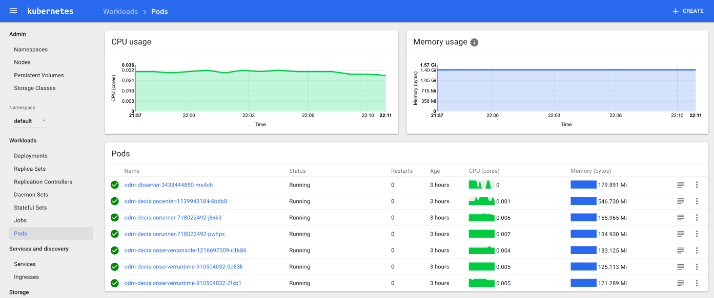

# Deploy IBM Operational Decision Manager Standard on Google Cloud Container Engine

This project demonstrates the deployment of an IBM® Operational Decision Manager clustered topology using IBM WebSphere® Application Server Liberty on Google Cloud. We use Kubernetes and Docker technologies. They are available by Google through Google Container Registry and Engine.

We reuse the ODM Docker material that is available on the repository [odm-ondocker](https://github.com/lgrateau/odm-ondocker). It includes Docker files and Docker compose descriptors. In this tutorial, we use only the Docker files to build the ODM runtime images that will be instantiated in the Kubernetes cluster.


## Included Components
- [IBM ODM](https://www.ibm.com/support/knowledgecenter/SSQP76_8.9.0/welcome/kc_welcome_odmV.html)
- [Google Container Engine](...)
- [Google Container Registry](...)

## Test environment
This tutorial was tested on MacOS.

## Prerequisites

* Create a Kubernetes cluster in [Google Container Engine](...).
* Install a Git client to obtain the sample code.
* Install a [Docker](https://docs.docker.com/engine/installation/) engine.

## Deploy to Kubernetes Cluster from Google Container

## Steps

1. [Install Docker CLI and Google Cloud CLI](#1-install-docker-cli-and-google-cloud-cli)
2. [Get and build the application code](#2-get-ODM-Docker-files-and-Kubernetes-manifest)
3. [Build application containers](#3-build-your-ODM-images)
4. [Create services and deployments](#4-create-services-and-deployments)

# 1. Install Docker and Google Cloud CLI

Install the [Docker CLI](https://www.docker.com/community-edition#/download).

Install the [Google Cloud CLI](https://cloud.google.com/sdk/docs/)

After the Google Cloud CLI is installed, check your configuration:

```bash
gcloud info
```

# 2. Get ODM Docker files and Kubernetes manifest

* Run the `git clone` command for the following projects:
   * [odm-ondocker](https://github.com/ODMDev/odm-ondocker)
   ```bash
      git clone https://github.com/ODMDev/odm-ondocker
  ```
   * [odm-docker-kubernetes](https://github.com/ODMDev/odm-docker-kubernetes)
   ```bash
      git clone https://github.com/ODMDev/odm-docker-kubernetes
  ```

# 3. Build your ODM images

NOTE: The Docker registry eu.gcr.io/odm890-kubernetes/ is used as an example. You must replace it with your registry path.

Build the Decision Server container:

```bash
docker tag ibmcom/odm-decisionserverruntime:8.9.0 eu.gcr.io/odm890-kubernetes/ibm-odm-decisionserverruntime:8.9.0
gcloud docker -- push eu.gcr.io/odm890-kubernetes/ibm-odm-decisionserverruntime:8.9.0
```

Build the Derby decision db server container:

```bash
docker tag ibmcom/dbserver:8.9.0 eu.gcr.io/odm890-kubernetes/ibm-odm-dbserver:8.9.0
gcloud docker -- push eu.gcr.io/odm890-kubernetes/ibm-odm-dbserver:8.9.0
```

Build the Decision Center container:

```bash
docker tag ibmcom/odm-decisioncenter:8.9.0 eu.gcr.io/odm890-kubernetes/ibm-odm-decisioncenter:8.9.0
gcloud docker -- push eu.gcr.io/odm890-kubernetes/ibm-odm-decisioncenter:8.9.0
```

Build the Decision Server console runtime container

```bash
docker tag ibmcom/odm-decisionserverconsole:8.9.0 eu.gcr.io/odm890-kubernetes/ibm-odm-decisionserverconsole:8.9.0
gcloud docker -- push eu.gcr.io/odm890-kubernetes/ibm-odm-decisionserverconsole:8.9.0
```

Build the Decision Runner container

```bash
docker tag ibmcom/odm-decisionrunner:8.9.0 eu.gcr.io/odm890-kubernetes/ibm-odm-decisionrunner:8.9.0
gcloud docker -- push eu.gcr.io/odm890-kubernetes/ibm-odm-decisionrunner:8.9.0
```

# 4. Create services and deployments

Edit the odm-standard-gcloud.yaml descriptor.
Change the image name that is given in the deployment YAML file with the newly built image names that are pushed in your Google Docker registry.

Deploy the ODM topology with the following command:

```bash
kubectl create -f odm-standard-gcloud.yaml
```

Wait 5 - 10 minutes after you created all the services and deployments. You can check the status of your deployment on the Kubernetes UI. 

Run the 'kubectl proxy' command and go to the URL 'http://127.0.0.1:8001/ui' to check when the application containers are ready.


After a few minutes, run the following commands to get your public IP and NodePort number.

```bash
$ kubectl get nodes
NAME                                               STATUS    AGE       VERSION
gke-ibm-odm-cluster-1-default-pool-b02d3eae-cswb   Ready     19h       v1.6.4
gke-ibm-odm-cluster-1-default-pool-b02d3eae-pvdr   Ready     19h       v1.6.4
gke-ibm-odm-cluster-1-default-pool-b02d3eae-rt52   Ready     19h       v1.6.4

$ kubectl get svc
NAME                        CLUSTER-IP      EXTERNAL-IP      PORT(S)          AGE
dbserver                    10.43.248.47    35.187.188.198   1527:32725/TCP   15h
kubernetes                  10.43.240.1     <none>           443/TCP          19h
odm-decisioncenter          10.43.240.151   35.187.41.88     9060:32434/TCP   15h
odm-decisionrunner          10.43.249.122   130.211.62.210   9070:31889/TCP   15h
odm-decisionserverconsole   10.43.245.253   35.187.110.53    9080:30589/TCP   15h
odm-decisionserverruntime   10.43.250.80    <nodes>          9080:32703/TCP   15h
```




With this ODM topology in place, you can access to web applications to author, deploy, and test your rule-based decision services.
* Decision Center console : http://DECISION-CENTER-EXTERNAL-IP:PORT/decisioncenter/t/library

   * Login with the rtsAdmin/rtsAdmin user name and password. You should see the following project library:
   * 

* Decision Server console: http://DECISION-SERVER-CONSOLE-EXTERNAL-IP:PORT/res

   * Login with the resAdmin/resAdmin user name and password. You should see the following executable decision services:
   * 

## Troubleshooting

* If your microservice instances are not running properly, you can check the logs by using the following command:
	* `kubectl logs <your-pod-name>`
* To delete a microservice, use the following command:
	* `kubectl delete -f manifests/<microservice-yaml-file>`
* To delete everything, use the following command:
	* `kubectl delete -f manifests`

## References

# License
[Apache 2.0](LICENSE)
