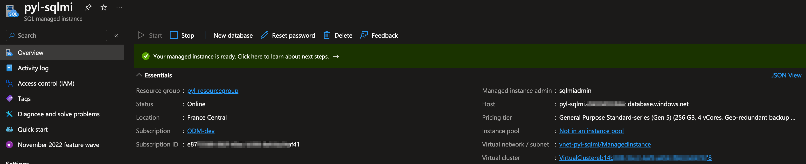

# Deploying IBM Operational Decision Manager with Azure SQL Managed Instance

This page provides instructions on setting up IBM® Operational Decision Manager (ODM) with Azure SQL Managed Instance (MI).

Search for 'Azure SQL' among the available services and create a **SQL Managed Instance** with Resource type: `Single instance`:


Choose the desired Resource Group for deploying the SQL Managed Instance and specify the Managed Instance name:


Click the link `Configure Managed Instance` that is next to the *Compute + storage* parameter under **Managed Instance details** section. 

Reduce the number of CPUs allocated for the instance to 4 vCores and apply the changes:


Back to **Basics** tab, select the option `Use SQL authentication` as **Authentication method** and then fill in admin login and password values:


In the **Networking** tab, enable `Public endpoint` and allow access from `Azure services`:
> NOTE: It is not recommended to use a public IP. In a production environment, you should use a private IP.


Click the **Review + create** button to review your configuration and proceed to create the Managed Instance. While it can take up to six hours, in most cases, it is created in approximately one hour:


Once the SQL Managed Instance is operational, you have the ability to establish a database within it. 

Click **+ New database** to create one with `odmdb` as *Database name*:


Later you'll need the FQDN for your SQL MI; it can be found as `Host` in the instance Overview:



The port to use should always be 3342. You can verify it in the public *JDBC* connection string of your SQL Managed Instance (under **Setting** section):


Proceed as standard installation and create a DB authentication secret:

```bash
kubectl create secret generic <odmdbsecret> --from-literal=db-user=<sqlmiadmin> \
                                            --from-literal=db-password='<password>'
```

> [!WARNING]
> db-user must not contain the `@<managedinstancename>` part!

You can now install the product.
- Get the [aks-sqlmi-values.yaml](./aks-sqlmi-values.yaml) file and replace the following keys:
  - `<registrysecret>` is your registry secret name
  - `<odmdbsecret>` is the database credentials secret name
  - `<mynicecompanytlssecret>` is the container certificate
  - `<password>` is the password to login with the basic registry users like `odmAdmin` 
  - `<sqlminame>` is the name of the SQL managed instance
  - `<identifier>` is the identifier of the dnsZone of the SQL managed instance

> [!NOTE]
> Make sure that you have created the registry secret and also the container certificate secret as explained in [Prepare your environment for the ODM installation](README.md#prepare-your-environment-for-the-odm-installation).

```shell
helm install <release> ibm-helm/ibm-odm-prod  --version 25.0.0 -f aks-sqlmi-values.yaml
```

Other deployment options (especially using NGINX) and IBM License Service usage are explained in the [NGINX README](README-NGINX.md).

## Troubleshooting

If your ODM instances are not running properly, refer to [our dedicated troubleshooting page](https://www.ibm.com/docs/en/odm/9.5.0?topic=950-troubleshooting-support).

## Getting Started with IBM Operational Decision Manager for Containers

Get hands-on experience with IBM Operational Decision Manager in a container environment by following this [Getting started tutorial](https://github.com/DecisionsDev/odm-for-container-getting-started/blob/master/README.md).

# License

[Apache 2.0](/LICENSE)
