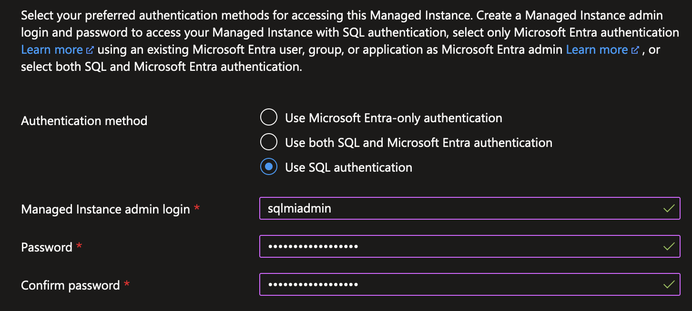

# Deploying IBM Operational Decision Manager with Azure SQL Managed Instance

We successfully deployed ODM with an external Azure SQL Managed Instance (SQL MI), following these instructions.

Look for `Azure SQL` in all available services and create a SQL Managed Instances / Single instance:


Choose the Resource Group you want to deploy the SQL MI into, and also the Managed Instance name:


You should have a look at `Configure Managed Instance` and lower the number of CPUs used by the instance:


Back to basics, select `Use SQL authentication` as Authentication method and then fill in admin login and password values:



In the Networking tab, enable `Public endpoint` and allow access from `Azure services`:


You can then review your configuration and create the Managed Instance. It can take up to six hours (but most of the time we manage to get it created in about one hour):


When the SQL MI is up, you can create a database in it:


Later you'll need the FQDN for your SQL MI; it can be found as `Host` in the instance Overview:


The port to use should always be 3342 but you can verify it in the public JDBC connection string from your SQL Managed Instance:


Proceed as standard installation and create a DB authentication secret:

```bash
kubectl create secret generic <odmdbsecret> --from-literal=db-user=<sqlmiadmin> \
                                            --from-literal=db-password='<password>'
```

> **Warning** db-user must not contain the `@<managedinstancename>` part!

Then you can deploy ODM with:

```bash
helm install <release> ibmcharts/ibm-odm-prod --version 23.2.0 \
        --set image.repository=cp.icr.io/cp/cp4a/odm --set image.pullSecrets=<registrysecret> \
        --set image.arch=amd64 --set image.tag=${ODM_VERSION:-8.12.0.1} --set service.type=LoadBalancer \
        --set externalDatabase.type=sqlserver \
        --set externalDatabase.serverName=<sqlminame>.public.<identifier>.database.windows.net \
        --set externalDatabase.databaseName=odmdb \
        --set externalDatabase.port=3342 \
        --set externalDatabase.secretCredentials=<odmdbsecret> \
        --set customization.securitySecretRef=<myodmcompanytlssecret> \
        --set license=true --set usersPassword=<password>
```

Other deployment options (especially using NGINX) and IBM License Service usage are explained in the main [README file](README.md).

## Troubleshooting

If your ODM instances are not running properly, refer to [our dedicated troubleshooting page](https://www.ibm.com/docs/en/odm/8.12.0?topic=8120-troubleshooting-support).

## Getting Started with IBM Operational Decision Manager for Containers

Get hands-on experience with IBM Operational Decision Manager in a container environment by following this [Getting started tutorial](https://github.com/DecisionsDev/odm-for-container-getting-started/blob/master/README.md).

# License

[Apache 2.0](/LICENSE)
