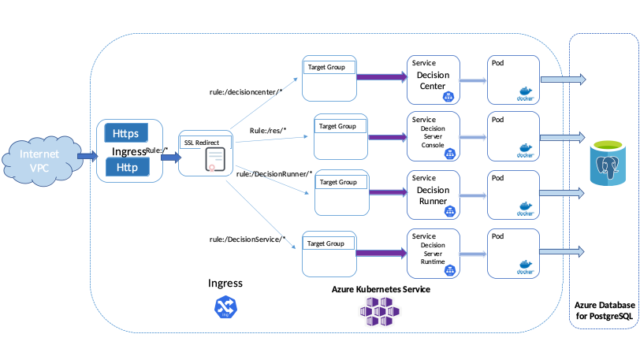

# Deploying IBM Operational Decision Manager on Azure AKS

This project demonstrates how to deploy an IBM® Operational Decision Manager (ODM) clustered topology on the Azure Kubernetes Service (AKS) cloud service. This deployment implements Kubernetes and Docker technologies.
Here is the home page of Microsoft Azure: https://portal.azure.com/#home



The ODM on Kubernetes Docker images are available in the [IBM Entitled Registry](https://www.ibm.com/cloud/container-registry). The ODM Helm chart is available in the [IBM Helm charts repository](https://github.com/IBM/charts).

## Included components

The project comes with the following components:

- [IBM Operational Decision Manager](https://www.ibm.com/docs/en/odm/8.11.1)
- [Azure Database for PostgreSQL](https://docs.microsoft.com/en-us/azure/postgresql/)
- [Azure Kubernetes Service (AKS)](https://docs.microsoft.com/en-us/azure/aks/)
- [Network concepts for applications in AKS](https://docs.microsoft.com/en-us/azure/aks/concepts-network)
- [IBM License Service](https://github.com/IBM/ibm-licensing-operator)

## Tested environment
The commands and tools have been tested on macOS and Linux.

## Prerequisites
First, install the following software on your machine:

- [Azure CLI](https://docs.microsoft.com/en-us/cli/azure/install-azure-cli?view=azure-cli-latest)
- [Helm v3](https://helm.sh/docs/intro/install/)

Then, [create an Azure account and pay as you go](https://azure.microsoft.com/en-us/pricing/purchase-options/pay-as-you-go/).

> Note:  Prerequisites and software supported by ODM 8.11 are listed in [the Detailed System Requirements page](https://www.ibm.com/software/reports/compatibility/clarity-reports/report/html/softwareReqsForProduct?deliverableId=2D28A510507B11EBBBEA1195F7E6DF31&osPlatforms=AIX%7CLinux%7CMac%20OS%7CWindows&duComponentIds=D002%7CS003%7CS006%7CS005%7CC006&mandatoryCapIds=30%7C1%7C13%7C25%7C26&optionalCapIds=341%7C47%7C9%7C1%7C15).

## Steps to deploy ODM on Kubernetes to Azure AKS

<!-- TOC depthfrom:2 depthto:2 -->

- [Included components](#included-components)
- [Tested environment](#tested-environment)
- [Prerequisites](#prerequisites)
- [Steps to deploy ODM on Kubernetes to Azure AKS](#steps-to-deploy-odm-on-kubernetes-to-azure-aks)
- [Prepare your AKS instance 30 min](#prepare-your-aks-instance-30-min)
- [Create the PostgreSQL Azure instance 10 min](#create-the-postgresql-azure-instance-10-min)
- [Prepare your environment for the ODM installation](#prepare-your-environment-for-the-odm-installation)
- [Install an ODM Helm release and expose it with the service type LoadBalancer 10 min](#install-an-odm-helm-release-and-expose-it-with-the-service-type-loadbalancer-10-min)
- [Create an NGINX Ingress controller](#create-an-nginx-ingress-controller)
- [Optional Install an ODM Helm release and expose it with the NGINX Ingress controller 10 min](#optional-install-an-odm-helm-release-and-expose-it-with-the-nginx-ingress-controller-10-min)
- [Install the IBM License Service and retrieve license usage](#install-the-ibm-license-service-and-retrieve-license-usage)
- [Troubleshooting](#troubleshooting)
- [Getting Started with IBM Operational Decision Manager for Containers](#getting-started-with-ibm-operational-decision-manager-for-containers)

<!-- /TOC -->

## Prepare your AKS instance (30 min)

Source: https://docs.microsoft.com/en-us/azure/aks/kubernetes-walkthrough

### Log into Azure

After installing the Azure CLI, use the following command line:

```
az login [--tenant <name>.onmicrosoft.com]
```

A web browser opens where you can connect with your Azure credentials.

### Create a resource group

An Azure resource group is a logical group in which Azure resources are deployed and managed. When you create a resource group, you are asked to specify a location. This location is where resource group metadata is stored. It is also where your resources run in Azure, if you do not specify another region during resource creation. Create a resource group by running the `az group create` command.

To get a list of available locations, run:

```shell
az account list-locations -o table
```

Then, create the resource group:

```shell
az group create --name <resourcegroup> --location <azurelocation> [--tags Owner=<email> Team=DBA Usage=demo Usage_desc="Azure customers support" Delete_date=2023-12-31]
```

The following example output shows that the resource group has been created successfully:

```json
{
  "id": "/subscriptions/<guid>/resourceGroups/<resourcegroup>",
  "location": "<azurelocation>",
  "managedBy": null,
  "name": "<resourcegroup>",
  "properties": {
    "provisioningState": "Succeeded"
  },
  "tags": null
}
```

### Create an AKS cluster

Use the `az aks create` command to create an AKS cluster. The following example creates a cluster named <cluster> with two nodes. Azure Monitor for containers is also enabled using the `--enable-addons monitoring` parameter.  The operation takes several minutes to complete.

> Note:  During the creation of the AKS cluster, a second resource group is automatically created to store the AKS resources. For more information, see [Why are two resource groups created with AKS](https://docs.microsoft.com/en-us/azure/aks/faq#why-are-two-resource-groups-created-with-aks).

```shell
az aks create --name <cluster> --resource-group <resourcegroup> --node-count 2 \
          --enable-cluster-autoscaler --min-count 2 --max-count 4 \
          --enable-addons monitoring --generate-ssh-keys [--location <azurelocation>]
```

After a few minutes, the command completes and returns JSON-formatted information about the cluster.  Make a note of the newly-created Resource Group that is displayed in the JSON output (e.g. "nodeResourceGroup": "<noderesourcegroup>") if you have to tag it, for example:

```shell
az group update --name <noderesourcegroup> \
    --tags Owner=<email> Team=DBA Usage=demo Usage_desc="Azure customers support" Delete_date=2023-12-31
```
       
### Set up your environment to this cluster

To manage a Kubernetes cluster, use `kubectl`, the Kubernetes command-line client. If you use Azure Cloud Shell, kubectl is already installed. To install kubectl locally, use the `az aks install-cli` command:

```shell
az aks install-cli
```

To configure kubectl to connect to your Kubernetes cluster, use the `az aks get-credentials` command. This command downloads credentials and configures the Kubernetes CLI to use them.

```shell
az aks get-credentials --name <cluster> --resource-group <resourcegroup>
```

To verify the connection to your cluster, use the `kubectl get` command to return the list of cluster nodes.

```shell
kubectl get nodes
```

The following example output shows the single node created in the previous steps. Make sure that the status of the node is Ready.

```
NAME                                STATUS   ROLES   AGE   VERSION
aks-nodepool1-26476812-vmss000000   Ready    agent   21m   v1.25.6
aks-nodepool1-26476812-vmss000001   Ready    agent   21m   v1.25.6
```

To further debug and diagnose cluster problems, run the following command:

```shell
kubectl cluster-info dump
```

## Create the PostgreSQL Azure instance (10 min)

### Create an Azure Database for PostgreSQL

Create an Azure Database for PostgreSQL server by running the `az postgres server create` command. A server can contain multiple databases.
To get a good bandwidth between ODM containers and the database, choose the same location for the PostgreSQL server and for the AKS cluster.

```shell
az postgres server create --name <postgresqlserver> --resource-group <resourcegroup> \
                          --admin-user myadmin --admin-password 'passw0rd!' \
                          --sku-name GP_Gen5_2 --version 11 [--location <azurelocation>]
```

> Note:  The PostgreSQL server name must be unique within Azure.

Verify the database.
To connect to your server, you need to provide host information and access credentials.

```shell
az postgres server show --name <postgresqlserver> --resource-group <resourcegroup>
```

Result:

```json
{
  "administratorLogin": "myadmin",
  "byokEnforcement": "Disabled",
  "earliestRestoreDate": "2022-01-06T09:15:54.563000+00:00",
  "fullyQualifiedDomainName": "<postgresqlserver>.postgres.database.azure.com",
  "id": "/subscriptions/xxxxxxxx-xxxx-xxxx-xxxx-5242e4507709/resourceGroups/<resourcegroup>/providers/Microsoft.DBforPostgreSQL/servers/<postgresqlserver>",
  "identity": null,
  "infrastructureEncryption": "Disabled",
  "location": "<azurelocation>",
  "masterServerId": "",
  "minimalTlsVersion": "TLSEnforcementDisabled",
  "name": "<postgresqlserver>",
  "privateEndpointConnections": [],
  "publicNetworkAccess": "Enabled",
  "replicaCapacity": 5,
  "replicationRole": "None",
  "resourceGroup": "<resourcegroup>",
  "sku": {
    "capacity": 2,
    "family": "Gen5",
    "name": "GP_Gen5_2",
    "size": null,
    "tier": "GeneralPurpose"
  },
  "sslEnforcement": "Enabled",
  "storageProfile": {
    "backupRetentionDays": 7,
    "geoRedundantBackup": "Disabled",
    "storageAutogrow": "Enabled",
    "storageMb": 51200
  },
  "tags": null,
  "type": "Microsoft.DBforPostgreSQL/servers",
  "userVisibleState": "Ready",
  "version": "11"
}
```

Make a note of the server name that is displayed in the JSON output (e.g. "fullyQualifiedDomainName": "<postgresqlserver>.postgres.database.azure.com") as it will be used later to deploy ODM with `helm install`.

###  Create a firewall rule that allows access from Azure services

To make sure your database and your AKS cluster can communicate, put in place firewall rules with the following command:

```shell
az postgres server firewall-rule create --resource-group <resourcegroup> --server-name <postgresqlserver> \
            --name <rulename> --start-ip-address 0.0.0.0 --end-ip-address 255.255.255.255
```

## Prepare your environment for the ODM installation

To get access to the ODM material, you must have an IBM entitlement key to pull the images from the IBM Entitled Registry.

### Using the IBM Entitled Registry with your IBMid (10 min)

Log in to [MyIBM Container Software Library](https://myibm.ibm.com/products-services/containerlibrary) with the IBMid and password that are associated with the entitled software.

In the Container software library tile, verify your entitlement on the View library page, and then go to Get entitlement key to retrieve the key.

Create a pull secret by running the `kubectl create secret` command.

```shell
$ kubectl create secret docker-registry <registrysecret> --docker-server=cp.icr.io \
                                                         --docker-username=cp \
                                                         --docker-password="<entitlementkey>" \
                                                         --docker-email=<email>
```

Where:

* \<registrysecret\> is the secret name
* \<entitlementkey\> is the entitlement key from the previous step. Make sure you enclose the key in double-quotes.
* \<email\> is the email address associated with your IBMid.

> Note:  The cp.icr.io value for the docker-server parameter is the only registry domain name that contains the images. You must set the docker-username to `cp` to use an entitlement key as docker-password.

Make a note of the secret name so that you can set it for the image.pullSecrets parameter when you run a helm install of your containers.  The image.repository parameter will later be set to cp.icr.io/cp/cp4a/odm.

Add the public IBM Helm charts repository:

```shell
helm repo add ibmcharts https://raw.githubusercontent.com/IBM/charts/master/repo/ibm-helm
helm repo update
```

Check that you can access the ODM charts:

```shell
helm search repo ibm-odm-prod
NAME                        	CHART VERSION	APP VERSION	DESCRIPTION
ibmcharts/ibm-odm-prod      	23.1.0       	8.12.0.0   	IBM Operational Decision Manager  License By in...
```

### Create the database credentials secret for Azure PostgreSQL

To secure the access to the database, create a secret that encrypts the database user and password before you install the Helm release.

```shell
kubectl create secret generic <odmdbsecret> --from-literal=db-user=myadmin@<postgresqlserver> \
                                            --from-literal=db-password='passw0rd!'
```

### Manage a digital certificate (10 min)

1. (Optional) Generate a self-signed certificate.

If you do not have a trusted certificate, you can use OpenSSL and other cryptography and certificate management libraries to generate a certificate file and a private key, to define the domain name, and to set the expiration date. The following command creates a self-signed certificate (.crt file) and a private key (.key file) that accept the domain name *myodmcompany.com*. The expiration is set to 1000 days:

```shell
openssl req -x509 -nodes -days 1000 -newkey rsa:2048 -keyout mycompany.key \
        -out mycompany.crt -subj "/CN=myodmcompany.com/OU=it/O=mycompany/L=Paris/C=FR" \
        -addext "subjectAltName = DNS:myodmcompany.com"
```

>Note:  You can use -addext only with actual OpenSSL, not with LibreSSL (yet).

2. Create a Kubernetes secret with the certificate.

```shell
kubectl create secret generic <mycompanytlssecret> --from-file=tls.crt=mycompany.crt --from-file=tls.key=mycompany.key
```

The certificate must be the same as the one you used to enable TLS connections in your ODM release. For more information, see [Server certificates](https://www.ibm.com/docs/en/odm/8.11.1?topic=servers-server-certificates).

## Install an ODM Helm release and expose it with the service type LoadBalancer (10 min)

### Allocate public IP addresses

```shell
az aks update --name <cluster> --resource-group <resourcegroup> --load-balancer-managed-outbound-ip-count 4
```

### Install the ODM release

You can now install the product:

```shell
helm install <release> ibmcharts/ibm-odm-prod --version 23.1.0 \
        --set image.repository=cp.icr.io/cp/cp4a/odm --set image.pullSecrets=<registrysecret> \
        --set image.arch=amd64 --set image.tag=${ODM_VERSION:-8.12.0.0} --set service.type=LoadBalancer \
        --set externalDatabase.type=postgres \
        --set externalDatabase.serverName=<postgresqlserver>.postgres.database.azure.com \
        --set externalDatabase.databaseName=postgres \
        --set externalDatabase.port=5432 \
        --set externalDatabase.secretCredentials=<odmdbsecret> \
        --set customization.securitySecretRef=<mycompanytlssecret> \
        --set license=true --set usersPassword=<password>
```

Where:

* \<password\> is the password that will be used for standard users odmAdmin, resAdmin, and rtsAdmin.

### Check the topology

Run the following command to check the status of the pods that have been created:

```shell
kubectl get pods
NAME                                                   READY   STATUS    RESTARTS   AGE
<release>-odm-decisioncenter-***                       1/1     Running   0          20m
<release>-odm-decisionrunner-***                       1/1     Running   0          20m
<release>-odm-decisionserverconsole-***                1/1     Running   0          20m
<release>-odm-decisionserverruntime-***                1/1     Running   0          20m
```

### Access ODM services

By setting `service.type=LoadBalancer`, the services are exposed with public IPs to be accessed with the following command:

```shell
kubectl get services
NAME                                        TYPE           CLUSTER-IP     EXTERNAL-IP       PORT(S)          AGE
kubernetes                                  ClusterIP      10.0.0.1       <none>            443/TCP          26h
<release>-odm-decisioncenter                LoadBalancer   10.0.141.125   xxx.xxx.xxx.xxx   9453:31130/TCP   22m
<release>-odm-decisionrunner                LoadBalancer   10.0.157.225   xxx.xxx.xxx.xxx   9443:31325/TCP   22m
<release>-odm-decisionserverconsole         LoadBalancer   10.0.215.192   xxx.xxx.xxx.xxx   9443:32448/TCP   22m
<release>-odm-decisionserverconsole-notif   ClusterIP      10.0.201.87    <none>            1883/TCP         22m
<release>-odm-decisionserverruntime         LoadBalancer   10.0.177.153   xxx.xxx.xxx.xxx   9443:31921/TCP   22m
```

You can then open a browser on https://xxx.xxx.xxx.xxx:9453 to access Decision Center, and on https://xxx.xxx.xxx.xxx:9443 to access Decision Server console, Decision Server Runtime, and Decision Runner.

## Create an NGINX Ingress controller

Installing an NGINX Ingress controller allows you to access ODM components through a single external IP address instead of the different IP addresses as seen above.  It is also mandatory to retrieve license usage through the IBM License Service.

1. Use the official YAML manifest:

    ```shell
    kubectl apply -f https://raw.githubusercontent.com/kubernetes/ingress-nginx/controller-v1.7.1/deploy/static/provider/cloud/deploy.yaml
    ```

    > Note: The version will probably change after the publication of our documentation so please refer to the actual [documentation](https://kubernetes.github.io/ingress-nginx/deploy/#azure)!

2. Get the Ingress controller external IP address:

    ```shell
    kubectl get service -l app.kubernetes.io/name=ingress-nginx
    NAME                                 TYPE           CLUSTER-IP     EXTERNAL-IP     PORT(S)                      AGE
    ingress-nginx-controller             LoadBalancer   10.0.78.246    20.19.105.130   80:32208/TCP,443:30249/TCP   2m12s
    ingress-nginx-controller-admission   ClusterIP      10.0.229.164   <none>          443/TCP                      2m12s
    ```

## (Optional) Install an ODM Helm release and expose it with the NGINX Ingress controller (10 min)

You might want to access ODM components through a single external IP address.

### Install the product

You can reuse the secret with TLS certificate created [above](#manage-adigital-certificate-10-min):

```shell
helm install <release> ibmcharts/ibm-odm-prod --version 23.1.0 \
        --set image.repository=cp.icr.io/cp/cp4a/odm --set image.pullSecrets=<registrysecret> \
        --set image.arch=amd64 --set image.tag=${ODM_VERSION:-8.12.0.0} \
        --set externalDatabase.type=postgres \
        --set externalDatabase.serverName=<postgresqlserver>.postgres.database.azure.com \
        --set externalDatabase.databaseName=postgres \
        --set externalDatabase.port=5432 \
        --set externalDatabase.secretCredentials=<odmdbsecret> \
        --set service.ingress.enabled=true --set service.ingress.tlsSecretRef=<mycompanytlssecret> \
        --set service.ingress.tlsHosts={myodmcompany.com} --set service.ingress.host=myodmcompany.com \
        --set service.ingress.annotations={"kubernetes.io/ingress.class: nginx"\,"nginx.ingress.kubernetes.io/backend-protocol: HTTPS"} \
        --set license=true --set usersPassword=<password>
```

> **Note**
> By default, the NGINX Ingress controller does not enable sticky session. If you want to use sticky session to connect to DC, refer to [Using sticky session for Decision Center connection](../../contrib/sticky-session/README.md)

### Edit your /etc/hosts

```shell
# vi /etc/hosts
<externalip> myodmcompany.com
```

### Access the ODM services

Check that ODM services are in NodePort type:

```shell
kubectl get services -l app.kubernetes.io/name=ibm-odm-prod
NAME                                               TYPE           CLUSTER-IP     EXTERNAL-IP    PORT(S)                      AGE
mycompany-odm-decisioncenter                       NodePort       10.0.178.43    <none>         9453:32720/TCP               16m
mycompany-odm-decisionrunner                       NodePort       10.0.171.46    <none>         9443:30223/TCP               16m
mycompany-odm-decisionserverconsole                NodePort       10.0.106.222   <none>         9443:30280/TCP               16m
mycompany-odm-decisionserverconsole-notif          ClusterIP      10.0.115.118   <none>         1883/TCP                     16m
mycompany-odm-decisionserverruntime                NodePort       10.0.232.212   <none>         9443:30082/TCP               16m
```

ODM services are available through the following URLs:

| SERVICE NAME | URL | USERNAME/PASSWORD
| --- | --- | ---
| Decision Server Console | https://myodmcompany.com/res | odmAdmin/\<password\>
| Decision Center | https://myodmcompany.com/decisioncenter | odmAdmin/\<password\>
| Decision Server Runtime | https://myodmcompany.com/DecisionService | odmAdmin/\<password\>
| Decision Runner | https://myodmcompany.com/DecisionRunner | odmAdmin/\<password\>

Where:

* \<password\> is the password provided to the **usersPassword** helm chart parameter

## Install the IBM License Service and retrieve license usage

This section explains how to track ODM usage with the IBM License Service.

Follow the **Installation** section of the [Manual installation without the Operator Lifecycle Manager (OLM)](https://www.ibm.com/docs/en/cpfs?topic=software-manual-installation-without-operator-lifecycle-manager-olm) documentation. Do not follow the **Creating an IBM Licensing instance**  part!

### Create the Licensing instance

Just run:

```shell
kubectl create -f licensing-instance.yml
```

(More information and use cases on [this page](https://www.ibm.com/docs/en/cpfs?topic=software-configuration).)

### Retrieve license usage

After a couple of minutes, the NGINX load balancer reflects the Ingress configuration and you will be able to access the IBM License Service by retrieving the URL with this command:

```shell
export LICENSING_URL=$(kubectl get ingress ibm-licensing-service-instance -n ibm-common-services |awk '{print $4}' |tail -1)/ibm-licensing-service-instance
export TOKEN=$(oc get secret ibm-licensing-token -o jsonpath={.data.token} -n ibm-common-services |base64 -d)
```

You can access the `http://${LICENSING_URL}/status?token=${TOKEN}` URL to view the licensing usage, or retrieve the licensing report .zip file by running:

```shell
curl -v "http://${LICENSING_URL}/snapshot?token=${TOKEN}" --output report.zip
```

If your IBM License Service instance is not running properly, refer to this [troubleshooting page](https://www.ibm.com/docs/en/cpfs?topic=software-troubleshooting).

## Troubleshooting

If your ODM instances are not running properly, refer to [our dedicated troubleshooting page](https://www.ibm.com/docs/en/odm/8.11.1?topic=8111-troubleshooting-support).

## Getting Started with IBM Operational Decision Manager for Containers

Get hands-on experience with IBM Operational Decision Manager in a container environment by following this [Getting started tutorial](https://github.com/DecisionsDev/odm-for-container-getting-started/blob/master/README.md).

# License

[Apache 2.0](/LICENSE)
