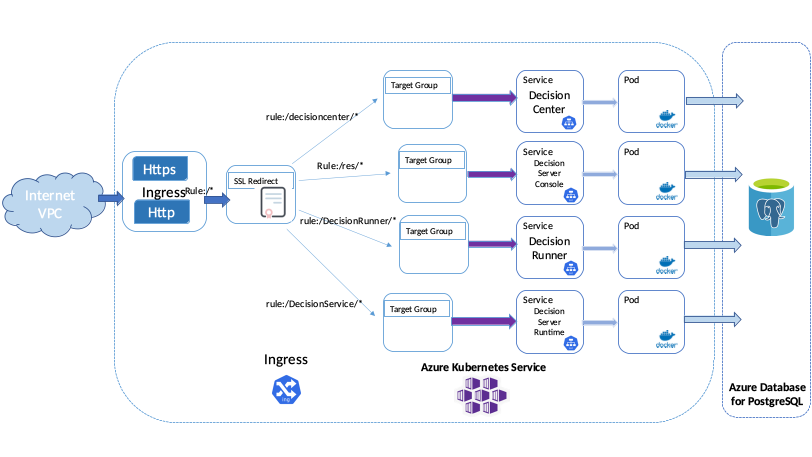

# Deploying IBM Operational Decision Manager on Azure AKS

This project demonstrates how to deploy an IBM® Operational Decision Manager (ODM) clustered topology on the Azure Kubernetes Service (AKS) cloud service. This deployment implements Kubernetes and Docker technologies.



> [!IMPORTANT]
> **Deployment Options:**
>
> There are two ways to expose ODM services on AKS:
>
> 1. **AKS default Load Balancer (Documented in this tutorial):** Uses the [AKS Load Balancer](https://learn.microsoft.com/en-us/azure/aks/load-balancer-standard) with container-native load balancing. This is the standard approach documented in the steps below.
>
> 2. **Gateway API (Recommended for Advanced Features):** Uses the [Application Gateway for Containers](https://learn.microsoft.com/en-us/azure/application-gateway/for-containers/overview) which provides more advanced routing capabilities, better session affinity management, and is the future direction for Kubernetes networking. See our tutorial [Deploying IBM Operational Decision Manager with Application Gateway for Containers (AGC) supporting Gateway API on Azure AKS](README-GATEWAY.md).


The ODM on Kubernetes Docker images are available in the [IBM Entitled Registry](https://www.ibm.com/cloud/container-registry). The ODM Helm chart is available in the [IBM Helm charts repository](https://github.com/IBM/charts).

## Included components

The project comes with the following components:

- [IBM Operational Decision Manager](https://www.ibm.com/docs/en/odm/9.6.0)
- [Azure Database for PostgreSQL](https://docs.microsoft.com/en-us/azure/postgresql/)
- [Azure Kubernetes Service (AKS)](https://docs.microsoft.com/en-us/azure/aks/)
- [Network concepts for applications in AKS](https://docs.microsoft.com/en-us/azure/aks/concepts-network)

## Tested environment
The commands and tools have been tested on macOS and Linux.

## Prerequisites
First, install the following software on your machine:

- [Azure CLI](https://docs.microsoft.com/en-us/cli/azure/install-azure-cli?view=azure-cli-latest)
- [Helm v3](https://helm.sh/docs/v3/intro/install/) or [Helm v4](https://helm.sh/docs/intro/install/)

Then, [create an Azure account and pay as you go](https://azure.microsoft.com/en-us/pricing/purchase-options/pay-as-you-go/).

> [!NOTE]
> Prerequisites and software supported by ODM 9.6.0 are listed in [the Detailed System Requirements page](https://www.ibm.com/support/pages/ibm-operational-decision-manager-detailed-system-requirements).

## Steps to deploy ODM on Kubernetes to Azure AKS
<!-- TOC depthfrom:2 depthto:2 -->

- [Included components](#included-components)
- [Tested environment](#tested-environment)
- [Prerequisites](#prerequisites)
- [Steps to deploy ODM on Kubernetes to Azure AKS](#steps-to-deploy-odm-on-kubernetes-to-azure-aks)
- [Prepare your AKS instance (30 min)](#prepare-your-aks-instance-30-min)
- [Create the PostgreSQL Azure instance (10 min)](#create-the-postgresql-azure-instance-10-min)
- [Prepare your environment for the ODM installation](#prepare-your-environment-for-the-odm-installation)
- [Install an ODM Helm release and expose it with the service type LoadBalancer (10 min)](#install-an-odm-helm-release-and-expose-it-with-the-service-type-loadbalancer-10-min)
- [IBM Usage Metering service](#ibm-usage-metering-service)
- [Troubleshooting](#troubleshooting)
- [Getting Started with IBM Operational Decision Manager for Containers](#getting-started-with-ibm-operational-decision-manager-for-containers)

<!-- /TOC -->

## Prepare your AKS instance (30 min)

For more information, see [Kubernetes walkthrough for AKS](https://docs.microsoft.com/en-us/azure/aks/kubernetes-walkthrough).

### Log into Azure

After installing the Azure CLI, use the following command line:

```shell
az login [--tenant <name>.onmicrosoft.com]
```

A web browser opens where you can connect with your Azure credentials.

### Create a resource group

An Azure resource group is a logical group in which Azure resources are deployed and managed. When you create a resource group, you will be prompted to specify a location. This location is where resource group metadata is stored. It is also where your resources run in Azure, if you do not specify another region during resource creation. 

To get a list of available locations, run:

```shell
az account list-locations -o table
```

Then, create a resource group by running the following command:

```shell
az group create --name <resourcegroup> --location <azurelocation> --tags Owner=<email> Team=<team> Usage=demo Usage_desc="Azure customers support" Delete_date=2027-12-31
```

The following example output shows that the resource group has been created successfully:

```json
{
  "id": "/subscriptions/<guid>/resourceGroups/<resourcegroup>",
  "location": "<azurelocation>",
  "managedBy": null,
  "name": "<resourcegroup>",
  "properties": {
    "provisioningState": "Succeeded"
  },
  "tags": {
    "Delete_date": "2027-12-31",
    "Owner": "<email>",
    "Team": "<team>",
    "Usage": "demo",
    "Usage_desc": "Azure customers support"
  },
  "type": "Microsoft.Resources/resourceGroups"
}
```

### Create an AKS cluster

Use the `az aks create` command to create an AKS cluster. The following example creates a cluster named <cluster> with two nodes. Azure Monitor for containers can also be enabled by using the `--enable-addons monitoring` parameter.  The operation takes several minutes to complete.

```shell
az aks create --name <cluster> --resource-group <resourcegroup> --node-count 2 \
          --enable-cluster-autoscaler --min-count 2 --max-count 4 --generate-ssh-keys
```
> [!NOTE]
> During the creation of the AKS cluster, a second resource group is automatically created to store the AKS resources. For more information, see [Why are two resource groups created with AKS](https://docs.microsoft.com/en-us/azure/aks/faq#why-are-two-resource-groups-created-with-aks).

After a few minutes, the command completes and returns JSON-formatted information about the cluster.  

Make a note of the newly-created Resource Group that is displayed in the JSON output (e.g. `"nodeResourceGroup": "<noderesourcegroup>"`). You can update the resource with additional tags. For example:

```shell
az group update --name <noderesourcegroup> \
    --tags Owner=<email> Team=<team> Usage=demo Usage_desc="Azure customers support" Delete_date=2027-12-31
```

### Set up your environment to this cluster

To manage a Kubernetes cluster, you will need to use `kubectl`, the Kubernetes command-line client. If you use `Azure Cloud Shell`, kubectl is already installed. Otherwise, to use `kubectl` locally, run the the following command to install the client:

```shell
az aks install-cli
```

To configure kubectl to connect to your Kubernetes cluster, use the `az aks get-credentials` command. This command downloads credentials and configures the Kubernetes CLI to use them.

```shell
az aks get-credentials --name <cluster> --resource-group <resourcegroup>
```

To verify the connection to your cluster, use the `kubectl get` command to return the list of cluster nodes.

```shell
kubectl get nodes
```

The following example output shows the single node created in the previous steps. Make sure that the status of the node is Ready.

```
NAME                                STATUS   ROLES   AGE   VERSION
aks-nodepool1-27504729-vmss000000   Ready    agent   21m   v1.35.8
aks-nodepool1-27504729-vmss000001   Ready    agent   21m   v1.35.8
```

## Create the PostgreSQL Azure instance (10 min)

### Create an Azure Database for PostgreSQL

Create an Azure Database for PostgreSQL flexible server by running the `az postgres flexible-server create` command. A server can contain multiple databases.
To get a good bandwidth between ODM containers and the database, choose the same location for the PostgreSQL server and for the AKS cluster.

```shell
az postgres flexible-server create --name <postgresqlserver> --resource-group <resourcegroup> \
                          --admin-user myadmin --admin-password 'passw0rd!' \
                          --sku-name Standard_D2s_v3 --version 18
```

> [!NOTE]
> The PostgreSQL server name must be unique within Azure.

Verify the database.
To connect to your server, you need to provide host information and access credentials.

```shell
az postgres flexible-server show --name <postgresqlserver> --resource-group <resourcegroup>
```

Result:

```json
{
  "administratorLogin": "myadmin",
  "administratorLoginPassword": null,
  "authConfig": {
    "activeDirectoryAuth": "Disabled",
    "passwordAuth": "Enabled",
    "tenantId": null
  },
  "availabilityZone": "1",
  "backup": {
    "backupRetentionDays": 7,
    "earliestRestoreDate": null,
    "geoRedundantBackup": "Disabled"
  },
  "cluster": null,
  "createMode": null,
  "dataEncryption": {
    "geoBackupEncryptionKeyStatus": null,
    "geoBackupKeyUri": null,
    "geoBackupUserAssignedIdentityId": null,
    "primaryEncryptionKeyStatus": null,
    "primaryKeyUri": null,
    "primaryUserAssignedIdentityId": null,
    "type": "SystemManaged"
  },
  "fullyQualifiedDomainName": "<postgresqlserver>.postgres.database.azure.com",
  "highAvailability": {
    "mode": "Disabled",
    "standbyAvailabilityZone": null,
    "state": "NotEnabled"
  },
  "id": "/subscriptions/xxxxxxxx-xxxx-xxxx-xxxx-cb6e4a84fda1/resourceGroups/<resourcegroup>/providers/Microsoft.DBforPostgreSQL/flexibleServers/<postgresqlserver>",
  "identity": null,
  "location": "<azurelocation>",
  "maintenanceWindow": {
    "customWindow": "Disabled",
    "dayOfWeek": 0,
    "startHour": 0,
    "startMinute": 0
  },
  "minorVersion": "13",
  "name": "<postgresqlserver>",
  "network": {
    "delegatedSubnetResourceId": null,
    "privateDnsZoneArmResourceId": null,
    "publicNetworkAccess": "Enabled"
  },
  "pointInTimeUtc": null,
  "privateEndpointConnections": [],
  "replica": {
    "capacity": 5,
    "promoteMode": null,
    "promoteOption": null,
    "replicationState": null,
    "role": "Primary"
  },
  "replicaCapacity": 5,
  "replicationRole": "Primary",
  "resourceGroup": "<resourcegroup>",
  "sku": {
    "name": "Standard_D2s_v3",
    "tier": "GeneralPurpose"
  },
  "sourceServerResourceId": null,
  "state": "Ready",
  "storage": {
    "autoGrow": "Disabled",
    "iops": 500,
    "storageSizeGb": 128,
    "throughput": null,
    "tier": "P10",
    "type": ""
  },
  "systemData": {
    "createdAt": "2026-05-18T06:38:28.834391+00:00",
    "createdBy": null,
    "createdByType": null,
    "lastModifiedAt": null,
    "lastModifiedBy": null,
    "lastModifiedByType": null
  },
  "tags": null,
  "type": "Microsoft.DBforPostgreSQL/flexibleServers",
  "version": "18"
}
```

Make a note of the server name that is displayed in the JSON output (e.g. `"fullyQualifiedDomainName": "<postgresqlserver>.postgres.database.azure.com"`) as it will be used later to deploy ODM with `helm install`.

###  Create a firewall rule that allows access from Azure services

To make sure your database and your AKS cluster can communicate, put in place firewall rules with the following command:

```shell
az postgres flexible-server firewall-rule create --resource-group <resourcegroup> --name <postgresqlserver> \
            --rule-name <rule-name> --start-ip-address 0.0.0.0 --end-ip-address 255.255.255.255
```

> [!NOTE] 
> If you use azure-cli version **2.86.0** or higher (released on May 2026), the --name/-n argument has been repurposed to specify the firewall rule name and the --server-name/-s argument was introduced to specify the server name. As a result, the command to run is:
>```shell
>az postgres flexible-server firewall-rule create --resource-group <resourcegroup> --server-name <postgresqlserver> \
>            --name <rule-name> --start-ip-address 0.0.0.0 --end-ip-address 255.255.255.255
>```

### Create the database credentials secret for Azure PostgreSQL

To secure the access to the database, create a secret that encrypts the database user and password before you install the Helm release.

```shell
kubectl create secret generic <odmdbsecret> --from-literal=db-user=myadmin \
                                            --from-literal=db-password='passw0rd!'
```

## Prepare your environment for the ODM installation

To get access to the ODM material, you must have an IBM entitlement key to pull the images from the IBM Entitled Registry.

### Using the IBM Entitled Registry with your IBMid (10 min)

Log in to [MyIBM Container Software Library](https://myibm.ibm.com/products-services/containerlibrary) with the IBMid and password that are associated with the entitled software.

In the Container software library tile, verify your entitlement on the View library page, and then go to Get entitlement key to retrieve the key.

Create a pull secret by running the `kubectl create secret` command.

```shell
kubectl create secret docker-registry ibm-entitlement-key \
        --docker-server=cp.icr.io \
        --docker-username=cp \
        --docker-password="<API_KEY_GENERATED>" \
        --docker-email=<USER_EMAIL>
```
Where:

* `<API_KEY_GENERATED>` is the entitlement key from the previous step. Make sure you enclose the key in double-quotes.
* `<USER_EMAIL>` is the email address associated with your IBMid.

> [!NOTE]
> 1. The **cp.icr.io** value for the docker-server parameter is the only registry domain name that contains the images. You must set the *docker-username* to **cp** to use an entitlement key as *docker-password*.
> 2. The `ibm-entitlement-key` secret name will be used for the `image.pullSecrets` parameter when you run a Helm install of your containers. The `image.repository` parameter is also set by default to `cp.icr.io/cp/cp4a/odm`.


Add the public IBM Helm charts repository:

```shell
helm repo add ibm-helm https://raw.githubusercontent.com/IBM/charts/master/repo/ibm-helm
helm repo update
```

Check that you can access the ODM charts:

```shell
helm search repo ibm-odm-prod
NAME                        CHART VERSION	APP VERSION DESCRIPTION
ibm-helm/ibm-odm-prod       26.3.0       	9.7.0.0     IBM Operational Decision Manager  License By in...
```

### Manage a digital certificate (10 min)

1. (Optional) Generate a self-signed certificate.

If you do not have a trusted certificate, you can use OpenSSL and other cryptography and certificate management libraries to generate a certificate file and a private key, to define the domain name, and to set the expiration date. The following command creates a self-signed certificate (.crt file) and a private key (.key file) that accept the domain name *mynicecompany.com*. The expiration is set to 1000 days:

```shell
openssl req -x509 -nodes -days 1000 -newkey rsa:2048 -keyout mynicecompany.key \
        -out mynicecompany.crt -subj "/CN=mynicecompany.com/OU=it/O=mynicecompany/L=Paris/C=FR" \
        -addext "subjectAltName = DNS:mynicecompany.com"
```

> [!NOTE]
> You can use -addext only with actual OpenSSL and from LibreSSL 3.1.0.

2. Create a Kubernetes secret with the certificate.

```shell
kubectl create secret tls <mynicecompanytlssecret> --cert=tls.crt=mynicecompany.crt --key=tls.key=mynicecompany.key
```

The certificate must be the same as the one you used to enable TLS connections in your ODM release. For more information, see [Server certificates](https://www.ibm.com/docs/en/odm/9.6.0?topic=production-defining-security-certificate).

## Install an ODM Helm release and expose it with the service type LoadBalancer (10 min)

> [!NOTE]
> There are two different options to expose the ODM services. The current tutorial uses the default AKS Load Balancer.
>
> Please refer to the [beginning of this tutorial](#deploying-ibm-operational-decision-manager-on-azure-aks) to read about the other options.

### 1. Allocate public IP addresses

```shell
az aks update --name <cluster> --resource-group <resourcegroup> --load-balancer-managed-outbound-ip-count 4
```

### 2. Install the ODM release

You can now install the product.
- Get the [aks-values.yaml](./aks-values.yaml) file and replace the following keys:
  - `<registrysecret>` is your registry secret name
  - `<postgresqlserver>` is your flexible postgres server name
  - `<odmdbsecret>` is the database credentials secret name
  - `<mynicecompanytlssecret>` is the container certificate
  - `<password>` is the password to login with the basic registry users like `odmAdmin`, `resAdmin`, and `rtsAdmin.`

```shell
helm install <release> ibm-helm/ibm-odm-prod -f aks-values.yaml
```

> [!NOTE]
> The above command installs the **latest available version** of the chart.  
> If you want to install a **specific version**, add the `--version` option:
>
> ```bash
> helm install <release> ibm-helm/ibm-odm-prod --version <version> -f aks-values.yaml
> ```
>
> You can list all available versions using:
>
> ```bash
> helm search repo ibm-helm/ibm-odm-prod -l
> ```

### 3. Check the topology

Run the following command to check the status of the pods that have been created:

```shell
kubectl get pods
```
```shell
NAME                                                   READY   STATUS    RESTARTS   AGE
<release>-odm-decisioncenter-***                       1/1     Running   0          20m
<release>-odm-decisionrunner-***                       1/1     Running   0          20m
<release>-odm-decisionserverconsole-***                1/1     Running   0          20m
<release>-odm-decisionserverruntime-***                1/1     Running   0          20m
```

### 4. Access ODM services

By setting `service.type=LoadBalancer`, the services are exposed with public IPs to be accessed with the following command:

```shell
kubectl get services --selector release=<release>
```
```shell
NAME                                        TYPE           CLUSTER-IP     EXTERNAL-IP       PORT(S)          AGE
<release>-odm-decisioncenter                LoadBalancer   10.0.141.125   xxx.xxx.xxx.xxx   443:31130/TCP   22m
<release>-odm-decisionrunner                LoadBalancer   10.0.157.225   yyy.yyy.yyy.yyy   443:31325/TCP   22m
<release>-odm-decisionserverconsole         LoadBalancer   10.0.215.192   zzz.zzz.zzz.zzz   443:32448/TCP   22m
<release>-odm-decisionserverconsole-notif   ClusterIP      10.0.201.87    <none>            1883/TCP         22m
<release>-odm-decisionserverruntime         LoadBalancer   10.0.177.153   uuu.uuu.uuu.uuu   443:31921/TCP   22m
```

The ODM services are available at the following URLs:

<!-- markdown-link-check-disable -->
| SERVICE NAME | URL | USERNAME/PASSWORD
| --- | --- | ---
| Decision Center | https://xxx.xxx.xxx.xxx | odmAdmin/\<password\>
| Decision Runner | https://yyy.yyy.yyy.yyy | 
| Decision Server Console | https://zzz.zzz.zzz.zzz | odmAdmin/\<password\>
| Decision Server Runtime | https://uuu.uuu.uuu.uuu | odmAdmin/\<password\>
<!-- markdown-link-check-enable -->

Where:
* \<password\> is the password set using the **usersPassword** helm chart parameter


## IBM Usage Metering service

### 1. Install the IBM Usage Metering service

IBM Usage Metering Service (UMS) gathers adoption metrics and creates reports. It captures business value metrics for auditing purposes and to visualize metric usage in reporting tools, and sends the information to IBM Software Central. For more details, see [Collecting and sending usage metrics](https://www.ibm.com/docs/en/odm/9.6.0?topic=production-collecting-sending-usage-metrics).

The IBM License Service (ILS) discovers the software that is installed in your infrastructure and generates reports containing contractual details. These metrics directly affect licensing obligations and are required for calculating license usage in compliance with IBM licensing requirements.

An ILS side-car must be activated when installing UMS. This allows UMS to capture two metrics: contractual metrics for compliance purposes, and adoption metrics for various scenarios related to usage analysis. 

It is required to install UMS in the same namespace as ODM. ODM will systematically report the usage metrics to the metering service through a CronJob. If the service is not installed, the job fails when it runs. 

To install and configure UMS, follow the information at [Installing the usage metering service](https://www.ibm.com/docs/en/odm/9.6.0?topic=metrics-installing-metering).

In this tutorial, we assume that ODM, UMS, and ILS are installed in the same namespace: `default`. The ILS side car is enabled with *namespace scope* to monitor only `default` namespace.

### 2. Troubleshooting

If the CronJob fails, check the pod logs:
```bash
kubectl logs -n <namespace> -l job-name=<cronjob-name>
```

### 3. Data transmission options

After installing the IBM Usage Metering service, choose one of the following modes to transmit the usage metering data based on your environment:

1. **Online mode** (Recommended): Automatic data transmission to IBM Software Central
2. **Offline mode** (Air-gapped): Manual data download and upload process

#### 3.1 Online mode (Recommended)

In online mode, the Usage Metering Service automatically sends *both adoption and contractual* data to IBM Software Central on a scheduled basis every 24 hours. This is the recommended configuration for environments with internet connectivity.

**Configuration requirements**:
- IBM Entitlement Key (required for authentication).
- Network connectivity to IBM Software Central (`swc.saas.ibm.com`)

For complete step-by-step instructions on configuring online mode, see [Automatic data transmission to IBM Software Central](https://www.ibm.com/docs/en/odm/9.6.0?topic=metrics-automatic-data-transmission).

The usage metrics are automatically sent to IBM Software Central and you can see them at https://swc.saas.ibm.com/en-us/software-central (the next day):
- Click **Log in** (create an account if needed)
- Click **Workspace** in the menu tab. This unfolds a drop-down list.
- Click **Usage** in the drop-down list

#### 3.2 Offline mode (Air-gapped environments)

For offline/air-gapped environments where the Usage Metering Service cannot connect directly to IBM Software Central, you need to manually download and upload usage data. You will need to access the service to retrieve the report.

##### 3.2.1. Expose the IBM Usage Metering service using the LoadBalancer

To expose the IBM Usage Metering service using the AKS LoadBalancer, run:

```bash
kubectl apply -f usage-metering-svc-loadbalancer.yaml
```

##### 3.2.2. Retrieve usage metrics

If your cluster is not connected to internet, you can generate a usage report and manually upload it to Software Central.

To generate a Usage report:

1. run the command below to get the external IP address of the UMS service (if you just created the service and the IP address is not set, try again after a while):

  ```bash
  EXTERNAL_IP=$(kubectl get service ibm-usage-metering-instance-loadbalancer -o jsonpath='{.status.loadBalancer.ingress[0].ip}')
  echo "EXTERNAL_IP=${EXTERNAL_IP}"
  ```

1. run:
  ```bash
  UMS_TOKEN=$(kubectl get secret ibm-usage-metering-upload-token -o jsonpath='{.data.token}' 2>/dev/null | base64 -d || echo "")
  curl -k --output swc_payload.tar.gz \
        --header "Authorization: Bearer ${UMS_TOKEN}" \
        --url "https://${EXTERNAL_IP}:8080/api/v1/swc"
  ```

The `swc_payload.tar.gz` contains the following files:
- manifest.json
- usage.json

The `usage.json` file contains both adoption (`"metricType": "adoption"`) and contractual (`"metricType": "contract"`) metrics.

##### 3.2.3. Send data to IBM Software Central

Transfer the downloaded `swc_payload.tar.gz` file to a system with internet connectivity.

Run the command to upload the file to IBM Software Central through its API:

```bash
curl -X POST "https://swc.saas.ibm.com/metering/api/v2/metrics" \
     -H "Authorization: Bearer <IEK>" \
     -F "file=@swc_payload.tar.gz;type=application/gzip"
```

> [!NOTE]
> Replace the `<IEK>` placeholder with your IBM Entitlement Key. You can obtain it from [IBM Container Software Library](https://myibm.ibm.com/products-services/containerlibrary).

For complete instructions, see [Uploading usage metrics to IBM Software Central](https://www.ibm.com/docs/en/odm/9.6.0?topic=metrics-uploading-usage-software-central).


### 4. [Optional] Access IBM License Service

You will be able to access the IBM License Service by retrieving the URL and the required token with this command:

```bash
export LICENSING_URL=$(kubectl get service ibm-usage-metering-instance-loadbalancer -o jsonpath='{.status.loadBalancer.ingress[0].ip}')
export TOKEN=$(kubectl get secret ibm-usage-metering-upload-token -o jsonpath='{.data.token}' |base64 -d)
echo https://${LICENSING_URL}:8082/status?token=${TOKEN}
```

You can access the `https://${LICENSING_URL}:8082/status?token=${TOKEN}` URL to view the licensing status.

Alternatively you can retrieve the licensing report .zip file by running:

```shell
curl -k "https://${LICENSING_URL}:8082/snapshot?token=${TOKEN}" --output ils_report.zip
```

## Troubleshooting

If your ODM instances are not running properly, refer to [our dedicated troubleshooting page](https://www.ibm.com/docs/en/odm/9.6.0?topic=960-troubleshooting-support).

## Getting Started with IBM Operational Decision Manager for Containers

Get hands-on experience with IBM Operational Decision Manager in a container environment by following this [Getting started tutorial](https://github.com/DecisionsDev/odm-for-container-getting-started/blob/master/README.md).

# License

[Apache 2.0](/LICENSE)
