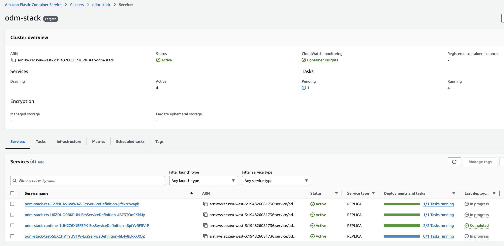

# 1. Pre-requisite 

To deploy ODM containers on AWS ECS Fargate from [docker-compose](docker-compose-http.yaml) file, you must meet the following requirements:

   * Install the latest version of [AWS Cli](https://docs.aws.amazon.com/cli/latest/userguide/getting-started-install.html).
   * Install the latest version of Podman.
   * Install python3.6+ and later version.
   * Ensure you have an [AWS Account](https://aws.amazon.com/getting-started/). 
   * Install [ECS Compose-x](https://github.com/compose-x/ecs_composex?tab=readme-ov-file#installation), preferably in a virtual environment.
   * Ensure that you have an existing internet-facing Elastic Load balancer and a VPC with public subnets [setup](https://docs.aws.amazon.com/elasticloadbalancing/latest/classic/elb-manage-subnets.html) on Amazon Web Services(AWS).
   * If you want to run ODM Decision services in HTTPS mode, you need to have an [ACM public certificate](https://console.aws.amazon.com/acm/home).

# 2. Prepare your environment for the ODM installation

##  Login to AWS

```
export REGION=<aws_deployment_region>
export AWSACCOUNTID=<aws_account_id>
aws ecr get-login-password --region ${REGION} | podman login --username AWS --password-stdin ${AWSACCOUNTID}.dkr.ecr.${REGION}.amazonaws.com
```
where
- `REGION`: AWS Regions where you want to deploy your services
- `AWSACCOUNTID`: your AWS account ID

## Create RDS Database
- Run the following command to create an Amazon RDS database instance that can be used by ODM.
```
aws rds create-db-instance \
  --db-instance-identifier "odm-rds" \
  --db-name "odmdb" \
  --engine 'postgres' \
  --engine-version '13' \
  --auto-minor-version-upgrade \
  --allocated-storage 50 \
  --max-allocated-storage 100 \
  --db-instance-class 'db.t3.large' \
  --master-username "odmusername" \
  --master-user-password "odmpassword" \
  --port "5432" \
  --publicly-accessible \
  --storage-encrypted \
  --tags Key=project,Value=odm
```
- Note down the RDS instance endpoint, you will assign it to the `DB_SERVER_NAME` parameter under `environment` section of each ODM service in the docker-compose file.

## Create a secret for the Entitled registry
To get access to the ODM material, you must have an IBM entitlement registry key to pull the images from the IBM Entitled registry. 
It will be used in the next step of this tutorial.

### a. Retrieve your entitled registry key
  - Log in to [MyIBM Container Software Library](https://myibm.ibm.com/products-services/containerlibrary) with the IBMid and password that are associated with the entitled software.

  - In the Container software library tile, verify your entitlement on the View library page, and then go to *Get entitlement key* to retrieve the key.

### b. Create a JSON file 

Create a `token.json` file with that format.
```json
{
    "username":"cp",
    "password":"<YOUR_ENTITLED_API_KEY>"
}
```

### c. Create the secret in ASW Secrets Manager:

- Create the secret using the following AWS Cli command. For more information, see [Create an AWS Secrets Manager secret](https://docs.aws.amazon.com/secretsmanager/latest/userguide/create_secret.html).

```
aws secretsmanager create-secret \
    --name IBMCPSecret \
    --secret-string file://token.json
```

*Result*:
```
{
    "ARN": "arn:aws:secretsmanager:<aws_deployment_region>:<aws_account_id>:secret:IBMCPSecret-YYYYY",
    "Name": "IBMCPSecret",
    "VersionId": "..."
}
```
- Note down the secret's ARN.  You will assign it to the `x-aws-pull_credentials` custom extension along with the image URI of each ODM service in the docker-compose file. 
For example:
```
  odm-decisioncenter:
    image: cp.icr.io/cp/cp4a/odm/odm-decisioncenter:8.12.0.1-amd64
    x-aws-pull_credentials: "arn:aws:secretsmanager:<aws_deployment_region>:<aws_account_id>:secret:IBMCPSecret-YYYYY"
    ...
  odm-decisionserverruntime:
    image: cp.icr.io/cp/cp4a/odm/odm-decisionserverruntime:8.12.0.1-amd64
    x-aws-pull_credentials: "arn:aws:secretsmanager:<aws_deployment_region>:<aws_account_id>:secret:IBMCPSecret-XXXXXX"
    ...
```
## Create S3 bucket and IAM policy for IBM licensing service

- Make sure to create a S3 bucket in AWS for storing the IBM software license usage data. The name of the bucket must follow the `ibm-license-service-<aws_account_id>` pattern. 

- Add a IAM policy with read and write access, and define it on the S3 bucket. 

```json
{
    "Version": "2012-10-17",
    "Statement": [
        {
            "Sid": "Statement1",
            "Effect": "Allow",
            "Action": [
                "s3:PutObject",
                "s3:GetObject"
            ],
            "Resource": "arn:aws:s3:::ibm-license-service-<aws_account_id>/*"
        }
    ]
}
```

- You will assign this policy to the `x-aws-policies` custom extension of each service in the docker-compose file. 
```
    x-aws-policies:
      - arn:aws:iam::<aws_account_id>:policy/<policy_allow_access_S3_bucket>
```

For more information, see [Tracking license usage on AWS ECS Fargate](https://www.ibm.com/docs/en/cloud-paks/foundational-services/3.23?topic=platforms-tracking-license-usage-aws-ecs-fargate).

## Add Outbound rule to Loadbalancer's security group

Verify that the outbound configuration of the security group of your existing loadbalancer is having "Allow all outbound traffic". However, if you have restricted outbound security group settings, then you must add an addition outbound rule to allow "Custom TCP" port range of `9060 - 9082` . These ports are for ODM Decision services in HTTP mode. For HTTPS mode, the port range should be `9653 - 9953`.

- Access to [EC2 Loadbalancer](https://console.aws.amazon.com/ec2/home?#LoadBalancers:) console.
- Click on the load balancer that you want to define in the docker-compose file.
- Click `Security` tab and then click on the security group.
- Click `Outbound rules` tab, `Edit outbound rules` button and add the outbound rule as shown below:


## Initialize ECS Compose-X

You will need to setup some permissions to validate the AWS CloudFormation (CFN) templates, Lookup AWS resources and etc when using ECS Compose-X commands. For more information about the configuration, see [AWS Account configuration](https://github.com/compose-x/ecs_composex/blob/main/docs/requisites.rst#aws-account-configuration) and [Permissions to upload files to S3](https://github.com/compose-x/ecs_composex/blob/main/docs/requisites.rst#permissions-to-upload-files-to-s3). If your AWS account has administrator permissions, then it is not required to do so.

Upon setting up the appropriate permissions, run this `ecs-compose-x` command which enables some ECS settings and create a default S3 bucket [required by ECS Compose-X](https://github.com/compose-x/ecs_composex/blob/main/docs/requisites.rst#aws-ecs-settings):
```
ecs-compose-x init  
```

Result:
```
2024-06-19 11:39:37 [    INFO] ECS Setting awsvpcTrunking set to 'enabled'
2024-06-19 11:39:37 [    INFO] ECS Setting serviceLongArnFormat set to 'enabled'
2024-06-19 11:39:37 [    INFO] ECS Setting taskLongArnFormat set to 'enabled'
2024-06-19 11:39:37 [    INFO] ECS Setting containerInstanceLongArnFormat set to 'enabled'
2024-06-19 11:39:37 [    INFO] ECS Setting containerInsights set to 'enabled'
2024-06-19 11:39:38 [    INFO] Bucket ecs-composex-<aws_account_id>-<aws_deployment_region> successfully created.
```

*NOTE*: A S3 bucket will automatically be created. It is used to store the generated CFN templates when running `ecs-compose-x` commands.

## Store Amazon Root CA (For HTTPS mode only)

If you want to run ODM Decision services in HTTPS mode, it is required to provide the Amazon Root CA to ODM Decision Center for authentication purposes during ruleApp deployments and also running `Test and Simulation`.

- Go to [Amazon Trust Services](https://www.amazontrust.com/repository/) and download [Amazon Root CA 1](https://www.amazontrust.com/repository/AmazonRootCA1.pem) in `PEM` format.
- Rename the downloaded `AmazonRootCA1.pem` file to `AmazonRootCA1.crt`.
- In the S3 bucket created by `ecs-compose-x init`, create a folder named `certificate`.
- Upload this `AmazonRootCA1.crt` file into this folder.

- Create a new file system name `odm-filesystem` in [Amazon EFS](https:/console.aws.amazon.com/efs/home) using the same VPC where you plan to create ECS Fargate cluster with ODM services. This file system will be used as a volume for Decision Center. See :
```
volumes:
  app:
    x-efs:
      Lookup:
        Tags: 
          Name: odm-filesystem
      RoleArn: arn:aws:iam::aws:policy/service-role/AmazonEFSCSIDriverPolicy
...
  odm-decisioncenter:
    image: cp.icr.io/cp/cp4a/odm/odm-decisioncenter:8.12.0.1-amd64
    x-aws-pull_credentials: "arn:aws:secretsmanager:<aws_deployment_region>:<aws_account_id>:secret:IBMCPSecret-XXXXXX"
    volumes:
      - app:/config/security/trusted-cert-volume
```
- At [AWS DataSync](https://console.aws.amazon.com/datasync), create a new task for data transfer and synchronization between the S3 bucket `certificate` folder and `odm-filesystem`.
    - Step 1: Configure source location. 
        - Select *Location type*: `Amazon S3`, *Region*, *S3 bucket*. In *Folder* field, and enter `/certificate`. Auto-generate the IAM role. Click `Next`.
    

    - Step 2: Configure destination location.
        - Select *Location type*: `Amazon EFS file system`, *Region*, *File System*: `odm-filesystem` and *Mount path*: `/`. Choose the appropriate subnet (that this filesystem will be accessed) and the security group (that can access this file system). Click `Next`.
    

    - Step 3: Configure settings.
        - Give a name to the datasync. Use the default options and click `Next` to `Review` page.
        
    - Step 4: Review
        - Verify the details and click `Create Task` to create the task.

- After the task is created, you can launch data synchronising using `Start with defaults`.

    - Wait for a few minutes and check the status at `Task history`.  It should be successful.
    
    - If the task failed with this following error, the security group that you configured at Step 2 does not allow ingress and egress on port 2049.
    
    - Make sure to add an inbound and outbound rule with NFS type at port 2049 to this security group. For example:
    

# 3. Deploy ODM to AWS ECS Fargate

## a. Edit docker-compose file

### 1. HTTP mode

- Download the [docker-compose-http.yaml](docker-compose-http.yaml) and save this file in your working dir.
- Edit the file and assign the appropriate values in the all `<PLACEHOLDER>`.
- For the parameter `RES_URL` that is defined in `environment` section of `odm-decisionrunner` service, look for the DNS value of your [loadbalancer](https://console.aws.amazon.com/ec2/home?#LoadBalancers:) and assign it to the parameter as `http://your_loadbalancer_dns/res`. This is required for running Testing and Simulation in Decision Center under ECS Fargate network.

### 2. HTTPS mode

- Download the [docker-compose-https.yaml](docker-compose-https.yaml) and save this file in your working dir.
- Edit the file and assign the appropriate values in the all `<PLACEHOLDER>`.
- For HTTPS mode, you need to assign the arn of the [ACM public certificate](https://console.aws.amazon.com/acm/home) at `x-elbv2` extension. The ssl policy is set to TLS1.3 `ELBSecurityPolicy-TLS13-1-2-2021-06` policy. 
```x-elbv2:
  public-alb:
    Lookup:
      loadbalancer:
        Tags:
          <loadbalancer_tag>: <loadbalancer_tag_value>
...
    Listeners:
    # Declare to use port=443, protocal=HTTPS and the access paths for each ODM components
    # If the port is used, change it to another value. 
      - Port: 443
        Protocol: HTTPS
        # Make sure there is ACM public certificate that can be applied on ELB for HTTPS purpose
        Certificates:
         - CertificateArn: arn:aws:acm:<aws_deployment_region>:<aws_account_id>:certificate/XXXX-YYYY
         SslPolicy: ELBSecurityPolicy-TLS13-1-2-2021-06
  ```
- For the parameter `RES_URL` that is defined in `environment` section of `odm-decisionrunner` service, look for the DNS value of your [loadbalancer](https://console.aws.amazon.com/ec2/home?#LoadBalancers:) and assign it to the parameter as `https://your_loadbalancer_dns/res`. This is required for running Testing and Simulation in Decision Center under ECS Fargate network.


## b. Create the AWS CloudFormation stacks

- Run the following command to generate the CFN templates, validate the templates, and create the stacks in CFN.

```
ecs-compose-x up -n odm-stack -b <generated_s3_bucket> -f docker-compose-http.yaml -d outputdir
```

- Sign in to the [AWS CloudFormation console](https://console.aws.amazon.com/cloudformation/home?) to monitor the stacks (root, CloudMap, IAM, elbv2, service networking, and ODM) creation status. 


- If all the stacks complete without error, go to [Elastic Container Service](https://console.aws.amazon.com/ecs/v2/home?) to look for the newly created cluster named `odm-stack`.  

- Click on the cluster and you shall find the ODM and IBM licensing service containers running in healthy state. For example:


## c. Access ODM services:

- Access to [EC2 Loadbalancer](https://console.aws.amazon.com/ec2/home?#LoadBalancers:) console.
- Click on the load balancer that you have defined in your [docker-compose](docker-compose-http.yaml) file.
- Verify that the listener rules for the ODM services are added and the target groups are in healthy state.
- Copy the loadbalancer's DNS name.
- Depending on HTTP or HTTPS mode, the URLs for the ODM components are as follows:
    - `http://<loadbalancer_dns>/decisioncenter` or `https://<loadbalancer_dns>/decisioncenter`
    - `http://<loadbalancer_dns>/res` or `https://<loadbalancer_dns>/res`
    - `http://<loadbalancer_dns>/DecisionService` or `https://<loadbalancer_dns>/DecisionService`
    - `http://<loadbalancer_dns>/DecisionRunner` or `https://<loadbalancer_dns>/DecisionRunner`

## d. Edit Server configurations in Decision Center

- Login to Decision Center with `odmAdmin` user.
- Click on `Administration` tab and then `Servers` tab.
- Edit `Decision Service Execution` configuration and update the `Server URL` to `http://<loadbalancer_dns>/res`. If HTTPS mode, use `https://`.
- Test the connection. If the test is successful, save the changes.

- Repeat the same for `Test and Simulation Execution` configuration. Update the `Server URL` to `http://<loadbalancer_dns>/DecisionRunner`. If HTTPS mode, use `https://`. Test and then save the changes.

## 4. Cleaup AWS CloudFormation stack

To remove the base stack and its nested stacks, there are 2 options.

### 1. AWS CloudFormation console:
- Access to the [AWS CloudFormation console](https://console.aws.amazon.com/cloudformation/home?).
- Select the base stack `odm-stack` and click `Delete` button.

### 2. AWS Cli command

```console
aws --region <aws_deployment_region> cloudformation delete-stack \
--stack-name odm-stack
```