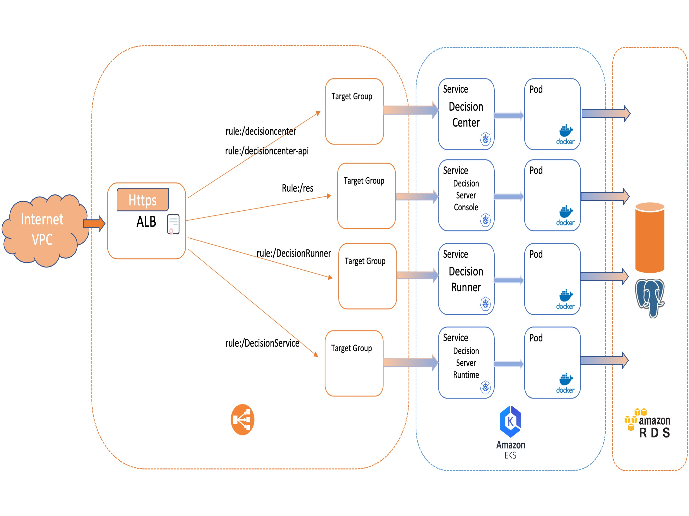

# Deploying IBM Operational Decision Manager on Amazon EKS

This project demonstrates how to deploy an IBM® Operational Decision Manager (ODM) clustered topology on the Amazon Elastic Kubernetes Service (EKS) cloud service. This deployment implements Kubernetes and Docker technologies.



The ODM on Kubernetes Docker images are available in the [IBM Entitled Registry](https://www.ibm.com/cloud/container-registry). The ODM Helm chart is available in the [IBM Helm charts repository](https://github.com/IBM/charts).

## Included components
The project uses the following components:
- [IBM Operational Decision Manager](https://www.ibm.com/docs/en/odm/8.11.0)
- [Amazon Elastic Kubernetes Service (Amazon EKS)](https://aws.amazon.com/eks/)
- [Amazon Relational Database Service (Amazon RDS)](https://aws.amazon.com/rds/)
- [AWS Application Load Balancer (ALB)](https://docs.aws.amazon.com/eks/latest/userguide/alb-ingress.html)

## Tested environment
The commands and tools have been tested on Linux and macOS.

## Prerequisites
First, install the following software on your machine:
* [AWS CLI](https://docs.aws.amazon.com/cli/latest/userguide/cli-chap-install.html)
* [eksctl](https://docs.aws.amazon.com/eks/latest/userguide/eksctl.html)
* [Helm v3](https://helm.sh/docs/intro/install/)
* [kubectl](https://kubernetes.io/docs/tasks/tools/)

Then, create an [AWS Account](https://aws.amazon.com/getting-started/).

## Steps to deploy ODM on Kubernetes from Amazon EKS

<!-- TOC depthfrom:3 depthto:3 updateonsave:false -->

- [Prepare your environment 40 min](#prepare-your-environment-40-min)
- [Prepare your environment for the ODM installation 25 min](#prepare-your-environment-for-the-odm-installation-25-min)
- [Create an RDS database 20 min](#create-an-rds-database-20-min)
- [Manage a  digital certificate 10 min](#manage-a%C2%A0-digital-certificate-10-min)
- [Install an IBM Operational Decision Manager release 10 min](#install-an-ibm-operational-decision-manager-release-10-min)
- [Access the ODM services](#access-the-odm-services)
- [Track ODM usage with the IBM License Service](#track-odm-usage-with-the-ibm-license-service)

<!-- /TOC -->

For more information, see [Getting started with Amazon EKS](https://docs.aws.amazon.com/eks/latest/userguide/getting-started.html)

### 1. Prepare your environment (40 min)

Set up your environment by [configuring the AWS CLI](https://docs.aws.amazon.com/cli/latest/userguide/cli-chap-configure.html):

```bash
aws configure 
```

#### a. Create an EKS cluster (30 min)

Create an EKS cluster:

```bash
eksctl create cluster <CLUSTER_NAME> --alb-ingress-access

```

Reference: https://docs.aws.amazon.com/eks/latest/userguide/create-cluster.html

#### b. Set up your environment (10 min)

Check your environment

If your environment is set up correctly, you should be able to get the cluster information by running the following command:

```bash
$ kubectl cluster-info
Kubernetes control plane is running at https://xxxxxxxx.<REGION>.eks.amazonaws.com
CoreDNS is running at https://xxxxxxxx.<REGION>.eks.amazonaws.com/api/v1/namespaces/kube-system/services/kube-dns:dns/proxy

To further debug and diagnose cluster problems, use 'kubectl cluster-info dump'.
```

#### c. Provision an AWS Load Balancer Controller

The AWS Load Balancer Controller creates Application Load Balancers (ALBs) and the necessary supporting AWS resources whenever a Kubernetes Ingress resource is created on the cluster with the `kubernetes.io/ingress.class: alb` annotation.

Provision an AWS Load Balancer Controller to your EKS cluster:

```bash
helm repo add eks https://aws.github.io/eks-charts
helm repo update
helm install aws-load-balancer-controller eks/aws-load-balancer-controller \
  -n kube-system \
  --set clusterName=<CLUSTER_NAME>
```

Reference: https://docs.aws.amazon.com/eks/latest/userguide/aws-load-balancer-controller.html

> NOTE: If you prefer to use the NGINX Ingress Controller instead of the AWS Load Balancer Controller, refer to [Deploying IBM Operational Decision Manager with NGINX Ingress Controller on Amazon EKS](README-NGINX.md)

### 2. Prepare your environment for the ODM installation (25 min)

To get access to the ODM material, you must have an IBM entitlement registry key to pull the images from the IBM Entitled registry.
It's what will be used in the next step of this tutorial.

But, you can also download the ODM on Kubernetes package (.tgz file) from Passport Advantage® (PPA) and then push the contained images to the EKS Container Registry (ECR). If you prefer to manage ODM images this way, find the explanation [here](README-ECR-REGISTRY.md)

#### a. Retrieve your entitled registry key

- Log in to [MyIBM Container Software Library](https://myibm.ibm.com/products-services/containerlibrary) with the IBMid and password that are associated with the entitled software.

- In the Container software library tile, verify your entitlement on the View library page, and then go to *Get entitlement key* to retrieve the key.

#### b. Create a pull secret by running a kubectl create secret command.

```console
kubectl create secret docker-registry my-odm-docker-registry --docker-server=cp.icr.io \
    --docker-username=cp --docker-password="<ENTITLEMENT_KEY>" --docker-email=<USER_EMAIL>
```

where:
* <ENTITLEMENT_KEY> is the entitlement key from the previous step. Make sure you enclose the key in double-quotes.
* <USER_EMAIL> is the email address associated with your IBMid.

> Note: The `cp.icr.io` value for the docker-server parameter is the only registry domain name that contains the images. You must set the docker-username to `cp` to use an entitlement key as docker-password.

The my-odm-docker-registry secret name is already used for the `image.pullSecrets` parameter when you run a helm install of your containers. The `image.repository` parameter is also set by default to `cp.icr.io/cp/cp4a/odm`.

#### c. Add the public IBM Helm charts repository:

```console
helm repo add ibmcharts https://raw.githubusercontent.com/IBM/charts/master/repo/entitled
helm repo update
```

#### d. Check you can access ODM's chart

```console
$ helm search repo ibm-odm-prod
NAME                             	CHART VERSION	APP VERSION	DESCRIPTION
ibmcharts/ibm-odm-prod           	22.2.0       	8.11.1.0   	IBM Operational Decision Manager
```

### 3. Create an RDS database (20 min)

This following step is using PostgreSQL but the procedure is valid for any database supported by ODM:

```bash
aws rds create-db-instance --db-instance-identifier <INSTANCE_NAME> \
  --engine postgres --db-instance-class db.t3.large --allocated-storage 250 \
  --master-username <PG_USERNAME> --master-user-password <PG_PASSWORD> \
  --db-name <RDS_DATABASE_NAME>
```

Wait a few minutes for the RDB instance to be created and then get its public endpoint FQDN:

```bash
aws rds describe-db-instances |jq -r ".DBInstances[].Endpoint.Address"
```

(If `jq` is not installed then just remove this second part above and look for the endpoint address; it looks like `<INSTANCE_NAME>.xxxxxxxx.<REGION>.rds.amazonaws.com`.)

It will be used later as RDS_DB_ENDPOINT.

Reference: https://docs.aws.amazon.com/AmazonRDS/latest/UserGuide/USER_CreateDBInstance.html

> NOTE:  Make sure to:
> - Create the RDS database in the same cluster region for performance reason (mainly for Decision Center schema creation time)
> - Take a PostgreSQL v13.X version (the command above creates a PG 13.7 instance at the moment)
> - Set up incoming traffic to allow connection from EKS (set vpc inboud rule to anywhere)

Once the RDS PostgreSQL database is available, take a note of the database endpoint. It will be referred as `RDS_DB_ENDPOINT` in the next sections.

To secure access to the database, you must create a secret that encrypts the database user and password before you install the Helm release.

```bash
kubectl create secret generic odm-db-secret \
--from-literal=db-user=<PG_USERNAME> \
--from-literal=db-password=<PG_PASSWORD>
```

> NOTE: ODM on K8s is provided with a ready to use internal database based on PostgreSQL that can be used empty or with pre-populated samples.
If you want to install an ODM demo quickly, you can use this internal database. This internal database is dedicated to prototyping, not for production.

### 4. Manage a  digital certificate (10 min)

#### a. (Optional) Generate a self-signed certificate

If you do not have a trusted certificate, you can use OpenSSL and other cryptography and certificate management libraries to generate a `.crt` certificate file and a private key, to define the domain name, and to set the expiration date.
The following command creates a self-signed certificate (.crt file) and a private key (.key file) that accept the domain name *.mycompany.com*. The expiration is set to 1000 days:

```bash
openssl req -x509 -nodes -days 1000 -newkey rsa:2048 -keyout mycompany.key \
  -out mycompany.crt -subj "/CN=*.mycompany.com/OU=it/O=mycompany/L=Paris/C=FR"
```

#### b. Upload the certificate to AWS IAM service

Run the following command:
```bash
aws iam upload-server-certificate --server-certificate-name mycompany \
  --certificate-body file://mycompany.crt --private-key file://mycompany.key
```

The output of the command is:
```json
{
  "ServerCertificateMetadata": {
    "Path": "/",
    "ServerCertificateName": "mycompany",
    "ServerCertificateId": "ASCA4GCFYJYN5C35DTU5X",
    "Arn": "arn:aws:iam::<AWS-AccountId>:server-certificate/mycompany",
    "UploadDate": "2020-04-08T13:52:49+00:00",
    "Expiration": "2023-01-03T13:39:08+00:00"
  }
}
```

> NOTE: "Arn": "arn:aws:iam::\<AWS-AccountId\>:server-certificate/mycompany" is used later to configure the Ingress ALB certificate annotation.

### 5. Install an IBM Operational Decision Manager release (10 min)

Install a Kubernetes release with the default configuration and a name of `mycompany`.

To install ODM with the AWS RDS postgreSQL database created in [step 3](#3-create-an-rds-database-20-min) :

- Get the [eks-rds-values.yaml](./eks-rds-values.yaml) file and replace the following keys:
  - `<AWS-AccountId>` is your AWS Account Id
  - `<RDS_DB_ENDPOINT>` is your database server endpoint
  - `<RDS_DATABASE_NAME>` is the initial database name defined when creating the RDS database

```bash
helm install mycompany ibmcharts/ibm-odm-prod --version 22.2.0 -f eks-rds-values.yaml
```

> NOTE: If you prefer to install ODM to prototype (not for production purpose) with the ODM PostgreSQL internal database :
>
> - Get the [eks-values.yaml](./eks-values.yaml) file and replace the following keys:
>   - `<AWS-AccountId>` is your AWS Account Id
>
>```bash
>helm install mycompany ibmcharts/ibm-odm-prod --version 22.2.0 -f eks-values.yaml
>```

> NOTE: If you choose to use the NGINX Ingress Controller, refer to [Install an ODM release with NGINX Ingress Controller](README-NGINX.md#install-an-odm-release-with-nginx-ingress-controller).


#### c. Check the topology
Run the following command to check the status of the pods that have been created: 
```bash
kubectl get pods
```

| *NAME* | *READY* | *STATUS* | *RESTARTS* | *AGE* |
|---|---|---|---|---|
| mycompany-odm-decisioncenter-*** | 1/1 | Running | 0 | 44m |
| mycompany-odm-decisionrunner-*** | 1/1 | Running | 0 | 44m |
| mycompany-odm-decisionserverconsole-*** | 1/1 | Running | 0 | 44m |
| mycompany-odm-decisionserverruntime-*** | 1/1 | Running | 0 | 44m |

### 6. Access the ODM services  

This section explains how to implement an Application Load Balancer (ALB) to expose the ODM services to Internet connectivity.

After a couple of minutes, the ALB reflects the ingress configuration. Then you can access the ODM services by retrieving the URL with this command:

```bash
export ROOTURL=$(kubectl get ingress mycompany-odm-ingress --no-headers |awk '{print $4}')
```

If ROOTURL is empty take a look the [troubleshooting](#troubleshooting) section.

With this ODM topology in place, you can access web applications to author, deploy, and test your rule-based decision services.

The services are accessible from the following URLs:

| *Component* | *URL* | *Username/Password* |
|---|---|---|
| Decision Center | https://${ROOTURL}/decisioncenter | odmAdmin/odmAdmin |
| Decision Center Swagger | https://${ROOTURL}/decisioncenter-api | odmAdmin/odmAdmin |
| Decision Server Console |https://${ROOTURL}/res| odmAdmin/odmAdmin |
| Decision Server Runtime | https://${ROOTURL}/DecisionService | odmAdmin/odmAdmin |
| Decision Runner | https://${ROOTURL}/DecisionRunner | odmAdmin/odmAdmin |

### 7. Track ODM usage with the IBM License Service

#### a. Install the IBM License Service

Follow the **Installation** section of the [Manual installation without the Operator Lifecycle Manager (OLM)](https://www.ibm.com/docs/en/cpfs?topic=software-manual-installation-without-operator-lifecycle-manager-olm)

> NOTE: Make sure you don't follow the instantiation part!

#### b. Create the IBM Licensing instance

Get the [licensing-instance.yaml](./licensing-instance.yaml) file and execute the command :

```
kubectl create -f licensing-instance.yaml
```

> NOTE: You can find more information and use cases on [this page](https://www.ibm.com/docs/en/cpfs?topic=software-configuration).

#### c. Retrieving license usage

After a couple of minutes, the ALB reflects the ingress configuration and you will be able to access the IBM License Service by retrieving the URL with this command:

```bash
export LICENSING_URL=$(kubectl get ingress ibm-licensing-service-instance -n ibm-common-services -o jsonpath='{.status.loadBalancer.ingress[0].hostname}')
export TOKEN=$(kubectl get secret ibm-licensing-token -n ibm-common-services -o jsonpath='{.data.token}' |base64 -d)
```

If LICENSING_URL is empty take a look the [troubleshooting](#troubleshooting) section.

You can access the `http://${LICENSING_URL}/status?token=${TOKEN}` url to view the licensing usage or retrieve the licensing report zip file by running:

```bash
curl "http://${LICENSING_URL}/snapshot?token=${TOKEN}" --output report.zip
```

## Troubleshooting

If your ODM instances are not running properly, check the logs by running the following command:
```
kubectl logs <your-pod-name>
```

If the ROOTURL is empty, it means there is no address delivered to the ODM ingress instance (mycompany-odm-ingress) by the ALB controller.
So, you can check the ALB controller logs with :
```
kubectl logs -n kube-system deployment.apps/aws-load-balancer-controller
```

Check the ALB configuration if you get a message like :
"msg"="Reconciler error" "error"="failed to reconcile ...

Reference: https://aws.amazon.com/blogs/opensource/network-load-balancer-nginx-ingress-controller-eks/

## Getting Started with IBM Operational Decision Manager for Containers

Get hands-on experience with IBM Operational Decision Manager in a container environment by following this [Getting started tutorial](https://github.com/DecisionsDev/odm-for-container-getting-started/blob/master/README.md).

# License
[Apache 2.0](/LICENSE)
