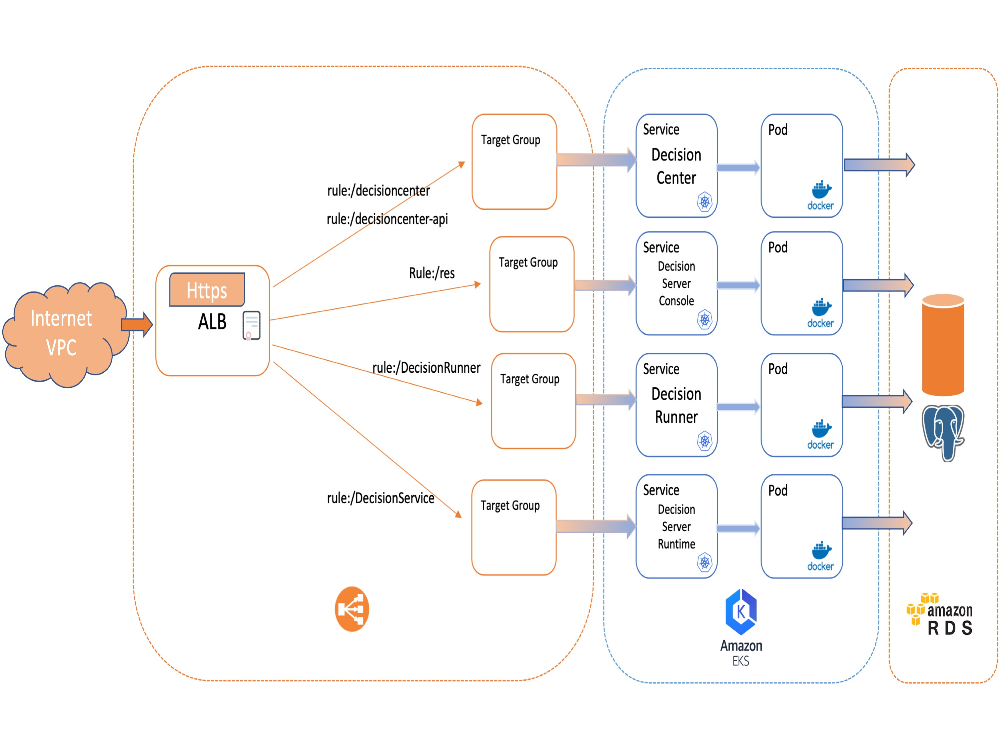

# Deploying IBM Operational Decision Manager on Amazon EKS

This project demonstrates how to deploy an IBM® Operational Decision Manager (ODM) clustered topology on the Amazon Elastic Kubernetes Service (EKS) cloud service. This deployment implements Kubernetes and Docker technologies.




The ODM on Kubernetes Docker images are available in the [IBM Cloud Container Registry](https://www.ibm.com/cloud/container-registry). The ODM Helm chart is available in the [IBM Helm charts repository](https://github.com/IBM/charts).

> [!IMPORTANT]
> **Deployment Options:**
>
> There are two ways to expose ODM services on EKS:
>
> 1. **AWS Application Load Balancer (ALB) Ingress (Default - Documented in this README):** Uses the [AWS Load Balancer Controller](https://github.com/kubernetes-sigs/aws-load-balancer-controller#aws-load-balancer-controller) with Kubernetes [Ingress resources](https://kubernetes.io/docs/concepts/services-networking/ingress/). This is the standard approach documented in the steps below.
>
> 2. **AWS Application Load Balancer (ALB) Gateway API (Recommended for Advanced Features):** Uses the AWS Load Balancer Controller with [Gateway resources](https://gateway-api.sigs.k8s.io/). This approach provides more advanced routing capabilities and better session affinity management. It is the future direction for Kubernetes networking. See the [Deploying IBM Operational Decision Manager with AWS Load Balancer Controller supporting Gateway API on Amazon EKS](README-GATEWAY-API.md) guide.


## Included components
The project uses the following components:
- [IBM Operational Decision Manager](https://www.ibm.com/docs/en/odm/9.6.0?topic=operational-decision-manager-certified-kubernetes-960)
- [Amazon Elastic Kubernetes Service (Amazon EKS)](https://aws.amazon.com/eks/)
- [Amazon Relational Database Service (Amazon RDS)](https://aws.amazon.com/rds/)
- [AWS Application Load Balancer (ALB)](https://docs.aws.amazon.com/eks/latest/userguide/alb-ingress.html)

## Tested environment
The commands and tools have been tested on Linux and macOS.

## Prerequisites
First, install the following software on your machine:
* [AWS CLI](https://docs.aws.amazon.com/cli/latest/userguide/cli-chap-install.html)
* [eksctl](https://docs.aws.amazon.com/eks/latest/userguide/eksctl.html)
* [Helm v4](https://helm.sh/docs/intro/install/)
* [kubectl](https://kubernetes.io/docs/tasks/tools/)

Then, create an [AWS Account](https://aws.amazon.com/getting-started/).

## Steps to deploy ODM on Kubernetes from Amazon EKS
<!-- TOC depthFrom:3 depthTo:3 withLinks:1 updateOnSave:1 orderedList:0 -->

- [1. Prepare your environment (20 min)](#1-prepare-your-environment-20-min)
- [2. Create an RDS database (10 min)](#2-create-an-rds-database-10-min)
- [3. Prepare your environment for the ODM installation (5 min)](#3-prepare-your-environment-for-the-odm-installation-5-min)
- [4. Manage a digital certificate (10 min)](#4-manage-adigital-certificate-10-min)
- [5. Install an IBM Operational Decision Manager release (10 min)](#5-install-an-ibm-operational-decision-manager-release-10-min)
- [6. Access the ODM services](#6-access-the-odm-services)
- [7. Track ODM Adoption and Contractual metrics](#7-track-odm-adoption-and-contractual-metrics)

<!-- /TOC -->

For more information, see [Getting started with Amazon EKS](https://docs.aws.amazon.com/eks/latest/userguide/getting-started.html)

### 1. Prepare your environment (20 min)

#### a. Configure the `aws` CLI

Set up your environment by [configuring the AWS CLI](https://docs.aws.amazon.com/cli/latest/userguide/cli-chap-configure.html):

```bash
aws configure 
```
Where you provide your `AWS Access Key ID`, `AWS Secret Access Key` and the `Default region name`.

#### b. Create an EKS cluster (20 min)

```bash
eksctl create cluster <CLUSTER_NAME> --version 1.34 --nodes 3 --alb-ingress-access
```

> [!NOTE]
> The tutorial has been tested with the Kubernetes version 1.34. Check the supported kubernetes version in the [Detailed System Requirements](https://www.ibm.com/software/reports/compatibility/clarity/product.html?id=C88B83D2853E4A628442E38C1194FF8F) page.

> [!TIP]
> As an alternative to the ALB Ingress approach, you can use the AWS Load Balancer Controller with Gateway API for more advanced routing capabilities. See the [Deploying IBM Operational Decision Manager with AWS Load Balancer Controller supporting Gateway API on Amazon EKS](README-GATEWAY-API.md) guide.

To see the options that you can specify when creating a cluster with `eksctl`, use the `eksctl create cluster --help` command. For more information, refer to [Creating an Amazon EKS cluster](https://docs.aws.amazon.com/eks/latest/userguide/create-cluster.html).

#### c. Set up your environment

If your environment is set up correctly, you should be able to get the cluster information by running the following command:

```bash
kubectl cluster-info

Kubernetes control plane is running at https://xxxxxxxx.<REGION>.eks.amazonaws.com
CoreDNS is running at https://xxxxxxxx.<REGION>.eks.amazonaws.com/api/v1/namespaces/kube-system/services/kube-dns:dns/proxy

To further debug and diagnose cluster problems, use 'kubectl cluster-info dump'.
```

#### d. Provision an AWS Load Balancer Controller

Provision an AWS Load Balancer Controller to your EKS cluster.
The Helm command to run differs depending on the type of nodes the Controller will be running on (EC2 or Fargate).

- EC2 nodes (EKS in standard mode (with or without Autoscaling) or managed mode)

    ```bash
    helm repo add eks https://aws.github.io/eks-charts
    helm repo update

    helm install aws-load-balancer-controller eks/aws-load-balancer-controller \
        -n kube-system \
        --set clusterName=<CLUSTER_NAME>
    ```

    For more information, refer to [Installing the AWS Load Balancer Controller add-on](https://docs.aws.amazon.com/eks/latest/userguide/aws-load-balancer-controller.html).

- Fargate nodes (EKS with Fargate)

    The AWS Load Balancer Controller is running on Fargate nodes if a Fargate profile specifies that the pods in the `kube-system` namespace should run on Fargate. A Fargate profile like that is automatically created if the EKS cluster is created with the `--fargate` option.

    In that case, additional Helm chart parameters must be specified:
    ```bash
    helm repo add eks https://aws.github.io/eks-charts
    helm repo update

    helm install aws-load-balancer-controller eks/aws-load-balancer-controller \
        -n kube-system \
        --set clusterName=<CLUSTER_NAME> \
        --set region=<region-code> \
        --set vpcId=vpc-xxxxxxxx \
        --set serviceAccount.create=false \
        --set serviceAccount.name=aws-load-balancer-controller
    ```

    Before running the Helm command above, you need to:
    - find the VPC ID and region code of the EKS cluster, and
    - create an IAM service account for the AWS Load Balancer Controller. You can find instructions in [Install AWS Load Balancer Controller with Helm](https://docs.aws.amazon.com/eks/latest/userguide/lbc-helm.html).

### 2. Create an RDS database (10 min)

#### a. Create the database instance

The following step uses PostgreSQL but the procedure is valid for any database supported by ODM:

```bash
aws rds create-db-instance --db-instance-identifier <INSTANCE_NAME> \
  --engine postgres --db-instance-class db.t3.large --allocated-storage 250 \
  --master-username <PG_USERNAME> --master-user-password <PG_PASSWORD> \
  --db-name <RDS_DATABASE_NAME>
```

For more information, refer to [Creating an Amazon RDS DB instance](https://docs.aws.amazon.com/AmazonRDS/latest/UserGuide/USER_CreateDBInstance.html).

#### b. Get the database endpoint (10 min)

Wait a few minutes for the RDS PostgreSQL database to be created and take note of its public endpoint. It will be referred to as `RDS_DB_ENDPOINT` in the next sections.

Use the following command to get the RDS instance's endpoint:

```bash
aws rds describe-db-instances | jq -r ".DBInstances[].Endpoint.Address"
```

> [!NOTE]
> If `jq` is not installed, remove the second part above and look for the endpoint address; it looks like `<INSTANCE_NAME>.xxxxxxxx.<REGION>.rds.amazonaws.com`.

#### c. Create the database secret

To secure access to the database, you must create a secret that encrypts the database user and password before you install the Helm release.

```bash
kubectl create secret generic odm-db-secret \
        --from-literal=db-user=<PG_USERNAME> \
        --from-literal=db-password=<PG_PASSWORD>
```

> [!NOTE]
> ODM on Kubernetes is provided with an internal PostgreSQL database that can be used empty or with pre-populated samples.
> If you want to install an ODM demo quickly, you can use this internal database. It is dedicated to prototyping, not for production.

### 3. Prepare your environment for the ODM installation (5 min)

To get access to the ODM material, you must have an IBM entitlement key to pull the images from the IBM Cloud Container registry.
This is what will be used in the next step of this tutorial.

You can also download the ODM CASE package from IBM Cloud Container Registry, and then push the contained images to the EKS Container Registry (ECR). If you prefer to manage the ODM images this way, see the details [here](README-ECR.md).

#### a. Retrieve your entitled registry key

- Log in to [MyIBM Container Software Library](https://myibm.ibm.com/products-services/containerlibrary) with the IBMid and password that are associated with the entitled software.

- In the **Container Software and Entitlement Keys** tile, verify your entitlement on the **View library page**, and then go to *Entitlement keys* to retrieve the key.

#### b. Create a pull secret by running the kubectl create secret command

```bash
kubectl create secret docker-registry ibm-entitlement-key --docker-server=cp.icr.io \
    --docker-username=cp --docker-password="<ENTITLEMENT_KEY>" --docker-email=<USER_EMAIL>
```

Where:
* `<ENTITLEMENT_KEY>` is the entitlement key from the previous step. Make sure you enclose the key in double-quotes.
* `<USER_EMAIL>` is the email address associated with your IBMid.

> [!NOTE]
> 1. The **cp.icr.io** value for the docker-server parameter is the only registry domain name that contains the images. You must set the *docker-username* to **cp** to use an entitlement key as *docker-password*.
> 2. The `ibm-entitlement-key` secret name will be used for the `image.pullSecrets` parameter when you run a Helm install of your containers. The `image.repository` parameter is also set by default to `cp.icr.io/cp/cp4a/odm`.

#### c. Add the public IBM Helm charts repository

```bash
helm repo add ibm-helm https://raw.githubusercontent.com/IBM/charts/master/repo/ibm-helm
helm repo update
```

#### d. Check your access to the ODM chart

```bash
$ helm search repo ibm-odm-prod
NAME                             	CHART VERSION	APP VERSION	DESCRIPTION
ibm-helm/ibm-odm-prod           	27.0.0       	9.7.0.0   	IBM Operational Decision Manager
```

### 4. Manage a digital certificate (10 min)

#### a. Generate a self-signed certificate

If you have a trusted certificate, you can use it to access the ODM container. Otherwise you can use OpenSSL and other cryptography and certificate management libraries to generate a `.crt` certificate file and a private key, to define the domain name, and to set the expiration date.
The following command creates a self-signed certificate (`.crt` file) and a private key (`.key` file) that accept the domain name `.mycompany.com`. The expiration is set to 1000 days:

```bash
openssl req -x509 -nodes -days 1000 -newkey rsa:2048 -keyout mycompany.key \
  -out mycompany.crt -subj "/CN=*.mycompany.com/OU=it/O=mycompany/L=Paris/C=FR"
```

#### b. Upload the certificate to the AWS IAM service

Run the following command:
```bash
aws iam upload-server-certificate --server-certificate-name mycompany \
  --certificate-body file://mycompany.crt --private-key file://mycompany.key
```

The output of the command is:
```json
{
  "ServerCertificateMetadata": {
    "Path": "/",
    "ServerCertificateName": "mycompany",
    "ServerCertificateId": "ASCA4GCFYJYN5C35DTU5X",
    "Arn": "arn:aws:iam::<AWS-AccountId>:server-certificate/mycompany",
    "UploadDate": "2020-04-08T13:52:49+00:00",
    "Expiration": "2023-01-03T13:39:08+00:00"
  }
}
```

> [!NOTE]
> "Arn": "arn:aws:iam::\<AWS-AccountId\>:server-certificate/mycompany" is used later to configure the Ingress ALB certificate annotation.

### 5. Install an IBM Operational Decision Manager release (10 min)

Install a Kubernetes release with the default configuration and a name of `mycompany`.

To install ODM with the AWS RDS PostgreSQL database created in [step 2](#2-create-an-rds-database-10-min):

- Get the [eks-rds-values.yaml](./eks-rds-values.yaml) file and replace the following keys:
  - `<AWS-AccountId>` is your AWS account ID
  - `<RDS_DB_ENDPOINT>` is your database server endpoint
  - `<RDS_DATABASE_NAME>` is the initial database name defined when creating the RDS database

```bash
helm install mycompany ibm-helm/ibm-odm-prod -f eks-rds-values.yaml
```

> [!NOTE]
> - The above command installs the **latest available version** of the chart. If you want to install a **specific version**, add the `--version` option:
>
> ```bash
> helm install mycompany ibm-helm/ibm-odm-prod --version <version> -f eks-rds-values.yaml
> ```
>
> - You can list all available versions using:
>
> ```bash
> helm search repo ibm-helm/ibm-odm-prod -l
> ```
>
> - If you prefer to install ODM to prototype (not for production purpose) with the ODM PostgreSQL internal database. Get the [eks-values.yaml](./eks-values.yaml) file and replace the following key:
>   - `<AWS-AccountId>` is your AWS account ID
>
>```bash
>helm install mycompany ibm-helm/ibm-odm-prod -f eks-values.yaml
>```
>
> - If you choose to use the NGINX Ingress Controller, refer to [Install an ODM release with NGINX Ingress Controller](README-NGINX.md#install-an-odm-release-with-nginx-ingress-controller).


#### Check the topology
Run the following command to check the status of the pods that have been created: 
```bash
kubectl get pods
```

| *NAME* | *READY* | *STATUS* | *RESTARTS* | *AGE* |
|---|---|---|---|---|
| mycompany-odm-decisioncenter-*** | 1/1 | Running | 0 | 44m |
| mycompany-odm-decisionrunner-*** | 1/1 | Running | 0 | 44m |
| mycompany-odm-decisionserverconsole-*** | 1/1 | Running | 0 | 44m |
| mycompany-odm-decisionserverruntime-*** | 1/1 | Running | 0 | 44m |

### 6. Access the ODM services  

This section explains how to implement an Application Load Balancer (ALB) to expose the ODM services to Internet connectivity.

After a couple of minutes, the ALB reflects the Ingress configuration. You can then access the ODM services by retrieving the URL with this command:

```bash
export ROOTURL=$(kubectl get ingress mycompany-odm-ingress --no-headers |awk '{print $4}')
echo $ROOTURL
```

> [!NOTE]
> If `ROOTURL` is empty, take a look at the [troubleshooting](#troubleshooting) section.

With this ODM topology in place, you can access web applications to author, deploy, and test your rule-based decision services.

The ODM services are accessible from the following URLs:

| *Component* | *URL* | *Username/Password* |
|---|---|---|
| Decision Center | https://${ROOTURL}/decisioncenter | odmAdmin/odmAdmin |
| Decision Center Swagger | https://${ROOTURL}/decisioncenter-api | odmAdmin/odmAdmin |
| Decision Server Console |https://${ROOTURL}/res| odmAdmin/odmAdmin |
| Decision Server Runtime | https://${ROOTURL}/DecisionService | odmAdmin/odmAdmin |
| Decision Runner | https://${ROOTURL}/DecisionRunner | odmAdmin/odmAdmin |

### 7. Track ODM Adoption and Contractual metrics

#### 7.1. Install IBM Usage Metering Service & IBM License Service

IBM Usage Metering Service (UMS) gathers adoption metrics and creates reports. It captures business value metrics for auditing purposes and to visualize metric usage in reporting tools, and sends the information to IBM Software Central. For more details, see [Collecting and sending usage metrics](https://www.ibm.com/docs/en/odm/9.6.0?topic=production-collecting-sending-usage-metrics).

The IBM License Service (ILS) discovers the software that is installed in your infrastructure and generates reports containing contractual details. These metrics directly affect licensing obligations and are required for calculating license usage in compliance with IBM licensing requirements.

An ILS side-car can be activated by setting `--set ibmUsageMetering.executionMode=PROCESSOR_CAPACITY_ENABLED` to UMS instance. This allows UMS to capture two metrics: contractual metrics for compliance purposes, and adoption metrics for various scenarios related to usage analysis. 

It is required to install UMS in the same namespace as ODM. ODM will systematically report the usage metrics to the metering service through a CronJob. If the service is not installed, the job fails when it runs. 

To install and configure UMS, follow the information at [Installing the usage metering service](https://www.ibm.com/docs/en/odm/9.6.0?topic=metrics-installing-metering).

In this tutorial, we assume that ODM, UMS, and ILS are installed in the same namespace: `default`. The ILS side car will be enabled with *namespace scope* to monitor only `default` namespace.

#### 7.1.1. Data transmission options

After installing the IBM Usage Metering service, choose one of the following modes to transmit the usage metering data based on your environment:

1. **Online mode** (Recommended): Automatic data transmission to IBM Software Central
2. **Offline mode** (Air-gapped): Manual data download and upload process

##### 7.1.1.1. Online mode (Recommended)

In online mode, the Usage Metering Service automatically sends *both adoption and contractual* data to IBM Software Central on a scheduled basis every 24 hours. This is the recommended configuration for environments with internet connectivity.

*Configuration requirements*:
- IBM Entitlement Key (required for authentication)
- Network connectivity to IBM Software Central (`swc.saas.ibm.com`)

For complete step-by-step instructions on configuring online mode, see [Automatic data transmission to IBM Software Central](https://www.ibm.com/docs/en/odm/9.6.0?topic=metrics-automatic-data-transmission).

##### 7.1.1.2. Offline mode (Air-gapped environments)

For offline/air-gapped environments where the Usage Metering Service cannot connect directly to IBM Software Central, you need to manually download and upload metrics data.

###### 7.1.1.2.1. Expose the IBM Usage Metering service and Licensing service using an ingress

You must expose the service to access and download the metering usage reports.

Open and edit the [ums-alb-ingress.yaml](./ums-alb-ingress.yaml) file. It defines two ingresses: `ibm-licensing-svc-ingress` (port 8082) and `usage-metering-svc-ingress` (port 8080), both routing to the IBM Usage Metering service.
  - Replace `<AWS-AccountId>` with your AWS account ID in the `certificate-arn` annotation of both ingresses. Use the certificate ARN created in step `4a`.
  - Save the file.

Run the command to create the ingresses:

```bash
kubectl apply -f ums-alb-ingress.yaml
```

Run the following command to see the status of Ingress instances:

```bash
kubectl get ingress
```

You should be able to see the address and other details about `ibm-licensing-svc-ingress` and `usage-metering-svc-ingress` instances:

```bash
NAME                         CLASS   HOSTS   ADDRESS                                                                PORTS   AGE
ibm-licensing-svc-ingress    alb     *       k8s-default-ibmlicen-xxxxxxx-yyyyyyy.<aws-region>.elb.amazonaws.com    80      2m
mycompany-odm-ingress        alb     *       k8s-default-mycompan-xxxxxxx-yyyyyyy.<aws-region>.elb.amazonaws.com    80      30m
usage-metering-svc-ingress   alb     *       k8s-default-usagemet-xxxxxxx-yyyyyyy.<aws-region>.elb.amazonaws.com    80      2m
```

###### 7.1.1.2.2. Retrieve metering usage

To get the UMS report archive file, run the command below:

```bash
export UMS_TOKEN=$(kubectl get secret ibm-usage-metering-upload-token -n "${NAMESPACE}" -o jsonpath='{.data.token}' 2>/dev/null | base64 -d || echo "")
export UMS_URL=$(kubectl get ingress usage-metering-svc-ingress --no-headers |awk '{print $4}')
curl -k --output "swc_payload.tar.gz" \
     --header "Authorization: Bearer ${UMS_TOKEN}" \
     --url "https://${UMS_URL}/api/v1/swc"
```

The `swc_payload.tar.gz` contains the following files:
- manifest.json
- usage.json

The `usage.json` file contains both adoption (`"metricType": "adoption"`) and contractual (`"metricType": "contract"`) metrics.


###### 7.1.1.2.3. Sending data to IBM Software Central

Transfer the downloaded `swc_payload.tar.gz` file to a system with internet connectivity.

Run the command to upload the file to IBM Software Central through its API:
```bash
curl -X POST "https://swc.saas.ibm.com/metering/api/v2/metrics" \
     -H "Authorization: Bearer <IEK>" \
     -F "file=@swc_payload.tar.gz;type=application/gzip"
```
> [!NOTE]
> Replace the `<IEK>` placeholder with IBM Entitlement Key. You can obtain it from [IBM Container Software Library](https://myibm.ibm.com/products-services/containerlibrary).

For complete instructions, see [Uploading usage metrics to IBM Software Central](https://www.ibm.com/docs/en/odm/9.6.0?topic=metrics-uploading-usage-software-central).

#### 7.1.2. Access IBM License Service page

> [!NOTE]
> The Ingress must be created as described in [Expose the IBM Usage Metering service and Licensing service using an ingress](#71121-expose-the-ibm-usage-metering-service-and-licensing-service-using-an-ingress).

If you want to view the product licensing status, you can retrieve its URL with this command:

```bash
export LICENSING_URL=$(kubectl get ingress ibm-licensing-svc-ingress -o jsonpath='{.status.loadBalancer.ingress[0].hostname}')
export TOKEN=$(kubectl get secret ibm-usage-metering-upload-token -o jsonpath='{.data.token}' | base64 -d)
echo https://${LICENSING_URL}/status?token=${TOKEN}
```

You can access the `https://${LICENSING_URL}/status?token=${TOKEN}` URL to view the licensing usage or retrieve the licensing snapshot report `.zip` file by running:

```bash
curl -k "https://${LICENSING_URL}/snapshot?token=${TOKEN}" --output ils_snapshot_report.zip
```

#### 7.1.3. Additional resources

For general information about collecting and sending usage metrics, see [Collecting and sending usage metrics](https://www.ibm.com/docs/en/odm/9.6.0?topic=production-collecting-sending-usage-metrics).

## Troubleshooting

- If your ODM instances are not running properly, check the logs with the following command:
  ```bash
  kubectl logs <your-pod-name>
  ```

- If the ODM CronJob fails, check the pod logs:
  ```bash
  kubectl logs -n <namespace> -l job-name=<cronjob-name>
  ```

- If the `ROOTURL` is empty, it means that the ALB controller did not deliver an address to the ODM Ingress instance (mycompany-odm-ingress).
  Check the ALB controller logs with the following command:
  ```bash
  kubectl logs -n kube-system deployment.apps/aws-load-balancer-controller
  ```

  Check the ALB configuration if you get a message like:
  `"msg"="Reconciler error" "error"="failed to reconcile ...`

## Getting Started with IBM Operational Decision Manager for Containers

Get hands-on experience with IBM Operational Decision Manager in a container environment by following this [Getting started tutorial](https://github.com/DecisionsDev/odm-for-container-getting-started/blob/master/README.md).

# License
[Apache 2.0](/LICENSE)
