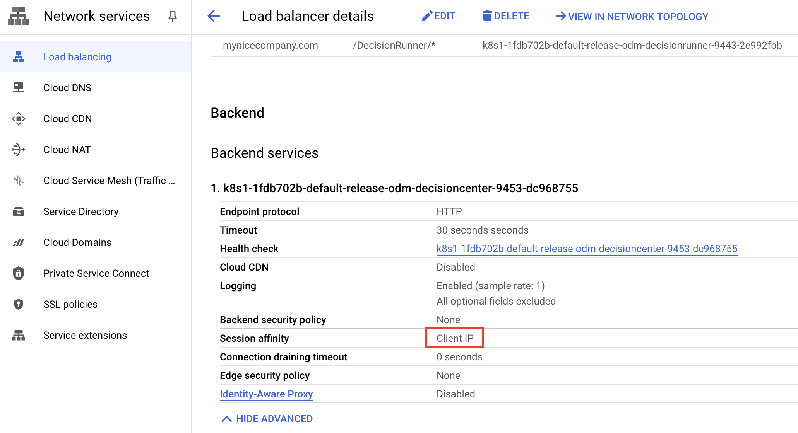

# Deploying IBM Operational Decision Manager on Google GKE

This project demonstrates how to deploy an IBM® Operational Decision Manager (ODM) clustered topology using the [container-native load balancer of GKE](https://cloud.google.com/kubernetes-engine/docs/concepts/container-native-load-balancing).

The ODM services will be exposed using the Ingress provided by the ODM on Kubernetes Helm chart.
This deployment implements Kubernetes and Docker technologies.
Here is the Google Cloud home page: <https://cloud.google.com>


The ODM on Kubernetes Docker images are available in the [IBM Entitled Registry](https://www.ibm.com/cloud/container-registry). The ODM Helm chart is available in the [IBM Helm charts repository](https://github.com/IBM/charts).

## Included components

The project comes with the following components:

- [IBM Operational Decision Manager](https://www.ibm.com/docs/en/odm/9.5.0?topic=operational-decision-manager-certified-kubernetes-950)
- [Google Kubernetes Engine (GKE)](https://cloud.google.com/kubernetes-engine)
- [Google Cloud SQL for PostgreSQL](https://cloud.google.com/sql)
- [IBM License Service](https://github.com/IBM/ibm-licensing-operator)

## Tested environment

The commands and tools have been tested on macOS and Linux.

## Prerequisites

First, install the following software on your machine:

- [gcloud CLI](https://cloud.google.com/sdk/gcloud)
- [kubectl](https://kubernetes.io/docs/tasks/tools/)
- [Helm v3](https://helm.sh/docs/intro/install/)

Then, perform the following tasks:

1. Create a Google Cloud account by connecting to the Google Cloud Platform [console](https://console.cloud.google.com/). When prompted to sign in, create a new account by clicking **Create account**.

2. [Create a Google Cloud project](https://cloud.google.com/resource-manager/docs/creating-managing-projects)

3. [Manage the associated billing](https://cloud.google.com/billing/docs/how-to/modify-project#confirm_billing_is_enabled_on_a_project).

Without the relevant billing level, some Google Cloud resources will not be created.

> [!NOTE]
> Prerequisites and software supported by ODM 9.0.0 are listed on [the Detailed System Requirements page](https://www.ibm.com/support/pages/ibm-operational-decision-manager-detailed-system-requirements).

## Steps to deploy ODM on Kubernetes from Google GKE

<!-- TOC depthfrom:3 depthto:3 -->

- [Prepare your GKE instance 30 min](#prepare-your-gke-instance-30-min)
- [Create the Google Cloud SQL PostgreSQL instance 10 min](#create-the-google-cloud-sql-postgresql-instance-10-min)
- [Prepare your environment for the ODM installation 10 min](#prepare-your-environment-for-the-odm-installation-10-min)
- [Manage a digital certificate 2 min](#manage-a-digital-certificate-2-min)
- [Install the ODM release 10 min](#install-the-odm-release-10-min)
- [Access ODM services](#access-odm-services)
- [Track ODM usage with the IBM License Service](#track-odm-usage-with-the-ibm-license-service)

<!-- /TOC -->

### 1. Prepare your GKE instance (30 min)

Refer to the [GKE quickstart](https://cloud.google.com/kubernetes-engine/docs/quickstart) for more information.

#### a. Log into Google Cloud

After installing the `gcloud` tool, use the following command line:

```shell
gcloud auth login
```

#### b. Create a GKE cluster

There are several [types of clusters](https://cloud.google.com/kubernetes-engine/docs/concepts/types-of-clusters).
In this article, we chose to create a [regional cluster](https://cloud.google.com/kubernetes-engine/docs/how-to/creating-a-regional-cluster).
Regions and zones (used below) can be listed respectively with `gcloud compute regions list` and `gcloud compute zones list`.

- Set the project (associated to a billing account):

  ```shell
  gcloud config set project <PROJECT_ID>
  ```

- Set the region:

  ```shell
  gcloud config set compute/region <REGION (ex: europe-west9)>
  ```

- Set the zone:

  ```shell
  gcloud config set compute/zone <ZONE (ex: europe-west9-b)>
  ```

- Create a cluster and [enable autoscaling](https://cloud.google.com/kubernetes-engine/docs/how-to/cluster-autoscaler). Here, we start with 6 nodes (16 max):

  ```shell
  gcloud container clusters create <CLUSTER_NAME> \
    --release-channel=regular --cluster-version=1.30 \
    --enable-autoscaling --num-nodes=6 --total-min-nodes=1 --total-max-nodes=16
  ```

> [!NOTE]
> If you get a red warning about a missing gke-gcloud-auth-plugin, install it with `gcloud components install gke-gcloud-auth-plugin`.
> For Kubernetes versions lower than 1.26 you have to enable it for each kubectl command with `export USE_GKE_GCLOUD_AUTH_PLUGIN=True` ([more information](https://cloud.google.com/blog/products/containers-kubernetes/kubectl-auth-changes-in-gke)).

> [!NOTE]
> You can also create your cluster from the Google Cloud Platform using the **Kubernetes Engine** > **Clusters** panel and clicking the **Create** button
> 

#### c. Set up your environment

- Create a kubeconfig to connect to your cluster:

  ```shell
  gcloud container clusters get-credentials <CLUSTER_NAME>
  ```

> [!NOTE]
> You can also retrieve the command line to configure `kubectl` from the Google Cloud Console using the **Kubernetes Engine** > **Clusters** panel and clicking **Connect** on the dedicated cluster.
> 

- Check your environment

  If your environment is set up correctly, you should be able to get the cluster information by running the following command:

  ```shell
  kubectl cluster-info
  ```

### 2. Create the Google Cloud SQL PostgreSQL instance (10 min)

#### a. Create the database instance

We will use the Google Cloud Platform console to create the database instance.

- Go to the [SQL context](https://console.cloud.google.com/sql), and then click the **CREATE INSTANCE** button
- Click **Choose PostgreSQL**
  - Database version: `PostgreSQL 15`
  - Instance ID: ``<YourInstanceName>``
  - Password: ``<PASSWORD>`` - Take note of this password.
  - Region: ``<REGION>`` (must be the same as the cluster for the communication to be optimal between the database and the ODM instance)
  - Eventually select **Multiple zones** for Zonal availability for redundancy
  - Expand **Show customization option** and expand **Connections**
    - As *Public IP* is selected by default, in Authorized networks, click the **ADD NETWORK** button, put a name and add *0.0.0.0/0* for Network, then click **DONE**.
      > NOTE: It is not recommended to use a public IP. In a production environment, you should use a private IP.
- Click **CREATE INSTANCE**

After the database instance is created, you can drill on the SQL instance overview to retrieve needed information to connect to this instance, like the IP address and the connection name. Take note of the **Public IP address**.


#### b. Create the database secret for Google Cloud SQL PostgreSQL

To secure access to the database, you must create a secret that encrypts the database user and password before you install the Helm release.

```shell
kubectl create secret generic odmdbsecret \
  --from-literal=db-user=postgres \
  --from-literal=db-password=<PASSWORD>
```

Where:

- `<PASSWORD>` is the database password (PASSWORD set during the PostgreSQL instance creation above)

### 3. Prepare your environment for the ODM installation (10 min)

To get access to the ODM material, you need an IBM entitlement key to pull the images from the IBM Entitled Registry.

#### a. Retrieve your entitled registry key

- Log in to [MyIBM Container Software Library](https://myibm.ibm.com/products-services/containerlibrary) with the IBMid and password that are associated with the entitled software.

- In the Container software library tile, verify your entitlement on the **View library** page, and then go to **Get entitlement key** to retrieve the key.

#### b. Create a pull secret by running a kubectl create secret command

```shell
kubectl create secret docker-registry registrysecret \
        --docker-server=cp.icr.io \
        --docker-username=cp \
        --docker-password='<API_KEY_GENERATED>' \
        --docker-email=<USER_EMAIL>
```

Where:

- `<API_KEY_GENERATED>` is the entitlement key from the previous step. Make sure you enclose the key in quotes.
- `<USER_EMAIL>` is the email address associated with your IBMid.

> [!NOTE]
> The `cp.icr.io` value for the docker-server parameter is the only registry domain name that contains the images. You must set the docker-username to `cp` to use an entitlement key as docker-password.

The *image.repository* parameter will later be set to `cp.icr.io/cp/cp4a/odm`.

#### c. Add the public IBM Helm charts repository

```shell
helm repo add ibm-helm https://raw.githubusercontent.com/IBM/charts/master/repo/ibm-helm
helm repo update
```

#### d. Check you can access ODM charts

```shell
helm search repo ibm-odm-prod
NAME                  CHART VERSION   APP VERSION     DESCRIPTION
ibm-helm/ibm-odm-prod 24.1.0          9.0.0.1         IBM Operational Decision Manager
```

### 4. Manage a digital certificate (2 min)

#### a. (Optional) Generate a self-signed certificate

In this step, you will generate a certificate to be used by the GKE load balancer.

If you do not have a trusted certificate, you can use OpenSSL and other cryptography and certificate management libraries to generate a certificate file and a private key to define the domain name and to set the expiration date. The following command creates a self-signed certificate (`.crt` file) and a private key (`.key` file) that accept the domain name *mynicecompany.com*. The expiration is set to 1000 days:

```shell
openssl req -x509 -nodes -days 1000 -newkey rsa:2048 -keyout mynicecompany.key \
        -out mynicecompany.crt -subj "/CN=mynicecompany.com/OU=it/O=mynicecompany/L=Paris/C=FR"
```

#### b. Create a TLS secret with these keys

```shell
kubectl create secret tls mynicecompany-tls-secret --key mynicecompany.key --cert mynicecompany.crt
```

The certificate must be the same as the one you used to enable TLS connections in your ODM release. For more information, see [Server certificates](https://www.ibm.com/docs/en/odm/9.5.0?topic=servers-server-certificates) and [Working with certificates and SSL](https://docs.oracle.com/cd/E19830-01/819-4712/ablqw/index.html).

### 5. Install the ODM release (10 min)

#### a. Install an ODM Helm release

The ODM services will be exposed with an Ingress that uses the previously created `mynicecompany` certificate.
It automatically creates an HTTPS GKE load balancer. We will disable the ODM internal TLS as it is not needed.

- Get the [gcp-values.yaml](./gcp-values.yaml) file and replace the following keys:

  - `<DB_ENDPOINT>`: the database IP

> [!NOTE]
> You can configure the driversUrl parameter to point to the appropriate version of the Google Cloud SQL PostgreSQL driver. For more information, refer to the [Cloud SQL Connector for Java](https://github.com/GoogleCloudPlatform/cloud-sql-jdbc-socket-factory#cloud-sql-connector-for-java) documentation.

- Install the chart from IBM's public Helm charts repository:

  ```shell
  helm install <release> ibm-helm/ibm-odm-prod --version 24.1.0 -f gcp-values.yaml
  ```

> [!NOTE]
> You might prefer to access ODM components through the NGINX Ingress controller instead of using the IP addresses. If so, please follow [these instructions](README_NGINX.md).

#### b. Check the topology

Run the following command to check the status of the pods that have been created:

```shell
kubectl get pods
NAME                                                   READY   STATUS    RESTARTS   AGE
<release>-odm-decisioncenter-***                       1/1     Running   0          20m
<release>-odm-decisionrunner-***                       1/1     Running   0          20m
<release>-odm-decisionserverconsole-***                1/1     Running   0          20m
<release>-odm-decisionserverruntime-***                1/1     Running   0          20m
```

#### c. Check the Ingress and the GKE LoadBalancer

To get the status of the current deployment, go to the [Kubernetes Engine / Services & Ingress Panel](https://console.cloud.google.com/kubernetes/ingresses) in the console.

The Ingress remains in the state *Creating ingress* for several minutes until the pods are up and running, and the backend gets in a healthy state.


You can also check the [load balancer status](https://console.cloud.google.com/net-services/loadbalancing/list/loadBalancers). It provides information about the backend using the service health check.


In the Ingress details, you should get a *HEALTHY* state on all backends.
This panel also provides some logs on the load balancer activity.
When the Ingress shows an OK status, all ODM services can be accessed.


#### d. Create a Backend Configuration for the Decision Center Service

Sticky session is needed for Decision Center. The browser contains a cookie which identifies the user session that is linked to a unique container.
The ODM on Kubernetes Helm chart has a [clientIP](https://kubernetes.io/docs/concepts/services-networking/service/#proxy-mode-ipvs) for the Decision Center session affinity. Unfortunately, GKE does not use it automatically.
You will not encounter any issue until you scale up the Decision Center deployment.

A configuration that uses [BackendConfig](https://cloud.google.com/kubernetes-engine/docs/how-to/ingress-features#session_affinity) is needed to manage session affinity at the load balancer level.

- Create the [Decision Center Backend Config](decisioncenter-backendconfig.yaml):

  ```shell
  kubectl create -f decisioncenter-backendconfig.yaml
  ```

- Annotate the Decision Center Service with this GKE Backend Config:

  ```shell
  kubectl annotate service <release>-odm-decisioncenter \
    cloud.google.com/backend-config='{"ports": {"9453":"dc-backendconfig"}}'
  ```

  As soon as GKE manages Decision Center session affinity at the load balancer level, you can check the ClientIP availability below the Decision Center Network Endpoint Group configuration from the Google Cloud Console in the Load Balancer details.

  

### 6. Access ODM services

In a real enterprise use case, to access the mynicecompany.com domain name, you have to deal with [Google Managed Certificate](https://cloud.google.com/load-balancing/docs/ssl-certificates/google-managed-certs) and [Google Cloud DNS](https://cloud.google.com/dns).

In this trial, we use a self-signed certificate. So, there is no extra charge like certificate and domain purchase.
We only have to manage a configuration to simulate the mynicecompany.com access.

- Get the EXTERNAL-IP with the command line:

  ```shell
  kubectl get ingress <release>-odm-ingress -o jsonpath='{.status.loadBalancer.ingress[].ip}'
  ```

- Edit your /etc/hosts file and add the following entry:

  ```shell
  <EXTERNAL-IP> mynicecompany.com
  ```

- You can now access all ODM services with the following URLs:

<!-- markdown-link-check-disable -->
  | SERVICE NAME | URL | USERNAME/PASSWORD
  | --- | --- | ---
  | Decision Server Console | <https://mynicecompany.com/res> | odmAdmin/odmAdmin
  | Decision Center | <https://mynicecompany.com/decisioncenter> | odmAdmin/odmAdmin
  | Decision Center REST-API | <https://mynicecompany.com/decisioncenter-api> | odmAdmin/odmAdmin
  | Decision Server Runtime | <https://mynicecompany.com/DecisionService> | odmAdmin/odmAdmin
  | Decision Runner | <https://mynicecompany.com/DecisionRunner> | odmAdmin/odmAdmin
<!-- markdown-link-check-enable -->

> [!NOTE]
> You can also click the Ingress frontends accessible from the Google Cloud console under the [Kubernetes Engine/Services & Ingress Details Panel](https://console.cloud.google.com/kubernetes/ingresses).
> 

### 7. Track ODM usage with the IBM License Service

This section explains how to track ODM usage with the IBM License Service.

#### a. Install the IBM License Service

Follow the **Installation** section of the [Manual installation without the Operator Lifecycle Manager (OLM)](https://www.ibm.com/docs/en/cloud-paks/foundational-services/4.10?topic=ils-installing-license-service-without-operator-lifecycle-manager-olm) and stop before it asks you to update the License Service instance. It will be done in the next paragraph.

#### b. Create the IBM Licensing instance

Get the [licensing-instance.yaml](./licensing-instance.yaml) file and run the following command:

```shell
kubectl apply -f licensing-instance.yaml -n ibm-licensing
```

> [!NOTE]
> You can find more information and use cases on [this page](https://www.ibm.com/docs/en/cloud-paks/foundational-services/4.10?topic=service-configuration).

#### c. Modify GKE Load Balancer settings

As Google native Load Balancer does not support the same URL rewriting rules as other ones (such as NGINX), [some settings have to be modified](https://cloud.google.com/load-balancing/docs/https/setting-up-url-rewrite) directly on GCP Web UI.

You have to look for the ibm-licensing-service-instance in the list of Ingresses, then select its Load Balancer in the list of resources at the bottom:


Edit the rule about /ibm-licensing-service-instance/* and add `/` as path prefix rewrite:


> [!NOTE]
> GKE Load Balancer may take a few minutes after its new configuration to actually apply it.

#### d. Retrieving license usage

After a couple of minutes, the Ingress configuration is created and you will be able to access the IBM License Service by retrieving the URL with the following command:

```shell
export LICENSING_URL=$(kubectl get ingress ibm-licensing-service-instance -n ibm-licensing -o jsonpath='{.status.loadBalancer.ingress[0].ip}')/ibm-licensing-service-instance
export TOKEN=$(kubectl get secret ibm-licensing-token -o jsonpath={.data.token} -n ibm-licensing |base64 -d)
```

You can access the `http://${LICENSING_URL}/status?token=${TOKEN}` URL to view the licensing usage or retrieve the licensing report .zip file by running the following command:

```shell
curl -v "http://${LICENSING_URL}/snapshot?token=${TOKEN}" --output report.zip
```

If your IBM License Service instance is not running properly, refer to this [troubleshooting page](https://www.ibm.com/docs/en/cloud-paks/foundational-services/4.10?topic=service-troubleshooting-license).

## Troubleshooting

If your ODM instances are not running properly, refer to [our dedicated troubleshooting page](https://www.ibm.com/docs/en/odm/9.5.0?topic=950-troubleshooting).

## Getting Started with IBM Operational Decision Manager for Containers

Get hands-on experience with IBM Operational Decision Manager in a container environment by following this [Getting started tutorial](https://github.com/DecisionsDev/odm-for-container-getting-started/blob/master/README.md).

## License

[Apache 2.0](/LICENSE)
