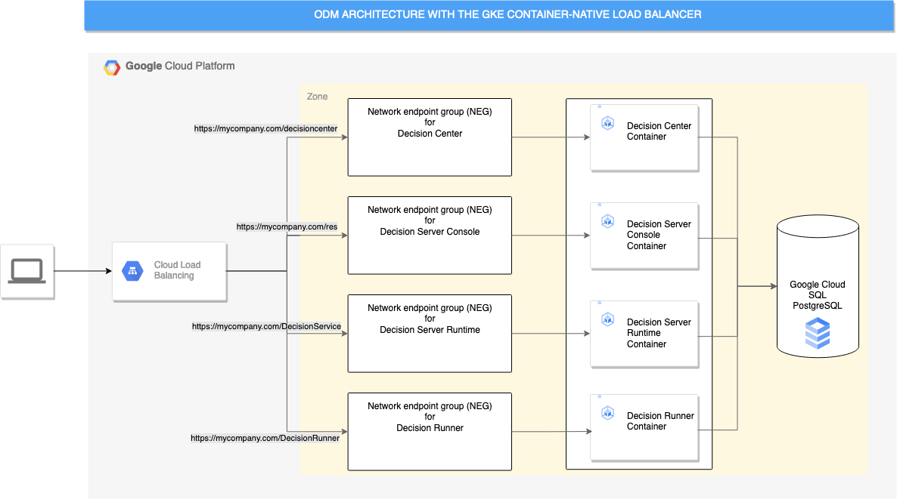
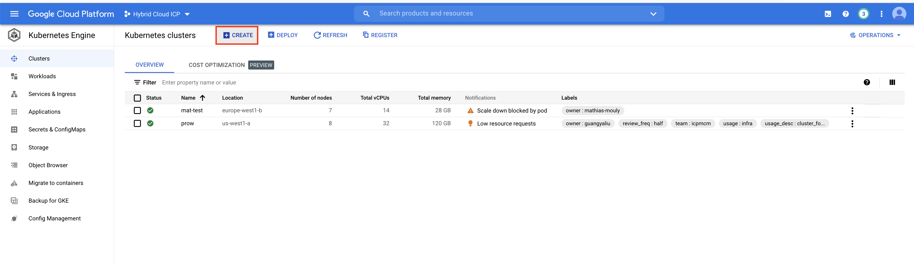
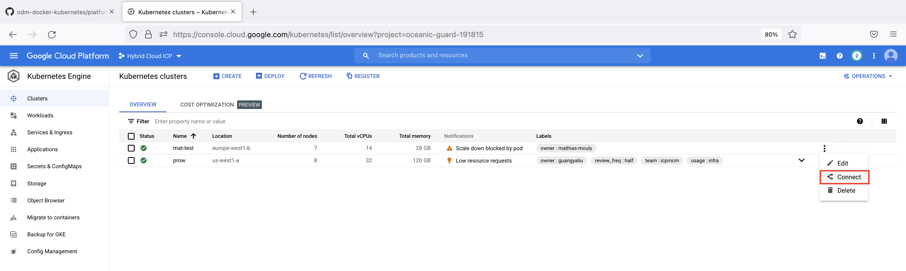
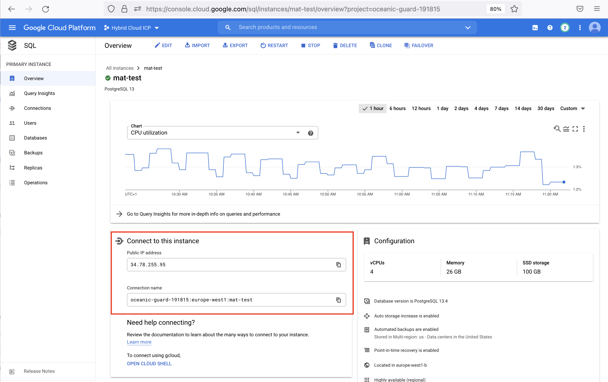

# Deploying IBM Operational Decision Manager on Google GKE

This project demonstrates how to deploy an IBM® Operational Decision Manager (ODM) clustered topology using the [Gateway API with GKE](https://cloud.google.com/kubernetes-engine/docs/concepts/gateway-api).

The ODM services will be exposed using the Gateway API provided by GKE's native Gateway Controller.
This deployment implements Kubernetes and Docker technologies.
Here is the Google Cloud home page: <https://cloud.google.com>



The ODM on Kubernetes Docker images are available in the [IBM Entitled Registry](https://www.ibm.com/cloud/container-registry). The ODM Helm chart is available in the [IBM Helm charts repository](https://github.com/IBM/charts).

## Included components

The project comes with the following components:

- [IBM Operational Decision Manager](https://www.ibm.com/docs/en/odm/9.6.0?topic=operational-decision-manager-certified-kubernetes-960)
- [Google Kubernetes Engine (GKE)](https://cloud.google.com/kubernetes-engine)
- [Google Cloud SQL for PostgreSQL](https://cloud.google.com/sql)
- [IBM License Service](https://github.com/IBM/ibm-licensing-operator)

## Tested environment

The commands and tools have been tested on macOS and Linux.

## Prerequisites

First, install the following software on your machine:

- [gcloud CLI](https://cloud.google.com/sdk/gcloud)
- [kubectl](https://kubernetes.io/docs/tasks/tools/)
- [Helm v3](https://helm.sh/docs/intro/install/)

Then, perform the following tasks:

1. Create a Google Cloud account by connecting to the Google Cloud Platform [console](https://console.cloud.google.com/). When prompted to sign in, create a new account by clicking **Create account**.

2. [Create a Google Cloud project](https://cloud.google.com/resource-manager/docs/creating-managing-projects)

3. [Manage the associated billing](https://cloud.google.com/billing/docs/how-to/modify-project#confirm_billing_is_enabled_on_a_project).

Without the relevant billing level, some Google Cloud resources will not be created.

> [!NOTE]
> Prerequisites and software supported by ODM 9.5.0 are listed on [the Detailed System Requirements page](https://www.ibm.com/support/pages/ibm-operational-decision-manager-detailed-system-requirements).

## Steps to deploy ODM on Kubernetes from Google GKE

<!-- TOC depthfrom:3 depthto:3 -->

- [Prepare your GKE instance 30 min](#1-prepare-your-gke-instance-30-min)
- [Create the Google Cloud SQL PostgreSQL instance 10 min](#2-create-the-google-cloud-sql-postgresql-instance-10-min)
- [Prepare your environment for the ODM installation 10 min](#3-prepare-your-environment-for-the-odm-installation-10-min)
- [Manage a digital certificate 2 min](#4-manage-a-digital-certificate-2-min)
- [Install the ODM release 10 min](#5-install-the-odm-release-10-min)
- [Access ODM services](#6-access-odm-services)
- [Track ODM usage](#7-track-odm-usage)

<!-- /TOC -->

### 1. Prepare your GKE instance (30 min)

Refer to the [GKE quickstart](https://cloud.google.com/kubernetes-engine/docs/quickstart) for more information.

#### Log into Google Cloud

After installing the `gcloud` tool, use the following command line:

```shell
gcloud auth login
```

#### Create a GKE cluster

There are several [types of clusters](https://docs.cloud.google.com/kubernetes-engine/docs/concepts/configuration-overview#availability).
In this article, we chose to create a [regional cluster](https://cloud.google.com/kubernetes-engine/docs/how-to/creating-a-regional-cluster).
Regions and zones (used below) can be listed respectively with `gcloud compute regions list` and `gcloud compute zones list`.

- Set the project (associated to a billing account):

  ```shell
  gcloud config set project <PROJECT_ID>
  ```

- Set the region:

  ```shell
  gcloud config set compute/region <REGION (ex: europe-west9)>
  ```

- Set the zone:

  ```shell
  gcloud config set compute/zone <ZONE (ex: europe-west9-b)>
  ```

- Create a cluster and [enable autoscaling](https://cloud.google.com/kubernetes-engine/docs/how-to/cluster-autoscaler). Here, we start with 6 nodes (16 max):

  ```shell
  gcloud container clusters create <CLUSTER_NAME> \
    --release-channel=regular --cluster-version=1.34 \
    --enable-autoscaling --num-nodes=6 --total-min-nodes=1 --total-max-nodes=16
  ```

> [!NOTE]
> If you get a red warning about a missing gke-gcloud-auth-plugin, install it with `gcloud components install gke-gcloud-auth-plugin`.
> For Kubernetes versions lower than 1.26 you have to enable it for each kubectl command with `export USE_GKE_GCLOUD_AUTH_PLUGIN=True` ([more information](https://cloud.google.com/blog/products/containers-kubernetes/kubectl-auth-changes-in-gke)).
> [!NOTE]
> You can also create your cluster from the Google Cloud Platform using the **Kubernetes Engine** > **Clusters** panel and clicking the **Create** button
> 

#### Set up your environment

- Create a kubeconfig to connect to your cluster:

  ```shell
  gcloud container clusters get-credentials <CLUSTER_NAME>
  ```

> [!NOTE]
> You can also retrieve the command line to configure `kubectl` from the Google Cloud Console using the **Kubernetes Engine** > **Clusters** panel and clicking **Connect** on the dedicated cluster.
> 

- Check your environment

  If your environment is set up correctly, you should be able to get the cluster information by running the following command:

  ```shell
  kubectl cluster-info
  ```

### 2. Create the Google Cloud SQL PostgreSQL instance (10 min)

#### Create the database instance

We will use the Google Cloud Platform console to create the database instance.

- Go to the [SQL context](https://console.cloud.google.com/sql), and then click the **CREATE INSTANCE** button
- Click **Choose PostgreSQL**
  - Database version: `PostgreSQL 18`
  - Instance ID: ``<YourInstanceName>``
  - Password: ``<PASSWORD>`` - Take note of this password.
  - Region: ``<REGION>`` (must be the same as the cluster for the communication to be optimal between the database and the ODM instance)
  - Eventually select **Multiple zones** for Zonal availability for redundancy
  - Expand **Show customization option** and expand **Connections**
    - As *Public IP* is selected by default, in Authorized networks, click the **ADD NETWORK** button, put a name and add *0.0.0.0/0* for Network, then click **DONE**.
      > NOTE: It is not recommended to use a public IP. In a production environment, you should use a private IP.
- Click **CREATE INSTANCE**

After the database instance is created, you can drill on the SQL instance overview to retrieve needed information to connect to this instance, like the IP address and the connection name. Take note of the **Public IP address**.



#### Create the database secret for Google Cloud SQL PostgreSQL

To secure access to the database, you must create a secret that encrypts the database user and password before you install the Helm release.

```shell
kubectl create secret generic odmdbsecret \
  --from-literal=db-user=postgres \
  --from-literal=db-password=<PASSWORD>
```

Where:

- `<PASSWORD>` is the database password (PASSWORD set during the PostgreSQL instance creation above)

### 3. Prepare your environment for the ODM installation (10 min)

To get access to the ODM material, you need an IBM entitlement key to pull the images from the IBM Entitled Registry.

#### Retrieve your entitled registry key

- Log in to [MyIBM Container Software Library](https://myibm.ibm.com/products-services/containerlibrary) with the IBMid and password that are associated with the entitled software.

- In the Container software library tile, verify your entitlement on the **View library** page, and then go to **Get entitlement key** to retrieve the key.

#### Create a pull secret by running a kubectl create secret command

```shell
kubectl create secret docker-registry ibm-entitlement-key \
        --docker-server=cp.icr.io \
        --docker-username=cp \
        --docker-password='<API_KEY_GENERATED>'
```

Where `<API_KEY_GENERATED>` is the entitlement key from the previous step. Make sure you enclose the key in quotes.

> Note:
>
> 1. The **cp.icr.io** value for the docker-server parameter is the only registry domain name that contains the images. You must set the *docker-username* to **cp** to use an entitlement key as *docker-password*.
> 2. The `ibm-entitlement-key` secret name will be used for the `image.pullSecrets` parameter when you run a Helm install of your containers. The `image.repository` parameter is also set by default to `cp.icr.io/cp/cp4a/odm`.

#### Add the public IBM Helm charts repository

```shell
helm repo add ibm-helm https://raw.githubusercontent.com/IBM/charts/master/repo/ibm-helm
helm repo update
```

#### Check you can access ODM charts

```shell
helm search repo ibm-odm-prod
NAME                  CHART VERSION   APP VERSION     DESCRIPTION
ibm-helm/ibm-odm-prod 26.0.0          9.6.0.0         IBM Operational Decision Manager
```

### 4. Manage a digital certificate (2 min)

#### (Optional) Generate a self-signed certificate

In this step, you will generate a certificate to be used by the GKE load balancer.

If you do not have a trusted certificate, you can use OpenSSL and other cryptography and certificate management libraries to generate a certificate file and a private key to define the domain name and to set the expiration date. The following command creates a self-signed certificate (`.crt` file) and a private key (`.key` file) that accept the domain name *mynicecompany.com*. The expiration is set to 1000 days:

```shell
openssl req -x509 -nodes -days 1000 -newkey rsa:2048 -keyout mynicecompany.key \
        -out mynicecompany.crt -subj "/CN=mynicecompany.com/OU=it/O=mynicecompany/L=Paris/C=FR"
```

#### Create a TLS secret with these keys

```shell
kubectl create secret tls mynicecompany-tls-secret --key mynicecompany.key --cert mynicecompany.crt
```

The certificate must be the same as the one you used to enable TLS connections in your ODM release. For more information, see [Server certificates](https://www.ibm.com/docs/en/odm/9.6.0?topic=production-defining-security-certificate) and [Working with certificates and SSL](https://docs.oracle.com/cd/E19830-01/819-4712/ablqw/index.html).

### 5. Install the ODM release (10 min)

#### Install an ODM Helm release

The ODM services will be exposed with an Ingress that uses the previously created `mynicecompany` certificate.
It automatically creates an HTTPS GKE load balancer. We will disable the ODM internal TLS as it is not needed.

- Get the [gcp-values.yaml](./gcp-values.yaml) file and replace the following key:

  - `<DB_ENDPOINT>`: the database IP

> [!NOTE]
> You can configure the driversUrl parameter to point to the appropriate version of the Google Cloud SQL PostgreSQL driver. For more information, refer to the [Cloud SQL Connector for Java](https://github.com/GoogleCloudPlatform/cloud-sql-jdbc-socket-factory#cloud-sql-connector-for-java) documentation.

- Install the chart from IBM's public Helm charts repository:

  ```shell
  helm install <release> ibm-helm/ibm-odm-prod -f gcp-values.yaml --set service.ingress.enabled=false
  ```

Example:

  ```shell
  helm install myodmsample ibm-helm/ibm-odm-prod -f gcp-values.yaml --set service.ingress.enabled=false
  ```


> [!NOTE]
>
> - This command installs the **latest available version** of the chart.
> If you want to install a **specific version**, add the `--version` option:
>
> ```bash
> helm install <release> ibm-helm/ibm-odm-prod --version <version> -f gcp-values.yaml
> ```
>
> You can list all available versions using:
>
> ```bash
> helm search repo ibm-helm/ibm-odm-prod -l
> ```

#### Check the topology

Run the following command to check the status of the pods that have been created:

```shell
kubectl get pods
NAME                                                   READY   STATUS    RESTARTS   AGE
<release>-odm-decisioncenter-***                       1/1     Running   0          20m
<release>-odm-decisionrunner-***                       1/1     Running   0          20m
<release>-odm-decisionserverconsole-***                1/1     Running   0          20m
<release>-odm-decisionserverruntime-***                1/1     Running   0          20m
```

#### Deploy the Gateway API Configuration

Now that the ODM services are running, you need to deploy the Gateway API resources to expose them externally.

The [odm-gateway-gke.yaml](./odm-gateway-gke.yaml) file contains three types of resources:
- **Gateway**: Configures the GKE load balancer with HTTPS termination using the `mynicecompany-tls-secret` certificate
- **HTTPRoute**: Defines routing rules for all ODM services based on URL paths
- **HealthCheckPolicy**: Configures custom health checks for each ODM component to ensure proper monitoring

Before applying the configuration, update the file to match your release name by replacing `myodmsample` with your actual Helm release name in:
- Gateway metadata name
- HTTPRoute backend service names
- HealthCheckPolicy service names

Apply the Gateway configuration:

```shell
kubectl apply -f odm-gateway-gke.yaml
```

This command creates:
- A Gateway resource that provisions a GKE external load balancer
- An HTTPRoute that routes traffic to the appropriate ODM services
- HealthCheckPolicy resources for Decision Center, Decision Server Console, Decision Server Runtime, and Decision Runner

You can check the Gateway status with:

```shell
kubectl get gateway <release>-odm-gateway
kubectl get httproute <release>-odm-httproute
```

The Gateway will remain in *Provisioning* state for several minutes until all backends are healthy. You can monitor the status in the [Kubernetes Engine / Gateways Panel](https://console.cloud.google.com/kubernetes/gateways) or check the [load balancer status](https://console.cloud.google.com/net-services/loadbalancing/list/loadBalancers).

When the Gateway shows a *Programmed* status, all ODM services are accessible.

> [!NOTE]
> The Gateway API automatically handles session affinity for Decision Center through the HealthCheckPolicy configuration, eliminating the need for manual BackendConfig annotations.


##### Apply the Gateway configuration

The [odm-gateway-gke.yaml](./odm-gateway-gke.yaml) file contains:
- A Gateway resource that configures the GKE load balancer with HTTPS termination
- An HTTPRoute resource that defines routing rules for all ODM services
- HealthCheckPolicy resources for each ODM component to ensure proper health monitoring

Before applying the configuration, update the file to match your release name:

- Replace `myodmsample` with your actual Helm release name in the following resources:
  - Gateway metadata name
  - HTTPRoute backend service names
  - HealthCheckPolicy service names

Apply the Gateway configuration:

```shell
kubectl apply -f odm-gateway.yaml
```

The Gateway will create a new GKE load balancer with the following characteristics:
- Uses the `gke-l7-global-external-managed` Gateway class for global external load balancing
- Terminates HTTPS using the `mynicecompany-tls-secret` certificate
- Routes traffic to ODM services based on URL paths
- Implements custom health checks for each ODM component

You can check the Gateway status with:

```shell
kubectl get gateway myodmsample-odm-gateway
kubectl get httproute myodmsample-odm-httproute
```

> [!NOTE]
> The Gateway API configuration is the recommended approach for this deployment. If you prefer to use the traditional Ingress approach instead, please refer to the main [README.md](README.md).

### 6. Access ODM services

In a real enterprise use case, to access the mynicecompany.com domain name, you have to deal with [Google Managed Certificate](https://cloud.google.com/load-balancing/docs/ssl-certificates/google-managed-certs) and [Google Cloud DNS](https://cloud.google.com/dns).

In this trial, we use a self-signed certificate. So, there is no extra charge like certificate and domain purchase.
We only have to manage a configuration to simulate the mynicecompany.com access.

- Get the EXTERNAL-IP with the command line:

  ```shell
  kubectl get gateway <release>-odm-gateway -o jsonpath='{.status.addresses[0].value}'
  ```

- Edit your /etc/hosts file and add the following entry:

  ```shell
  <EXTERNAL-IP> mynicecompany.com
  ```

- You can now access all ODM services with the following URLs:

<!-- markdown-link-check-disable -->
  | SERVICE NAME | URL | USERNAME/PASSWORD
  | --- | --- | ---
  | Decision Server Console | <https://mynicecompany.com/res> | odmAdmin/odmAdmin
  | Decision Center | <https://mynicecompany.com/decisioncenter> | odmAdmin/odmAdmin
  | Decision Center REST-API | <https://mynicecompany.com/decisioncenter-api> | odmAdmin/odmAdmin
  | Decision Server Runtime | <https://mynicecompany.com/DecisionService> | odmAdmin/odmAdmin
  | Decision Runner | <https://mynicecompany.com/DecisionRunner> | odmAdmin/odmAdmin
<!-- markdown-link-check-enable -->

> [!NOTE]
> You can also access the Gateway frontends from the Google Cloud console under the [Kubernetes Engine/Gateways Panel](https://console.cloud.google.com/kubernetes/gateways).


### 7. Track ODM usage

#### 7.1 Install the IBM Usage Metering Service

The IBM Usage Metering Service (UMS) is a critical component that gathers metrics to monitor compliance and create reports. It captures business value metrics for auditing purposes, visualizes metric usage in reporting tools, and sends the information to IBM Software Central.

**Prerequisites:**
- Cluster-admin permissions or appropriate RBAC roles
- Target namespace must exist before installation
- ODM 9.6.0 or later installed

**Important Requirements:**
- From ODM 9.6.0 onwards, UMS **must** be installed in the same namespace as ODM
- ODM reports usage metrics to UMS through a scheduled CronJob
- If UMS is not installed, the CronJob will fail when it runs

**Installation:**

For detailed installation and configuration instructions, see [Installing the usage metering service](https://www.ibm.com/docs/en/odm/9.6.0?topic=production-installing-metering).

**Troubleshooting:**

If the CronJob fails, check the pod logs:
```bash
kubectl logs -n <namespace> -l job-name=<cronjob-name>
```

**Configuration Options:**

After installing UMS, choose one of the following configuration modes based on your environment:

1. **Online Mode** (Recommended): Automatic data transmission to IBM Software Central
2. **Offline Mode** (Air-gapped): Manual data download and upload process

##### 7.1.1 Usage Metering Service in Offline Mode (Air-gapped Environment)

In an offline or air-gapped environment, the IBM Usage Metering Service (UMS) cannot connect directly to IBM Software Central. You must manually download the usage data and upload it to Software Central.

**Prerequisites:**
- IBM Entitlement Key (IEK) for authentication
- Network access to IBM Software Central from the machine performing the upload
- `kubectl` access to the cluster

**Step 1: Expose the Usage Metering Service**

Create a LoadBalancer service to expose UMS:

```bash
kubectl apply -f usage-metering-service-loadbalancer.yaml
```

> [!NOTE]
> This creates a LoadBalancer service that exposes the Usage Metering Service externally.

**Step 2: Download Usage Data**

Retrieve the metering service data from the LoadBalancer:

```bash
export NAMESPACE=<namespace>
UMS_TOKEN=$(kubectl get secret ibm-usage-metering-upload-token -n "${NAMESPACE}" -o jsonpath='{.data.token}' 2>/dev/null | base64 -d || echo "")
UMS_URL=$(kubectl get service ibm-usage-metering-instance-loadbalancer -n "${NAMESPACE}" -o jsonpath='{.status.loadBalancer.ingress[0].ip}' 2>/dev/null || echo "")

curl -k --output "swc_payload.tar.gz" \
     --header "Authorization: Bearer ${UMS_TOKEN}" \
     --url "https://${UMS_URL}:8080/api/v1/snapshot"
```

**Step 3: Verify the Downloaded Data**

Extract and inspect the usage data:

```bash
tar xvzf swc_payload.tar.gz
```

Expected output:

```
x manifest.json
x usage.json
```

**Extracted files:**
- **`manifest.json`**: Metadata about the usage data package
  - Package version and format information
  - Data collection period
  - Checksum for integrity verification
- **`usage.json`**: Actual usage metrics data
  - Product usage statistics (number of pods, resources)
  - Metric collection timestamps and intervals
  - License consumption details

**Step 4: Upload Data to IBM Software Central**

Upload the usage data to IBM Software Central:

```bash
curl -X POST "https://swc.saas.ibm.com/metering/api/v2/metrics" \
     -H "Authorization: Bearer <IEK>" \
     -F "file=@swc_payload.tar.gz;type=application/gzip"
```

**Parameters:**
- `<IEK>`: Your IBM Entitlement Key (obtain from [IBM Container Software Library](https://myibm.ibm.com/products-services/containerlibrary))

**Step 5: Verify Upload**

Verify the usage data in the IBM Software Central portal:
- Navigate to: https://swc.saas.ibm.com/en-us/software-central
- Check the usage reports section for your uploaded data

> [!TIP]
> Schedule this process regularly (e.g., monthly) to ensure compliance reporting is up to date.


##### 7.1.2 Usage Metering Service in Online Mode (Recommended)

In online mode, the Usage Metering Service automatically sends usage data to IBM Software Central on a scheduled basis. This is the recommended configuration for environments with internet connectivity.

**Default Behavior:**
- Usage data is automatically sent every 24 hours at **12:05 AM UTC**
- No manual intervention required after initial setup
- Automatic retry on transmission failures

**Prerequisites:**
- IBM Entitlement Key (IEK) - **REQUIRED**
- Network connectivity to IBM Software Central (`swc.saas.ibm.com`)
- UMS installed and running in the same namespace as ODM

> [!IMPORTANT]
> An IBM Entitlement Key (IEK) is **REQUIRED** to configure Software Central integration. The key authenticates requests to Software Central and associates usage data with your client information.

**Step 1: Create Entitlement Key Secret**

Store your IBM Entitlement Key as a Kubernetes secret:

```bash
export NAMESPACE=<namespace>
export ENTITLEMENT_SECRET_NAME=entitlement-secret
export ENTITLEMENT_KEY_VALUE=<your_entitlement_key>

kubectl create secret generic ${ENTITLEMENT_SECRET_NAME} \
    --from-literal=token=${ENTITLEMENT_KEY_VALUE} \
    -n ${NAMESPACE}
```

> [!TIP]
> Obtain your IBM Entitlement Key from the [IBM Container Software Library](https://myibm.ibm.com/products-services/containerlibrary).

**Step 2: Configure Automatic Data Transmission**

Patch the IBMUsageMetering instance to enable automatic data transmission:

```bash
kubectl patch IBMUsageMetering ibm-usage-metering-instance \
    -n ${NAMESPACE} \
    --type=merge \
    -p "{
        \"spec\": {
            \"sender\": {
                \"softwareCentral\": {
                    \"enable\": true,
                    \"entitlementKeySecret\": \"${ENTITLEMENT_SECRET_NAME}\",
                    \"anonymize\": false
                }
            }
        }
    }"
```

**Configuration Parameters:**
- `enable`: Set to `true` to activate automatic transmission
- `entitlementKeySecret`: Name of the secret containing your IEK


**Step 3: Verify Configuration**

Check that the configuration was applied successfully:

```bash
kubectl get IBMUsageMetering ibm-usage-metering-instance -n ${NAMESPACE} -o yaml
```

Look for the `sender.softwareCentral` section in the output to confirm your settings.

**Step 4: Monitor Data Transmission**

Monitor the UMS logs to verify successful data transmission:

```bash
kubectl logs -n ${NAMESPACE} -l app.kubernetes.io/name=ibm-usage-metering-instance --tail=100
```

Look for log entries indicating successful uploads to Software Central.

**Verification:**

After the first scheduled transmission (or wait up to 24 hours), verify your usage data in IBM Software Central:
- Navigate to: https://swc.saas.ibm.com/en-us/software-central
- Check the usage reports section for your product

> [!NOTE]
> The first data transmission occurs at the next scheduled time (12:05 AM UTC). You can also trigger an immediate transmission by restarting the UMS pod.

**Troubleshooting:**

If data transmission fails:
1. Verify network connectivity to `swc.saas.ibm.com`
2. Confirm the entitlement key is valid and not expired
3. Check UMS pod logs for error messages
4. Ensure the secret name matches the configuration

#### 7.2 Install the IBM License Service

This section explains how to track ODM usage with the IBM License Service.

Follow the instructions in the **Installation** section of the [Manual installation without the Operator Lifecycle Manager (OLM)](https://www.ibm.com/docs/en/cloud-paks/foundational-services/4.x_cd?topic=ilsfpcr-installing-license-service-without-operator-lifecycle-manager-olm) documentation, **except for the step 3** which should be replaced by:


##### 7.2.1 Create the IBM Licensing instance

Get the [licensing-instance.yaml](./licensing-instance.yaml) file and run the following command:

```shell
kubectl apply -f licensing-instance-gateway.yaml -n ibm-licensing
```


##### 7.2.2 Expose the IBM License Service

You need to create a Gateway to expose the IBM License Service using GKE's native Gateway API.

Get the [`ils-gateway.yaml`](./ils-gateway.yaml) file and apply the gateway configuration with the following command:

```bash
kubectl apply -f ils-gateway.yaml -n ibm-licensing
```

**Verification:**

Wait for the Gateway to be ready (this may take a few minutes):

```bash
kubectl wait --for=condition=Programmed gateway/ils-gateway -n ibm-licensing --timeout=5m
```

Check the Gateway status:

```bash
kubectl get gateway ils-gateway -n ibm-licensing
kubectl describe gateway ils-gateway -n ibm-licensing
```

> [!NOTE]
> The Gateway uses the `gke-l7-global-external-managed` Gateway class and requires HTTPS with a valid certificate. Ensure the `ibm-license-service-cert-internal` secret exists in the `ibm-licensing` namespace before applying this configuration.

##### 7.2.3 Retrieving license usage

After a couple of minutes, the Ingress configuration is created and you will be able to access the IBM License Service by retrieving the URL with the following command:

```shell
export LICENSING_URL=$(kubectl get gateway ils-gateway -n ibm-licensing -o jsonpath='{.status.addresses[0].value}')/ibm-licensing-service-instance
export TOKEN=$(kubectl get secret ibm-licensing-token -o jsonpath={.data.token} -n ibm-licensing | base64 -d)
```

You can access the `https://${LICENSING_URL}/status?token=${TOKEN}` URL to view the licensing usage or retrieve the licensing report .zip file by running the following command:

```shell
curl "https://${LICENSING_URL}/snapshot?token=${TOKEN}" -k --output ils-report.zip
```

If your IBM License Service instance is not running properly, refer to this [troubleshooting page](https://www.ibm.com/docs/en/cloud-paks/foundational-services/4.x_cd?topic=service-troubleshooting-license).

##### 7.2.4 Reporting License Usage to IBM Software Central

IBM License Service (ILS) can optionally send collected license usage data directly to [IBM Software Central](https://swc.saas.ibm.com) (SWC). This enables you to view aggregated license usage across clusters in the Software Central UI and analytics dashboards.

This feature is **opt-in**: no product data is sent to Software Central unless explicitly enabled by both the product team (via pod annotation) and the cluster administrator (via IBMLicensing CR configuration).

**How it works:**

ILS collects license usage data from annotated workloads across all namespaces. Only products that have explicitly opted in are included in the upload. Data is transformed into Software Central's format and sent once per day.

Two modes of operation are supported:
- **Online mode**: ILS automatically uploads data to Software Central on a configurable schedule (default: daily at 00:05 UTC)
- **Offline mode**: For airgapped environments, ILS exposes an API endpoint to download a data package for manual upload

###### Prerequisites

- IBM Entitlement Key (IEK) for authentication with Software Central
- Network connectivity to `swc.saas.ibm.com` (for online mode)
- IBM License Service installed and running

###### Online Mode Configuration

**Step 1: Add the opt-in annotation to ODM pods**

ODM pods are already annotated with `includeSWCUpload: "true"` by default, so this step is typically not required. However, if you need to verify or add the annotation manually:

```yaml
spec:
  template:
    metadata:
      annotations:
        includeSWCUpload: "true"
```

**Step 2: Create the IBM Entitlement Key secret**

Create a Kubernetes secret in the `ibm-licensing` namespace containing your IBM Entitlement Key:

```bash
export ENTITLEMENT_KEY=<your_ibm_entitlement_key>

kubectl create secret generic ibm-swc-entitlement-key \
    --from-literal=entitlementKey=${ENTITLEMENT_KEY} \
    -n ibm-licensing
```

> [!TIP]
> Obtain your IBM Entitlement Key from the [IBM Container Software Library](https://myibm.ibm.com/products-services/containerlibrary).

**Step 3: Configure the IBMLicensing Custom Resource**

Update the `IBMLicensing` CR to enable Software Central integration:

```bash
kubectl patch IBMLicensing instance \
    -n ibm-licensing \
    --type=merge \
    -p '{
        "spec": {
            "softwareCentral": {
                "enable": true,
                "entitlementKeySecret": "ibm-swc-entitlement-key",
                "frequency": "5 0 * * *",
                "sandbox": false
            }
        }
    }'
```

**Configuration parameters:**

| Parameter | Type | Default | Description |
|---|---|---|---|
| `enable` | bool | `false` | Master switch for Software Central integration |
| `entitlementKeySecret` | string | — | Name of the Kubernetes secret containing the IBM Entitlement Key (required) |
| `frequency` | string | `"5 0 * * *"` | Cron expression for upload schedule (default: daily at 00:05 UTC) |
| `sandbox` | bool | `false` | When `true`, uses `sandbox.swc.saas.ibm.com` for testing |

**Step 4: Verify configuration**

Check that the configuration was applied successfully:

```bash
kubectl get IBMLicensing instance -n ibm-licensing -o yaml
```

Look for the `softwareCentral` section in the output to confirm your settings.

**Step 5: Monitor data transmission**

Monitor the IBM License Service logs to verify successful data transmission:

```bash
kubectl logs -n ibm-licensing -l app.kubernetes.io/name=ibm-licensing-service-instance --tail=100
```

Look for log entries indicating successful uploads to Software Central.

**Step 6: Verify in IBM Software Central**

After the first scheduled transmission (or wait up to 24 hours), verify your license usage data:

1. Navigate to: https://swc.saas.ibm.com/en-us/software-central
2. Log in with your IBM ID
3. Check the usage reports section for your product data

###### Offline Mode (Airgapped Environments)

In airgapped environments where ILS cannot directly connect to Software Central, you can download the data and manually upload it.

**Step 1: Download the usage data**

Access the IBM License Service API endpoint to download usage data:

```bash
export LICENSING_URL=$(kubectl get gateway ils-gateway -n ibm-licensing -o jsonpath='{.status.addresses[0].value}')/ibm-licensing-service-instance
export TOKEN=$(kubectl get secret ibm-licensing-token -o jsonpath={.data.token} -n ibm-licensing | base64 -d)

curl --insecure --output "swc_payload.tar.gz" \
     "https://${LICENSING_URL}/swc_aggregations?token=${TOKEN}"
```

**Step 2: Transfer and upload to Software Central**

1. Transfer the downloaded `swc_payload.tar.gz` file to a system with access to Software Central
2. Upload the file to Software Central:

```bash
export ENTITLEMENT_KEY=<your_ibm_entitlement_key>
export SWC_URL=swc.saas.ibm.com  # Use sandbox.swc.saas.ibm.com for testing

curl -X POST "https://${SWC_URL}/metering/api/v2/metrics" \
     -H "Authorization: Bearer ${ENTITLEMENT_KEY}" \
     -F "file=@swc_payload.tar.gz;type=application/gzip"
```

> [!NOTE]
> When `spec.softwareCentral.enable` is set to `false`, no automatic upload occurs and only the manual download endpoint is available.

###### Metrics Included

Software Central upload covers all contractual metrics already included in the ILS snapshot generation, including:
- **VPC** (Virtual Processor Core)
- **PVU** (Processor Value Unit)
- **GPGPU** (General Purpose Graphics Processing Unit)

###### Troubleshooting

If data transmission fails:

1. **Verify network connectivity to Software Central:**
   ```bash
   kubectl run -it --rm debug --image=curlimages/curl --restart=Never -n ibm-licensing -- \
       curl -I https://swc.saas.ibm.com/metering/api/v2/metrics
   ```

2. **Confirm the entitlement key is valid:**
   ```bash
   kubectl get secret ibm-swc-entitlement-key -n ibm-licensing -o jsonpath='{.data.entitlementKey}' | base64 -d
   ```

3. **Check IBM License Service pod logs for errors:**
   ```bash
   kubectl logs -n ibm-licensing -l app.kubernetes.io/name=ibm-licensing-service-instance --tail=200
   ```

4. **Verify the IBMLicensing instance configuration:**
   ```bash
   kubectl describe IBMLicensing instance -n ibm-licensing
   ```

> [!NOTE]
> Failed uploads are retried automatically up to 3 times using exponential backoff. Upload failures do not affect ILS core functionality or license compliance reporting.


## Troubleshooting

If your ODM instances are not running properly, refer to [our dedicated troubleshooting page](https://www.ibm.com/docs/en/odm/9.6.0?topic=960-troubleshooting).

## Getting Started with IBM Operational Decision Manager for Containers

Get hands-on experience with IBM Operational Decision Manager in a container environment by following this [Getting started tutorial](https://github.com/DecisionsDev/odm-for-container-getting-started/blob/master/README.md).

## License

[Apache 2.0](/LICENSE)

