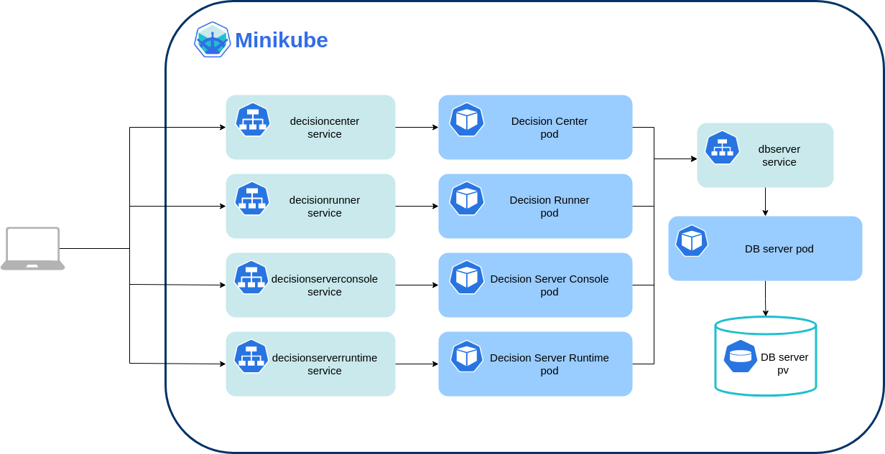

#  Deploying IBM Operational Decision Manager on Kubernetes Minikube

This tutorial explains how to deploy an IBM® Operational Decision Manager (ODM) clustered topology on a Minikube Kubernetes cluster. This deployment implements Kubernetes and Docker technologies.

Minikube is a local Kubernetes, focusing on making it easy to learn and develop for Kubernetes. You can use it to evaluate ODM.



The ODM on Kubernetes Docker images are available in the [IBM Entitled Registry](https://www.ibm.com/cloud/container-registry). The ODM Helm chart is available in the [IBM Helm charts repository](https://github.com/IBM/charts).

## Included Components
- [IBM Operational Decision Manager](https://www.ibm.com/docs/en/odm/8.11.1)
- [Kubernetes Minikube](https://github.com/kubernetes/minikube)

## Test environment
This tutorial was tested on macOS and Linux.

## Prerequisites

* [Minikube](https://github.com/kubernetes/minikube#installation)
* [Helm v3](https://helm.sh/docs/intro/install/)


## Steps

1. [Start Minikube](#1-start-minikube)
2. [Prepare your environment for the ODM installation](#2-prepare-your-environment-for-the-odm-installation)
3. [Install an IBM Operational Decision Manager release](#3-install-an-ibm-operational-decision-manager-release)
4. [Access the ODM services](#4-access-the-odm-services)

### 1. Start Minikube

- Start Minikube with sufficient resources:

  ```
  minikube start --cpus 6 --memory 8GB
  ```

  The kubectl context is automatically set to point to the created Minikube cluster.

- Check your environment:

  ```
  $ kubectl cluster-info
  Kubernetes control plane is running at https://<CLUSTER-IP>:8443
  CoreDNS is running at https://<CLUSTER-IP>:8443/api/v1/namespaces/kube-system/services/kube-dns:dns/proxy

  To further debug and diagnose cluster problems, use 'kubectl cluster-info dump'.
  ```

  > **Note**  
  > You can access the [Kubernetes Dashboard](http://kubernetes.io/docs/user-guide/ui/) by running the `minikube dashboard` command.

### 2. Prepare your environment for the ODM installation

To get access to the ODM material, you need an IBM entitlement key to pull the images from the IBM Entitled registry.
This is explained in the next step of this tutorial.

#### a. Retrieve your entitled registry key

- Log in to [MyIBM Container Software Library](https://myibm.ibm.com/products-services/containerlibrary) with the IBMid and password that are associated with the entitled software.

- In the *Container software library* tile, verify your entitlement on the *View library* page, and then go to **Get entitlement key** to retrieve the key.

#### b. Create a pull secret by running the `kubectl create secret` command

```
kubectl create secret docker-registry my-odm-docker-registry --docker-server=cp.icr.io \
    --docker-username=cp --docker-password="<ENTITLEMENT_KEY>" --docker-email=<USER_EMAIL>
```

Where:
* `<ENTITLEMENT_KEY>` is the entitlement key from the previous step. Make sure you enclose the key in double-quotes.
* `<USER_EMAIL>` is the email address associated with your IBMid.

> **Note**  
> The `cp.icr.io` value for the docker-server parameter is the only registry domain name that contains the images. You must set the docker-username to `cp` to use an entitlement key as docker-password.

The *my-odm-docker-registry* secret name is set as the `image.pullSecrets` parameter when you run a helm install of your containers. The `image.repository` parameter is also set to `cp.icr.io/cp/cp4a/odm`.

#### c. Add the public IBM Helm charts repository

```
helm repo add ibmcharts https://raw.githubusercontent.com/IBM/charts/master/repo/entitled
helm repo update
```

#### d. Check your access to the ODM chart

```
$ helm search repo ibm-odm-prod
NAME                             	CHART VERSION	APP VERSION	DESCRIPTION
ibmcharts/ibm-odm-prod           	22.2.0       	8.11.1.0   	IBM Operational Decision Manager
```

### 3. Install an IBM Operational Decision Manager release

#### a. Install an ODM Helm release

Install an ODM release with the default configuration and an internal database:

Get the [minikube-values.yaml](./minikube-values.yaml) file and run the following command:

```
helm install my-odm-release ibmcharts/ibm-odm-prod --version 22.2.0 -f minikube-values.yaml
```

#### b. Check the topology

Run the following command to check the status of the pods that have been created: 

```
kubectl get pods
NAME                                               READY   STATUS    RESTARTS   AGE
my-odm-release-dbserver-xxxxxxx                    1/1     Running   0          16m
my-odm-release-odm-decisioncenter-xxxxxxx          1/1     Running   0          16m
my-odm-release-odm-decisionrunner-xxxxxxx          1/1     Running   0          16m
my-odm-release-odm-decisionserverconsole-xxxxxxx   1/1     Running   0          16m
my-odm-release-odm-decisionserverruntime-xxxxxxx   1/1     Running   0          16m

```

### 4. Access the ODM services

With this ODM topology in place, you can access web applications to author, deploy, and test your rule-based decision services. You can retrieve the URL to access the ODM services with the following command:

```
$ minikube service list -n default
|----------------------|------------------------------------------------|----------------------------------|---------------------------|
|      NAMESPACE       |                      NAME                      |           TARGET PORT            |            URL            |
|----------------------|------------------------------------------------|----------------------------------|---------------------------|
| default              | my-odm-release-dbserver                        | No node port                     |
| default              | my-odm-release-odm-decisioncenter              | decisioncenter/9453              | http://<CLUSTER-IP>:30108 |
| default              | my-odm-release-odm-decisionrunner              | decisionrunner/9443              | http://<CLUSTER-IP>:32215 |
| default              | my-odm-release-odm-decisionserverconsole       | decisionserverconsole/9443       | http://<CLUSTER-IP>:32040 |
| default              | my-odm-release-odm-decisionserverconsole-notif | No node port                     |
| default              | my-odm-release-odm-decisionserverruntime       | decisionserverruntime/9443       | http://<CLUSTER-IP>:32346 |
|----------------------|------------------------------------------------|----------------------------------|---------------------------|
```

> **Warning**  
> The URLs are prefixed with **http**. You must replace it with **https** to access the services.

You can directly open the URL corresponding to a component in a new browser tab with the following command:
```
$ minikube service my-odm-release-odm-decisioncenter -n default --https
```

## Troubleshooting

If your ODM instances are not running properly, check the logs by running the following command:
```
kubectl logs <your-pod-name>
```

## Getting Started with IBM Operational Decision Manager for Containers

Get hands-on experience with IBM Operational Decision Manager in a container environment by following this [Getting started tutorial](https://github.com/DecisionsDev/odm-for-container-getting-started/blob/master/README.md).

# License
[Apache 2.0](LICENSE)
