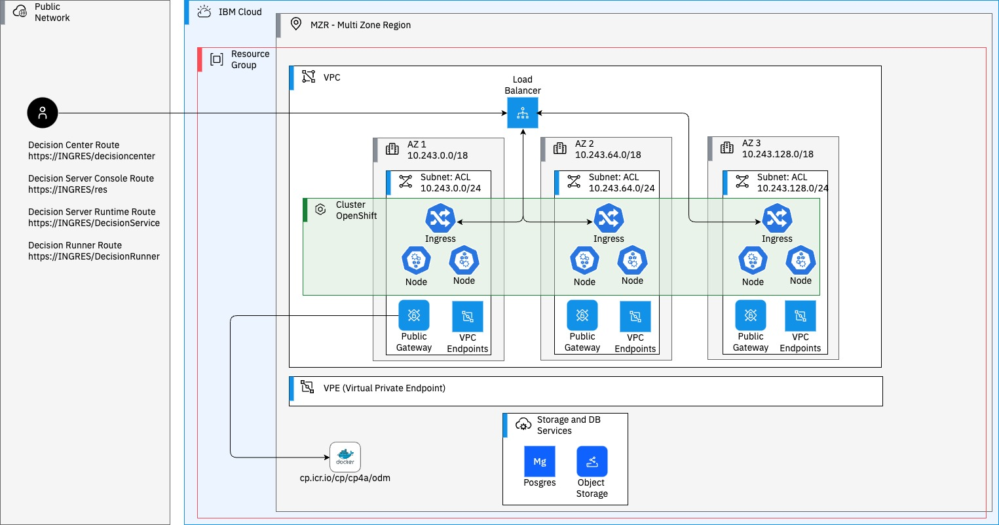

# Deploying IBM Operational Decision Manager on Redhat Openshift Kubernetes Service aka ROKS

This project demonstrates how to deploy an IBM® Operational Decision Manager (ODM) clustered topology on Redhat Openshift Kubernetes Service (ROKS). This deployment implements Kubernetes and Docker technologies.
Redhat Openshift is available on a lot of cloud platform. You can find more details about all of [these availability](https://www.redhat.com/en/technologies/cloud-computing/openshift#cloud-services-editions).
Concerning this tutorial, it will be dedicated to the deployment of ODM on top of the [IBM Cloud platform](https://www.redhat.com/en/technologies/cloud-computing/openshift/ibm).



The ODM on Kubernetes Docker images are available in the [IBM Cloud Container Registry](https://www.ibm.com/cloud/container-registry). The ODM Helm chart is available in the [IBM Helm charts repository](https://github.com/IBM/charts).

## Included components
The project uses the following components:
- [IBM Operational Decision Manager](https://ibmdocs-test.dcs.ibm.com/docs/en/odm/9.0.0?topic=operational-decision-manager-certified-kubernetes-900)
- [IBM Cloud](https://cloud.ibm.com)

## Tested environment
The commands and tools have been tested on Linux and macOS.

## Prerequisites
First, install the following software on your machine:
* [Helm v3](https://helm.sh/docs/intro/install/)

Then, create an [IBM Cloud Account](https://cloud.ibm.com/registration).

## Steps to deploy ODM on Kubernetes from ROKS
<!-- TOC depthFrom:3 depthTo:3 withLinks:1 updateOnSave:1 orderedList:0 -->

- [1. Prepare your environment (20 min)](#1-prepare-your-environment-20-min)
- [2. Prepare your environment for the ODM installation (5 min)](#2-prepare-your-environment-for-the-odm-installation-5-min)
- [3. Install an IBM Operational Decision Manager release (10 min)](#3-install-an-ibm-operational-decision-manager-release-10-min)
- [4. Access the ODM services](#4-access-the-odm-services)
- [5. Track ODM usage with the IBM License Service](#5-track-odm-usage-with-the-ibm-license-service)
- [6. Deploy ODM to support sticky session on ROKS](#6-deploy-odm-to-support-sticky-session-on-roks)

<!-- /TOC -->

### 1. Prepare your environment (20 min)

When you have created your IBM Cloud account, if you have no available ROKS cluster, you can follow this [IBM Cloud tutorial](https://cloud.ibm.com/docs/openshift?topic=openshift-openshift_tutorial&locale=en) to create your first cluster.
Then, create a new project dedicated to the ODM instance deployment using the command line:

```bash
oc new-project odm-tutorial
```

### 2. Prepare your environment for the ODM installation (5 min)

To get access to the ODM material, you must have an IBM entitlement key to pull the images from the IBM Cloud Container registry.
This is what will be used in the next step of this tutorial.

#### a. Retrieve your entitled registry key

- Log in to [MyIBM Container Software Library](https://myibm.ibm.com/products-services/containerlibrary) with the IBMid and password that are associated with the entitled software.

- In the **Container Software and Entitlement Keys** tile, verify your entitlement on the **View library page**, and then go to *Entitlement keys* to retrieve the key.

#### b. Create a pull secret by running the kubectl create secret command

```bash
oc create secret docker-registry my-odm-docker-registry --docker-server=cp.icr.io \
    --docker-username=cp --docker-password="<ENTITLEMENT_KEY>" --docker-email=<USER_EMAIL>
```

Where:
* `<ENTITLEMENT_KEY>` is the entitlement key from the previous step. Make sure you enclose the key in double-quotes.
* `<USER_EMAIL>` is the email address associated with your IBMid.

> **Note**
> The `cp.icr.io` value for the docker-server parameter is the only registry domain name that contains the images. You must set the docker-username to `cp` to use an entitlement key as docker-password.

The my-odm-docker-registry secret name is already used for the `image.pullSecrets` parameter when you run a helm install of your containers. The `image.repository` parameter is also set by default to `cp.icr.io/cp/cp4a/odm`.

#### c. Add the public IBM Helm charts repository

```bash
helm repo add ibm-helm https://raw.githubusercontent.com/IBM/charts/master/repo/ibm-helm
helm repo update
```

#### d. Check your access to the ODM chart

```bash
$ helm search repo ibm-odm-prod
NAME                             	CHART VERSION	APP VERSION	DESCRIPTION
ibm-helm/ibm-odm-prod           	24.0.0       	9.0.0.0   	IBM Operational Decision Manager
```

### 3. Install an IBM Operational Decision Manager release (10 min)


Get the [roks-values.yaml](./roks-values.yaml) file and launch your ODM instance :

```bash
helm install roks-tuto ibm-helm/ibm-odm-prod --version 24.0.0 -f roks-values.yaml
```

#### Check the topology
Run the following command to check the status of the pods that have been created: 
```bash
oc get pods
```

| *NAME* | *READY* | *STATUS* | *RESTARTS* | *AGE* |
|---|---|---|---|---|
| roks-tuto-dbserver-*** | 1/1 | Running | 0 | 44m |
| roks-tuto-odm-decisioncenter-*** | 1/1 | Running | 0 | 44m |
| roks-tuto-odm-decisionrunner-*** | 1/1 | Running | 0 | 44m |
| roks-tuto-odm-decisionserverconsole-*** | 1/1 | Running | 0 | 44m |
| roks-tuto-odm-decisionserverruntime-*** | 1/1 | Running | 0 | 44m |

### 4. Access the ODM services  

Refer to [this documentation](https://www.ibm.com/docs/en/odm/9.0.0?topic=tasks-configuring-external-access) to retrieve the endpoints.
For example, on OpenShift you can get the route names and hosts with:

```
oc get routes --no-headers --output custom-columns=":metadata.name,:spec.host"
```

You get the following hosts:
```
roks-tuto-odm-dc-route           <DC_HOST>
roks-tuto-odm-dr-route           <DR_HOST>
roks-tuto-odm-ds-console-route   <DS_CONSOLE_HOST>
roks-tuto-odm-ds-runtime-route   <DS_RUNTIME_HOST>
```

### 5. Track ODM usage with the IBM License Service

Follow the **Installation** section of the [Manual installation without the Operator Lifecycle Manager (OLM)](https://www.ibm.com/docs/en/cloud-paks/foundational-services/4.7?topic=ils-installing-license-service-without-operator-lifecycle-manager-olm) documentation.

### 6. Deploy ODM to support sticky session on ROKS

The ODM Decision Center component needs sticky session, also named [session affinity](https://kubernetes.io/docs/reference/networking/virtual-ips/#session-affinity).
As explained in [OpenShift documentation](https://docs.openshift.com/container-platform/4.15/networking/routes/route-configuration.html#nw-using-cookies-keep-route-statefulness_route-configuration), using a passthrough route for Decision Center is not enough to allow sticky session. 
It's the reason why we will use a [reencrypt route](https://docs.openshift.com/container-platform/4.15/networking/routes/secured-routes.html#nw-ingress-creating-a-reencrypt-route-with-a-custom-certificate_secured-routes).

Using reencrypt route, ROKS is very sensitive that route is using a valid domain certificate. So, we will explain :
* How to get the domain certificates and inject them in the ODM containers ?
* How to create a reencrypt route for Decision Center ?
 
#### a. Get the ROKS Domain certificate

Copy the default-ingress-cert secret of the openshift-ingress project that is storing the ROKS domain certificate into the odm-tutorial project.
You can do it manually using the OpenShift dashboard or using the following command line :

```bash
oc extract secret/default-ingress-cert -n openshift-ingress
oc create secret tls default-ingress-cert --cert=./tls.crt --key=./tls.key -n odm-tutorial
```

#### b. Launch the ODM instance injecting the domain certificate 

- Get the [roks-sticky-values.yaml](./roks-sticky-values.yaml) file and launch your ODM instance :

```bash
helm install roks-sticky-tuto ibm-helm/ibm-odm-prod --version 24.0.0 -f roks-sticky-values.yaml
```

The ODM containers will embbed the ROKS Domain certificates.
And, 2 Decision Center pods will be launched to check the sticky session behaviour.

#### c. Create a reencrypt route for the Decision Center service

```bash
oc create route reencrypt my-sticky-dc-route --service=roks-sticky-tuto-odm-decisioncenter --cert=tls.crt --key=tls.key --dest-ca-cert=tls.crt
```

#### d. Access Decision Center using the created reencrypt route

You can now access Decision Center managing a sticky session with this reencrypt route with the URL:

```bash
DC_URL='https://'$(oc get route my-sticky-dc-route -o jsonpath='{.spec.host}')
echo $DC_URL
```

## Troubleshooting

- If your ODM instances are not running properly, check the logs with the following command:
  ```bash
  oc logs <your-pod-name>
  ```
## Getting Started with IBM Operational Decision Manager for Containers

Get hands-on experience with IBM Operational Decision Manager in a container environment by following this [Getting started tutorial](https://github.com/DecisionsDev/odm-for-container-getting-started/blob/master/README.md).

# License
[Apache 2.0](/LICENSE)
